An Introduction to Inductive Statistical Inference — Worked examples in
statistical modelling using R and Stan
================
Henk van Elst
August 30, 2022

-   <a href="#1-introduction" id="toc-1-introduction">1 Introduction</a>
-   <a href="#2-load-packages" id="toc-2-load-packages">2 Load packages</a>
-   <a href="#3-fixed-effects-generalised-linear-models"
    id="toc-3-fixed-effects-generalised-linear-models">3 Fixed effects
    generalised linear models</a>
    -   <a href="#31-linear-regression" id="toc-31-linear-regression">3.1 Linear
        regression</a>
        -   <a href="#311-data-and-visualisation"
            id="toc-311-data-and-visualisation">3.1.1 Data and visualisation</a>
        -   <a href="#312-statistical-model" id="toc-312-statistical-model">3.1.2
            Statistical model</a>
        -   <a
            href="#313-fitting-a-stan-model-gauß-likelihood-and-regularising-fixed-priors"
            id="toc-313-fitting-a-stan-model-gauß-likelihood-and-regularising-fixed-priors">3.1.3
            Fitting a Stan model: Gauß likelihood and regularising fixed priors</a>
        -   <a href="#314-hmc-diagnostics" id="toc-314-hmc-diagnostics">3.1.4 HMC
            diagnostics</a>
        -   <a
            href="#315-summary-of-posterior-marginal-probability-distributions-for-model-parameters"
            id="toc-315-summary-of-posterior-marginal-probability-distributions-for-model-parameters">3.1.5
            Summary of posterior marginal probability distributions for model
            parameters</a>
        -   <a href="#316-posterior-predictive-checks"
            id="toc-316-posterior-predictive-checks">3.1.6 Posterior predictive
            checks</a>
        -   <a href="#317-analysis-of-residuals"
            id="toc-317-analysis-of-residuals">3.1.7 Analysis of residuals</a>
        -   <a href="#318-remarks" id="toc-318-remarks">3.1.8 Remarks</a>
    -   <a href="#32-anova-like-regression"
        id="toc-32-anova-like-regression">3.2 ANOVA-like regression</a>
        -   <a href="#321-data-and-visualisation"
            id="toc-321-data-and-visualisation">3.2.1 Data and visualisation</a>
        -   <a href="#322-statistical-model" id="toc-322-statistical-model">3.2.2
            Statistical model</a>
        -   <a
            href="#323-fitting-a-stan-model-gauß-likelihood-homogeneous-variances-and-fixed-priors"
            id="toc-323-fitting-a-stan-model-gauß-likelihood-homogeneous-variances-and-fixed-priors">3.2.3
            Fitting a Stan model: Gauß likelihood, homogeneous variances and fixed
            priors</a>
        -   <a href="#324-hmc-diagnostics" id="toc-324-hmc-diagnostics">3.2.4 HMC
            diagnostics</a>
        -   <a
            href="#325-summary-of-posterior-marginal-probability-distributions-for-model-parameters"
            id="toc-325-summary-of-posterior-marginal-probability-distributions-for-model-parameters">3.2.5
            Summary of posterior marginal probability distributions for model
            parameters</a>
        -   <a href="#326-posterior-predictive-checks"
            id="toc-326-posterior-predictive-checks">3.2.6 Posterior predictive
            checks</a>
        -   <a href="#327-remarks" id="toc-327-remarks">3.2.7 Remarks</a>
    -   <a href="#33-logistic-regression" id="toc-33-logistic-regression">3.3
        Logistic regression</a>
        -   <a href="#331-data-and-visualisation"
            id="toc-331-data-and-visualisation">3.3.1 Data and visualisation</a>
        -   <a href="#332-statistical-model" id="toc-332-statistical-model">3.3.2
            Statistical model</a>
        -   <a
            href="#333-fitting-a-stan-model-bernoulli-likelihood-with-logit-link-and-regularising-fixed-priors"
            id="toc-333-fitting-a-stan-model-bernoulli-likelihood-with-logit-link-and-regularising-fixed-priors">3.3.3
            Fitting a Stan model: Bernoulli likelihood with logit link and
            regularising fixed priors</a>
        -   <a href="#334-hmc-diagnostics" id="toc-334-hmc-diagnostics">3.3.4 HMC
            diagnostics</a>
        -   <a
            href="#335-summary-of-posterior-marginal-probability-distributions-for-model-parameters"
            id="toc-335-summary-of-posterior-marginal-probability-distributions-for-model-parameters">3.3.5
            Summary of posterior marginal probability distributions for model
            parameters</a>
        -   <a href="#336-posterior-predictive-checks"
            id="toc-336-posterior-predictive-checks">3.3.6 Posterior predictive
            checks</a>
        -   <a href="#337-remarks" id="toc-337-remarks">3.3.7 Remarks</a>
    -   <a href="#34-poisson-regression" id="toc-34-poisson-regression">3.4
        Poisson regression</a>
        -   <a href="#341-data-and-visualisation"
            id="toc-341-data-and-visualisation">3.4.1 Data and visualisation</a>
        -   <a href="#342-statistical-model" id="toc-342-statistical-model">3.4.2
            Statistical model</a>
        -   <a
            href="#343-fitting-a-stan-model-poisson-likelihood-with-log-link-and-regularising-fixed-priors"
            id="toc-343-fitting-a-stan-model-poisson-likelihood-with-log-link-and-regularising-fixed-priors">3.4.3
            Fitting a Stan model: Poisson likelihood with log link and regularising
            fixed priors</a>
        -   <a href="#344-hmc-diagnostics" id="toc-344-hmc-diagnostics">3.4.4 HMC
            diagnostics</a>
        -   <a
            href="#345-summary-of-posterior-marginal-probability-distributions-for-model-parameters"
            id="toc-345-summary-of-posterior-marginal-probability-distributions-for-model-parameters">3.4.5
            Summary of posterior marginal probability distributions for model
            parameters</a>
        -   <a href="#346-posterior-predictive-checks"
            id="toc-346-posterior-predictive-checks">3.4.6 Posterior predictive
            checks</a>
        -   <a href="#347-remarks" id="toc-347-remarks">3.4.7 Remarks</a>
    -   <a href="#35-exponential-regression"
        id="toc-35-exponential-regression">3.5 Exponential regression</a>
        -   <a href="#351-data-and-visualisation"
            id="toc-351-data-and-visualisation">3.5.1 Data and visualisation</a>
        -   <a href="#352-statistical-model" id="toc-352-statistical-model">3.5.2
            Statistical model</a>
        -   <a
            href="#353-fitting-a-stan-model-exponential-likelihood-with-log-link-and-regularising-fixed-priors"
            id="toc-353-fitting-a-stan-model-exponential-likelihood-with-log-link-and-regularising-fixed-priors">3.5.3
            Fitting a Stan model: Exponential likelihood with log link and
            regularising fixed priors</a>
        -   <a href="#354-hmc-diagnostics" id="toc-354-hmc-diagnostics">3.5.4 HMC
            diagnostics</a>
        -   <a
            href="#355-summary-of-posterior-marginal-probability-distributions-for-model-parameters"
            id="toc-355-summary-of-posterior-marginal-probability-distributions-for-model-parameters">3.5.5
            Summary of posterior marginal probability distributions for model
            parameters</a>
        -   <a href="#356-posterior-predictive-checks"
            id="toc-356-posterior-predictive-checks">3.5.6 Posterior predictive
            checks</a>
        -   <a href="#357-remarks" id="toc-357-remarks">3.5.7 Remarks</a>
-   <a href="#4-varying-effects-generalised-linear-models"
    id="toc-4-varying-effects-generalised-linear-models">4 Varying effects
    generalised linear models</a>
    -   <a href="#41-multi-level-linear-regression"
        id="toc-41-multi-level-linear-regression">4.1 Multi-level linear
        regression</a>
        -   <a href="#411-data-and-visualisation"
            id="toc-411-data-and-visualisation">4.1.1 Data and visualisation</a>
        -   <a href="#412-statistical-model" id="toc-412-statistical-model">4.1.2
            Statistical model</a>
        -   <a
            href="#413-fitting-a-stan-model-gauß-likelihood-and-adaptive-priors-non-centred-parametrisation"
            id="toc-413-fitting-a-stan-model-gauß-likelihood-and-adaptive-priors-non-centred-parametrisation">4.1.3
            Fitting a Stan model: Gauß likelihood and adaptive priors (non-centred
            parametrisation)</a>
        -   <a href="#414-hmc-diagnostics" id="toc-414-hmc-diagnostics">4.1.4 HMC
            diagnostics</a>
        -   <a
            href="#415-summary-of-posterior-marginal-probability-distributions-for-model-parameters"
            id="toc-415-summary-of-posterior-marginal-probability-distributions-for-model-parameters">4.1.5
            Summary of posterior marginal probability distributions for model
            parameters</a>
        -   <a href="#416-posterior-predictive-checks"
            id="toc-416-posterior-predictive-checks">4.1.6 Posterior predictive
            checks</a>
        -   <a
            href="#417-pareto-smoothed-importance-sampling-leave-one-out-cross-validation-psis-loo"
            id="toc-417-pareto-smoothed-importance-sampling-leave-one-out-cross-validation-psis-loo">4.1.7
            Pareto-smoothed importance-sampling leave-one-out cross-validation
            (PSIS-LOO)</a>
        -   <a href="#418-remarks" id="toc-418-remarks">4.1.8 Remarks</a>
    -   <a href="#42-multi-level-anova-like-regression"
        id="toc-42-multi-level-anova-like-regression">4.2 Multi-level ANOVA-like
        regression</a>
        -   <a href="#421-data-and-visualisation"
            id="toc-421-data-and-visualisation">4.2.1 Data and visualisation</a>
        -   <a href="#422-statistical-model" id="toc-422-statistical-model">4.2.2
            Statistical model</a>
        -   <a
            href="#423-fitting-a-stan-model-gauß-likelihood-inhomogeneous-variances-and-adaptive-priors"
            id="toc-423-fitting-a-stan-model-gauß-likelihood-inhomogeneous-variances-and-adaptive-priors">4.2.3
            Fitting a Stan model: Gauß likelihood, inhomogeneous variances and
            adaptive priors</a>
        -   <a href="#424-hmc-diagnostics" id="toc-424-hmc-diagnostics">4.2.4 HMC
            diagnostics</a>
        -   <a
            href="#425-summary-of-posterior-marginal-probability-distributions-for-model-parameters"
            id="toc-425-summary-of-posterior-marginal-probability-distributions-for-model-parameters">4.2.5
            Summary of posterior marginal probability distributions for model
            parameters</a>
        -   <a href="#426-posterior-predictive-checks"
            id="toc-426-posterior-predictive-checks">4.2.6 Posterior predictive
            checks</a>
        -   <a
            href="#427-pareto-smoothed-importance-sampling-leave-one-out-cross-validation-psis-loo"
            id="toc-427-pareto-smoothed-importance-sampling-leave-one-out-cross-validation-psis-loo">4.2.7
            Pareto-smoothed importance-sampling leave-one-out cross-validation
            (PSIS-LOO)</a>
        -   <a href="#428-remarks" id="toc-428-remarks">4.2.8 Remarks</a>
    -   <a href="#43-multi-level-logistic-regression"
        id="toc-43-multi-level-logistic-regression">4.3 Multi-level logistic
        regression</a>
        -   <a href="#431-data-and-visualisation"
            id="toc-431-data-and-visualisation">4.3.1 Data and visualisation</a>
        -   <a href="#432-statistical-model" id="toc-432-statistical-model">4.3.2
            Statistical model</a>
        -   <a
            href="#433-fitting-a-stan-model-bernoulli-likelihood-with-logit-link-and-adaptive-priors-non-centred-parametrisation"
            id="toc-433-fitting-a-stan-model-bernoulli-likelihood-with-logit-link-and-adaptive-priors-non-centred-parametrisation">4.3.3
            Fitting a Stan model: Bernoulli likelihood with logit link and adaptive
            priors (non-centred parametrisation)</a>
        -   <a href="#434-hmc-diagnostics" id="toc-434-hmc-diagnostics">4.3.4 HMC
            diagnostics</a>
        -   <a
            href="#435-summary-of-posterior-marginal-probability-distributions-for-model-parameters"
            id="toc-435-summary-of-posterior-marginal-probability-distributions-for-model-parameters">4.3.5
            Summary of posterior marginal probability distributions for model
            parameters</a>
        -   <a href="#436-posterior-predictive-checks"
            id="toc-436-posterior-predictive-checks">4.3.6 Posterior predictive
            checks</a>
        -   <a
            href="#437-pareto-smoothed-importance-sampling-leave-one-out-cross-validation-psis-loo"
            id="toc-437-pareto-smoothed-importance-sampling-leave-one-out-cross-validation-psis-loo">4.3.7
            Pareto-smoothed importance-sampling leave-one-out cross-validation
            (PSIS-LOO)</a>
        -   <a href="#438-remarks" id="toc-438-remarks">4.3.8 Remarks</a>
    -   <a href="#44-multi-level-poisson-regression"
        id="toc-44-multi-level-poisson-regression">4.4 Multi-level Poisson
        regression</a>
        -   <a href="#441-data-and-visualisation"
            id="toc-441-data-and-visualisation">4.4.1 Data and visualisation</a>
        -   <a href="#442-statistical-model" id="toc-442-statistical-model">4.4.2
            Statistical model</a>
        -   <a
            href="#443-fitting-a-stan-model-poisson-likelihood-with-log-link-and-adaptive-priors-non-centred-parametrisation"
            id="toc-443-fitting-a-stan-model-poisson-likelihood-with-log-link-and-adaptive-priors-non-centred-parametrisation">4.4.3
            Fitting a Stan model: Poisson likelihood with log link and adaptive
            priors (non-centred parametrisation)</a>
        -   <a href="#444-hmc-diagnostics" id="toc-444-hmc-diagnostics">4.4.4 HMC
            diagnostics</a>
        -   <a
            href="#445-summary-of-posterior-marginal-probability-distributions-for-model-parameters"
            id="toc-445-summary-of-posterior-marginal-probability-distributions-for-model-parameters">4.4.5
            Summary of posterior marginal probability distributions for model
            parameters</a>
        -   <a href="#446-posterior-predictive-checks"
            id="toc-446-posterior-predictive-checks">4.4.6 Posterior predictive
            checks</a>
        -   <a
            href="#447-pareto-smoothed-importance-sampling-leave-one-out-cross-validation-psis-loo"
            id="toc-447-pareto-smoothed-importance-sampling-leave-one-out-cross-validation-psis-loo">4.4.7
            Pareto-smoothed importance-sampling leave-one-out cross-validation
            (PSIS-LOO)</a>
        -   <a href="#448-remarks" id="toc-448-remarks">4.4.8 Remarks</a>
    -   <a href="#45-multi-level-exponential-regression"
        id="toc-45-multi-level-exponential-regression">4.5 Multi-level
        exponential regression</a>
        -   <a href="#451-data-and-visualisation"
            id="toc-451-data-and-visualisation">4.5.1 Data and visualisation</a>
        -   <a href="#452-statistical-model" id="toc-452-statistical-model">4.5.2
            Statistical model</a>
        -   <a
            href="#453-fitting-a-stan-model-exponential-likelihood-with-log-link-and-adaptive-priors-non-centred-parametrisation"
            id="toc-453-fitting-a-stan-model-exponential-likelihood-with-log-link-and-adaptive-priors-non-centred-parametrisation">4.5.3
            Fitting a Stan model: Exponential likelihood with log link and adaptive
            priors (non-centred parametrisation)</a>
        -   <a href="#454-hmc-diagnostics" id="toc-454-hmc-diagnostics">4.5.4 HMC
            diagnostics</a>
        -   <a
            href="#455-summary-of-posterior-marginal-probability-distributions-for-model-parameters"
            id="toc-455-summary-of-posterior-marginal-probability-distributions-for-model-parameters">4.5.5
            Summary of posterior marginal probability distributions for model
            parameters</a>
        -   <a href="#456-posterior-predictive-checks"
            id="toc-456-posterior-predictive-checks">4.5.6 Posterior predictive
            checks</a>
        -   <a
            href="#457-pareto-smoothed-importance-sampling-leave-one-out-cross-validation-psis-loo"
            id="toc-457-pareto-smoothed-importance-sampling-leave-one-out-cross-validation-psis-loo">4.5.7
            Pareto-smoothed importance-sampling leave-one-out cross-validation
            (PSIS-LOO)</a>
        -   <a href="#458-remarks" id="toc-458-remarks">4.5.8 Remarks</a>
-   <a href="#5-time-series-analysis" id="toc-5-time-series-analysis">5 Time
    series analysis</a>
    -   <a href="#51-stationary-linear-textarp-model-with-gauß-likelihood"
        id="toc-51-stationary-linear-textarp-model-with-gauß-likelihood">5.1
        Stationary linear -model
        with Gauß likelihood</a>
        -   <a href="#511-data-and-visualisation"
            id="toc-511-data-and-visualisation">5.1.1 Data and visualisation</a>
        -   <a href="#512-statistical-model" id="toc-512-statistical-model">5.1.2
            Statistical model</a>
        -   <a href="#513-fitting-a-stan-model-gauß-likelihood-with-fixed-priors"
            id="toc-513-fitting-a-stan-model-gauß-likelihood-with-fixed-priors">5.1.3
            Fitting a Stan model: Gauß likelihood with fixed priors</a>
        -   <a href="#514-hmc-diagnostics" id="toc-514-hmc-diagnostics">5.1.4 HMC
            diagnostics</a>
        -   <a
            href="#515-summary-of-posterior-marginal-probability-distributions-for-model-parameters"
            id="toc-515-summary-of-posterior-marginal-probability-distributions-for-model-parameters">5.1.5
            Summary of posterior marginal probability distributions for model
            parameters</a>
        -   <a href="#516-posterior-predictive-checks"
            id="toc-516-posterior-predictive-checks">5.1.6 Posterior predictive
            checks</a>
        -   <a href="#517-remarks" id="toc-517-remarks">5.1.7 Remarks</a>
    -   <a href="#52-stationary-linear-textgarch11-model-with-gauß-likelihood"
        id="toc-52-stationary-linear-textgarch11-model-with-gauß-likelihood">5.2
        Stationary linear -model with Gauß likelihood</a>
        -   <a href="#521-data-and-visualisation"
            id="toc-521-data-and-visualisation">5.2.1 Data and visualisation</a>
        -   <a href="#522-statistical-model" id="toc-522-statistical-model">5.2.2
            Statistical model</a>
        -   <a href="#523-fitting-a-stan-model-gauß-likelihood-with-fixed-priors"
            id="toc-523-fitting-a-stan-model-gauß-likelihood-with-fixed-priors">5.2.3
            Fitting a Stan model: Gauß likelihood with fixed priors</a>
        -   <a href="#524-hmc-diagnostics" id="toc-524-hmc-diagnostics">5.2.4 HMC
            diagnostics</a>
        -   <a
            href="#525-summary-of-posterior-marginal-probability-distributions-for-model-parameters"
            id="toc-525-summary-of-posterior-marginal-probability-distributions-for-model-parameters">5.2.5
            Summary of posterior marginal probability distributions for model
            parameters</a>
        -   <a href="#526-posterior-predictive-checks"
            id="toc-526-posterior-predictive-checks">5.2.6 Posterior predictive
            checks</a>
        -   <a href="#527-remarks" id="toc-527-remarks">5.2.7 Remarks</a>
-   <a href="#6-references" id="toc-6-references">6 References</a>
-   <a href="#7-information-on-current-r-session"
    id="toc-7-information-on-current-r-session">7 Information on current R
    session</a>

# 1 Introduction

This R Markdown `github_document` provides worked examples in
statistical modelling accompanying the online lecture notes “An
Introduction to Inductive Statistical Inference” (URL:
<https://arxiv.org/abs/1808.10173>). These worked examples are grouped
into sections on each of “Fixed effects generalised linear models”,
“Varying effects generalised linear models” and “Time series analysis”.
The worked examples are coded in the statistical programming languages R
and Stan; cf. R Core Team (2022) and Carpenter *et al* (2017). Valuable
suggestions on how to make effective use of visualisation in Bayesian
workflow have been put forward by Gabry *et al* (2019).

# 2 Load packages

For the worked examples in statistical modelling to be discussed in
subsequent sections the following R packages will be loaded: `rstan` by
the Stan Development Team (2022b), `bayesplot` by Gabry and Mahr (2022),
`loo` by Vehtari *et al* (2022), `tidyverse` by Wickham *et al* (2019),
`magrittr` by Bache and Wickham (2022), `GGally` by Schloerke *et al*
(2021), `lubridate` by Grolemund and Wickham (2011) and `scales` by
Wickham and Seidel (2022).

``` r
library(bayesplot)
```

    ## This is bayesplot version 1.9.0

    ## - Online documentation and vignettes at mc-stan.org/bayesplot

    ## - bayesplot theme set to bayesplot::theme_default()

    ##    * Does _not_ affect other ggplot2 plots

    ##    * See ?bayesplot_theme_set for details on theme setting

``` r
library(GGally)
```

    ## Lade nötiges Paket: ggplot2

    ## Registered S3 method overwritten by 'GGally':
    ##   method from   
    ##   +.gg   ggplot2

``` r
library(loo)
```

    ## This is loo version 2.5.1

    ## - Online documentation and vignettes at mc-stan.org/loo

    ## - As of v2.0.0 loo defaults to 1 core but we recommend using as many as possible. Use the 'cores' argument or set options(mc.cores = NUM_CORES) for an entire session.

    ## - Windows 10 users: loo may be very slow if 'mc.cores' is set in your .Rprofile file (see https://github.com/stan-dev/loo/issues/94).

``` r
library(lubridate)
```

    ## 
    ## Attache Paket: 'lubridate'

    ## Die folgenden Objekte sind maskiert von 'package:base':
    ## 
    ##     date, intersect, setdiff, union

``` r
library(magrittr)
library(rstan)
```

    ## Lade nötiges Paket: StanHeaders

    ## 
    ## rstan version 2.26.13 (Stan version 2.26.1)

    ## For execution on a local, multicore CPU with excess RAM we recommend calling
    ## options(mc.cores = parallel::detectCores()).
    ## To avoid recompilation of unchanged Stan programs, we recommend calling
    ## rstan_options(auto_write = TRUE)
    ## For within-chain threading using `reduce_sum()` or `map_rect()` Stan functions,
    ## change `threads_per_chain` option:
    ## rstan_options(threads_per_chain = 1)

    ## Do not specify '-march=native' in 'LOCAL_CPPFLAGS' or a Makevars file

    ## 
    ## Attache Paket: 'rstan'

    ## Das folgende Objekt ist maskiert 'package:magrittr':
    ## 
    ##     extract

``` r
library(scales)
library(tidyverse)
```

    ## ── Attaching packages
    ## ───────────────────────────────────────
    ## tidyverse 1.3.2 ──

    ## ✔ tibble  3.1.8     ✔ dplyr   1.0.9
    ## ✔ tidyr   1.2.0     ✔ stringr 1.4.0
    ## ✔ readr   2.1.2     ✔ forcats 0.5.1
    ## ✔ purrr   0.3.4     
    ## ── Conflicts ────────────────────────────────────────── tidyverse_conflicts() ──
    ## ✖ lubridate::as.difftime() masks base::as.difftime()
    ## ✖ readr::col_factor()      masks scales::col_factor()
    ## ✖ lubridate::date()        masks base::date()
    ## ✖ purrr::discard()         masks scales::discard()
    ## ✖ tidyr::extract()         masks rstan::extract(), magrittr::extract()
    ## ✖ dplyr::filter()          masks stats::filter()
    ## ✖ lubridate::intersect()   masks base::intersect()
    ## ✖ dplyr::lag()             masks stats::lag()
    ## ✖ purrr::set_names()       masks magrittr::set_names()
    ## ✖ lubridate::setdiff()     masks base::setdiff()
    ## ✖ lubridate::union()       masks base::union()

``` r
options(mc.cores = parallel::detectCores())
rstan::rstan_options("required" = FALSE)
rstan::rstan_options(auto_write = TRUE)
rstan::stan_version()
```

    ## [1] "2.26.1"

# 3 Fixed effects generalised linear models

## 3.1 Linear regression

### 3.1.1 Data and visualisation

**data set** `ashenfelter.RData` by Ashenfelter, Ashmore and Lalonde,
URL (cited on August 17, 2022): <http://www.liquidasset.com/>);
cf. Kahneman (2011). Check for an remove NAs.

``` r
load("ashenfelter.RData")
attach(what = ashenfelter)
any(is.na(x = ashenfelter)) # Checking for missing values in the data matrix
```

    ## [1] TRUE

``` r
dat <-
  stats::na.omit(object = ashenfelter) %>% # Delete cases with missing values
  tibble::as_tibble(x = .)
rm(ashenfelter)
dim(x = dat)
```

    ## [1] 27  7

``` r
head(x = dat)
```

    ## # A tibble: 6 × 7
    ##   OBS    VINT LPRICE2 WRAIN DEGREES HRAIN TIME_SV
    ##   <chr> <dbl>   <dbl> <dbl>   <dbl> <dbl>   <dbl>
    ## 1 1      1952  -0.999   600    17.1   160      31
    ## 2 2      1953  -0.454   690    16.7    80      30
    ## 3 4      1955  -0.808   502    17.2   130      28
    ## 4 6      1957  -1.51    420    16.1   110      26
    ## 5 7      1958  -1.72    582    16.4   187      25
    ## 6 8      1959  -0.418   485    17.5   187      24

**standardisation** of **variables**

`y`: standardised logarithm of average vintage wine price relative to
1961 vintage


(`LPRICE2`)

`x1`: standardised winter (October-March) rain


(`WRAIN`)

`x2`: standardised average temperature April-September


(`DEGREES`)

`x3`: standardised harvest (August and September) rain


(`HRAIN`)

`x4`: standardised time since vintage


(zero-point year: 1983) (`TIME_SV`)

``` r
Z <-
  scale(x = dat[, 3:7],
        center = TRUE,
        scale = TRUE) %>%
  magrittr::set_colnames(x = ., value = c("y", "x1", "x2", "x3", "x4")) %>%
  tibble::as_tibble(x = .)
head(x = Z)
```

    ## # A tibble: 6 × 5
    ##         y      x1      x2     x3    x4
    ##     <dbl>   <dbl>   <dbl>  <dbl> <dbl>
    ## 1  0.714  -0.0652  0.969   0.208 1.80 
    ## 2  1.57    0.632   0.388  -0.887 1.68 
    ## 3  1.01   -0.825   1.02   -0.203 1.43 
    ## 4 -0.0906 -1.46   -0.523  -0.476 1.19 
    ## 5 -0.417  -0.205  -0.0927  0.577 1.07 
    ## 6  1.63   -0.956   1.53    0.577 0.948

**visualisation**

``` r
Z %>%
  GGally::ggpairs(data = ., title = "Scatter plot matrix") +
  ggplot2::theme_bw()
```

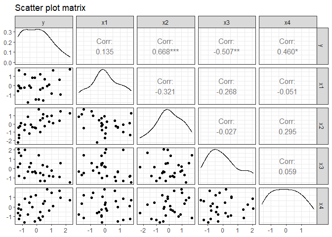<!-- -->

**design matrix**

``` r
X <-
  unname(stats::model.matrix(object = y ~ 1 + x1 + x2 + x3 + x4,
                             data = Z))
attr(x = X, which = "assign") <- NULL
head(x = X)
```

    ##      [,1]        [,2]        [,3]       [,4]      [,5]
    ## [1,]    1 -0.06515604  0.96924866  0.2078288 1.7965226
    ## [2,]    1  0.63232937  0.38762530 -0.8870740 1.6752573
    ## [3,]    1 -0.82464016  1.01976524 -0.2027598 1.4327267
    ## [4,]    1 -1.46012687 -0.52258340 -0.4764855 1.1901962
    ## [5,]    1 -0.20465313 -0.09266149  0.5773585 1.0689309
    ## [6,]    1 -0.95638741  1.52538617  0.5773585 0.9476656

data list for Stan simulation

``` r
dataList <-
  list(
    N = nrow(x = X),
    M = ncol(x = X),
    X = as.matrix(x = X),
    y = as.numeric(x = Z$y)
  )
rm(dat, X, Z)
```

### 3.1.2 Statistical model

**model parameters**

and


![\`\text{Likelihood:}\`{=tex} \`\qquad\`{=tex}
\`\left\`{=tex}.\`\boldsymbol{y}\`{=tex}\`\right\`{=tex}\\\|
\`\boldsymbol{X}\`{=tex}, \`\boldsymbol{\beta}\`{=tex}, \`\sigma\`{=tex}\\^{2},
I \`\stackrel{\mathrm{ind}}{\sim}\`{=tex} \`\mathrm{N}\`{=tex}(\`\mu\`{=tex},
\`\sigma\`{=tex}\\^{2})  , \`\qquad\`{=tex} \`\sigma\`{=tex}\\^{2} :=
\`\mathrm{Var}\`{=tex}\`\left\`{=tex}(\`\left\`{=tex}.\`\boldsymbol{y}\`{=tex}\`\right\`{=tex}\\\|
\`\boldsymbol{X}\`{=tex}, \`\boldsymbol{\beta}\`{=tex}, I\`\right\`{=tex}) =
\`\text{constant}\`{=tex}](https://latex.codecogs.com/png.image?%5Cdpi%7B110%7D&space;%5Cbg_white&space;%60%5Ctext%7BLikelihood%3A%7D%60%7B%3Dtex%7D%20%60%5Cqquad%60%7B%3Dtex%7D%0A%60%5Cleft%60%7B%3Dtex%7D.%60%5Cboldsymbol%7By%7D%60%7B%3Dtex%7D%60%5Cright%60%7B%3Dtex%7D%5C%7C%0A%60%5Cboldsymbol%7BX%7D%60%7B%3Dtex%7D%2C%20%60%5Cboldsymbol%7B%5Cbeta%7D%60%7B%3Dtex%7D%2C%20%60%5Csigma%60%7B%3Dtex%7D%5C%5E%7B2%7D%2C%0AI%20%60%5Cstackrel%7B%5Cmathrm%7Bind%7D%7D%7B%5Csim%7D%60%7B%3Dtex%7D%20%60%5Cmathrm%7BN%7D%60%7B%3Dtex%7D%28%60%5Cmu%60%7B%3Dtex%7D%2C%0A%60%5Csigma%60%7B%3Dtex%7D%5C%5E%7B2%7D%29%20%C2%A0%2C%20%60%5Cqquad%60%7B%3Dtex%7D%20%60%5Csigma%60%7B%3Dtex%7D%5C%5E%7B2%7D%20%3A%3D%0A%60%5Cmathrm%7BVar%7D%60%7B%3Dtex%7D%60%5Cleft%60%7B%3Dtex%7D%28%60%5Cleft%60%7B%3Dtex%7D.%60%5Cboldsymbol%7By%7D%60%7B%3Dtex%7D%60%5Cright%60%7B%3Dtex%7D%5C%7C%0A%60%5Cboldsymbol%7BX%7D%60%7B%3Dtex%7D%2C%20%60%5Cboldsymbol%7B%5Cbeta%7D%60%7B%3Dtex%7D%2C%20I%60%5Cright%60%7B%3Dtex%7D%29%20%3D%0A%60%5Ctext%7Bconstant%7D%60%7B%3Dtex%7D "`\text{Likelihood:}`{=tex} `\qquad`{=tex}
`\left`{=tex}.`\boldsymbol{y}`{=tex}`\right`{=tex}\|
`\boldsymbol{X}`{=tex}, `\boldsymbol{\beta}`{=tex}, `\sigma`{=tex}\^{2},
I `\stackrel{\mathrm{ind}}{\sim}`{=tex} `\mathrm{N}`{=tex}(`\mu`{=tex},
`\sigma`{=tex}\^{2})  , `\qquad`{=tex} `\sigma`{=tex}\^{2} :=
`\mathrm{Var}`{=tex}`\left`{=tex}(`\left`{=tex}.`\boldsymbol{y}`{=tex}`\right`{=tex}\|
`\boldsymbol{X}`{=tex}, `\boldsymbol{\beta}`{=tex}, I`\right`{=tex}) =
`\text{constant}`{=tex}")

 = `\boldsymbol{X}`{=tex}`\boldsymbol{\beta}`{=tex}")

  ,
`\qquad `{=tex}`\left`{=tex}.`\sigma`{=tex}`\right`{=tex}\| I
`\sim `{=tex}`\mathrm{Exp}`{=tex}(1)")

### 3.1.3 Fitting a Stan model: Gauß likelihood and regularising fixed priors

``` r
stanLinRegNormFixed <-
  rstan::stan(
    file = "linRegNormFixed.stan",
    data = dataList,
    chains = 4,
    iter = 2000,
    warmup = 1000,
    thin = 1,
    init = "random",
    algorithm = "NUTS",
    control = list(adapt_delta = 0.99,
                   max_treedepth = 15),
    cores = 3
  )
```

    ## recompiling to avoid crashing R session

See also the Stan User’s Guide (Version 2.30), Sec. 1.1, URL (cited on
August 19, 2022):
<https://mc-stan.org/docs/stan-users-guide/linear-regression.html>.

### 3.1.4 HMC diagnostics

``` r
rstan::check_hmc_diagnostics(object = stanLinRegNormFixed)
```

    ## 
    ## Divergences:

    ## 0 of 4000 iterations ended with a divergence.

    ## 
    ## Tree depth:

    ## 0 of 4000 iterations saturated the maximum tree depth of 15.

    ## 
    ## Energy:

    ## E-BFMI indicated no pathological behavior.

``` r
rstan::stan_trace(
  object = stanLinRegNormFixed,
  pars = c("beta", "sigma", "lp__"),
  inc_warmup = TRUE
)
```

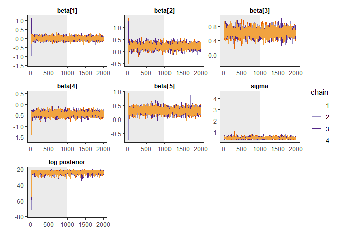<!-- -->

### 3.1.5 Summary of posterior marginal probability distributions for model parameters

``` r
print(
  x = stanLinRegNormFixed,
  pars = c("beta", "sigma", "lp__"),
  probs = c(0.015, 0.25, 0.50, 0.75, 0.985)
)
```

    ## Inference for Stan model: anon_model.
    ## 4 chains, each with iter=2000; warmup=1000; thin=1; 
    ## post-warmup draws per chain=1000, total post-warmup draws=4000.
    ## 
    ##           mean se_mean   sd   1.5%    25%    50%    75%  98.5% n_eff Rhat
    ## beta[1]   0.00    0.00 0.09  -0.20  -0.06   0.00   0.06   0.19  4273    1
    ## beta[2]   0.23    0.00 0.10   0.01   0.17   0.23   0.30   0.45  3114    1
    ## beta[3]   0.64    0.00 0.11   0.40   0.57   0.64   0.71   0.87  3515    1
    ## beta[4]  -0.44    0.00 0.10  -0.66  -0.51  -0.44  -0.38  -0.23  3291    1
    ## beta[5]   0.31    0.00 0.10   0.09   0.24   0.31   0.37   0.52  3626    1
    ## sigma     0.47    0.00 0.07   0.34   0.42   0.46   0.51   0.67  2244    1
    ## lp__    -23.70    0.06 1.91 -29.04 -24.74 -23.34 -22.29 -20.92  1205    1
    ## 
    ## Samples were drawn using NUTS(diag_e) at Mon Aug 29 23:38:53 2022.
    ## For each parameter, n_eff is a crude measure of effective sample size,
    ## and Rhat is the potential scale reduction factor on split chains (at 
    ## convergence, Rhat=1).

``` r
rstan::stan_plot(
  object = stanLinRegNormFixed,
  pars = c("beta", "sigma"),
  ci_level = 0.89,
  outer_level = 0.97
)
```

    ## ci_level: 0.89 (89% intervals)

    ## outer_level: 0.97 (97% intervals)

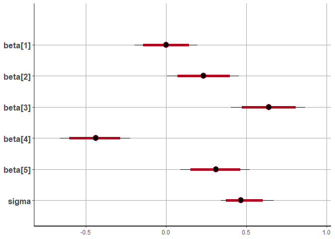<!-- -->

``` r
rstan::stan_dens(object = stanLinRegNormFixed,
                 pars = c("beta", "sigma", "lp__"))
```

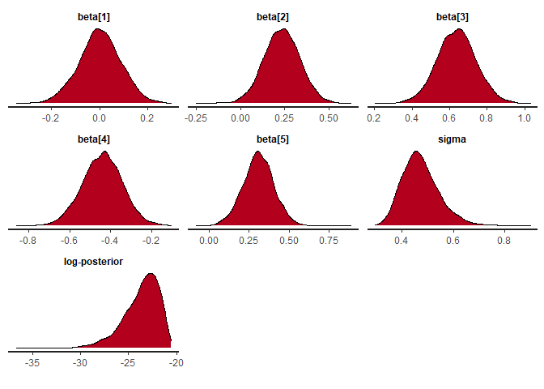<!-- -->

### 3.1.6 Posterior predictive checks

``` r
draws <-
  as.matrix(x = stanLinRegNormFixed,
            pars = "yrep")

bayesplot::ppc_dens_overlay(y = dataList$y,
                            yrep = draws[501:600,]) +
  ggplot2::labs(
    title = paste0(
      "Posterior predictive distribution ",
      "(re-using predictor data)"
    ),
    subtitle = "Empirical density overlaid with 100 HMC samples"
  ) +
  ggplot2::xlab(label = "Standardised y [1]") +
  ggplot2::ylab(label = "Density [1]") +
  ggplot2::theme_bw()
```

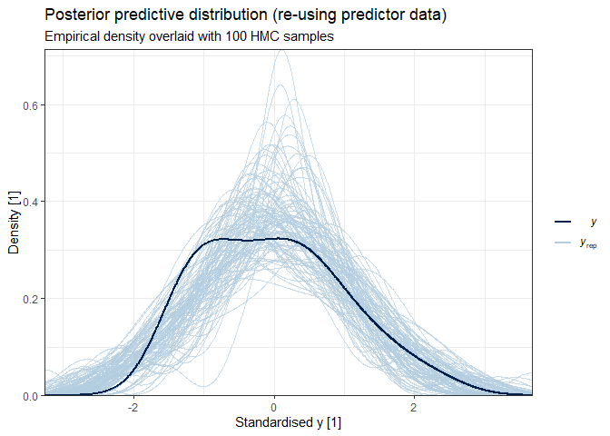<!-- -->

``` r
bayesplot::ppc_intervals(
  y = dataList$y,
  yrep = draws,
  prob = 0.89,
  prob_outer = 0.97,
  size = 1,
  fatten = 3
) +
  ggplot2::labs(
    title = paste0(
      "Posterior predictive compatibility intervals ",
      "(re-using predictor data)"
    ),
    subtitle = "Data points overlaid with interval estimates"
  ) +
  ggplot2::xlab(label = "Sample number") +
  ggplot2::ylab(label = "Standardised y [1]") +
  ggplot2::theme_bw()
```

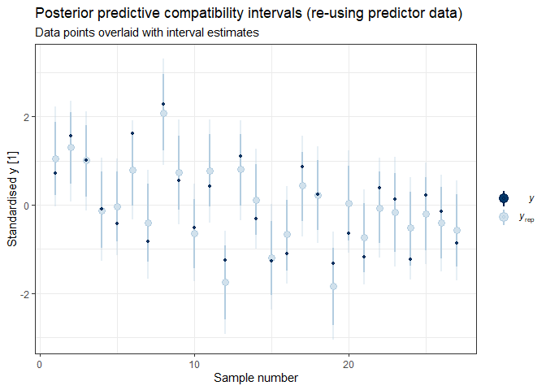<!-- -->

### 3.1.7 Analysis of residuals

``` r
tibble::tibble(
  predicted = draws %>%
    tibble::as_tibble(x = .) %>%
    purrr::map_dbl(.x = ., .f = mean, na.rm = TRUE),
  observed = dataList$y
) %>%
  dplyr::mutate(.data = .,
                residuals = (observed - predicted)) %>%
  dplyr::mutate(
    .data = .,
    residuals_std = scale(x = residuals,
                          center = TRUE,
                          scale = TRUE) %>%
      as.numeric(x = .)
  ) %>%
  ggplot2::ggplot(data = .,
         mapping = aes(x = predicted, y = residuals_std)) +
  ggplot2::geom_point() +
  ggplot2::geom_hline(yintercept = 0, size = 0.4) +
  ggplot2::geom_vline(xintercept = 0, size = 0.4) +
  ggplot2::labs(title = "Analysis of residuals: residual scatter plot") +
  ggplot2::xlab(label = "Predicted y-values [1]") +
  ggplot2::ylab(label = "Standardised residuals [1]") +
  ggplot2::theme_bw()
```

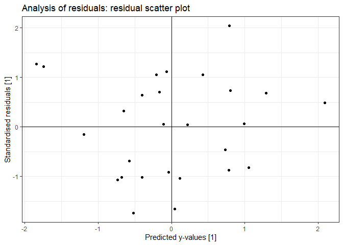<!-- -->

### 3.1.8 Remarks

clear data

``` r
rm(dataList, draws, stanLinRegNormFixed)
```

## 3.2 ANOVA-like regression

### 3.2.1 Data and visualisation

**data set** `massMonitoring.csv`

``` r
dat <-
  utils::read.csv(file = "massMonitoring.csv") %>%
  tibble::as_tibble(x = .)
any(is.na(x = dat))
```

    ## [1] FALSE

``` r
dim(x = dat)
```

    ## [1] 252   2

``` r
head(x = dat)
```

    ## # A tibble: 6 × 2
    ##      X1    X2
    ##   <dbl> <int>
    ## 1  91.8     1
    ## 2  92       1
    ## 3  92.2     1
    ## 4  91       1
    ## 5  92.5     1
    ## 6  91.8     1

**variables**

`y`: body mass


(`X1`)

`gp`: year of observation (`X2`)

**visualisation**

``` r
dat %>%
  ggplot2::ggplot(data = ., mapping = aes(x = as.factor(x = X2), y = X1)) +
  ggplot2::geom_boxplot() +
  ggplot2::xlab(label = "Year of observation") +
  ggplot2::ylab(label = "Body mass [kg]") +
  ggplot2::theme_bw()
```

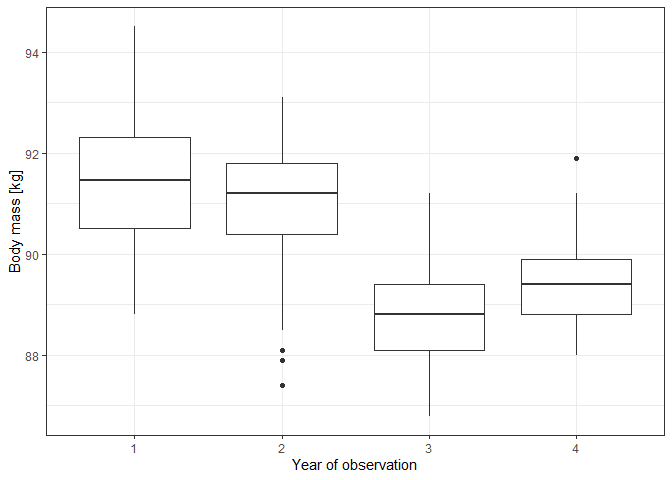<!-- -->

data list for Stan simulation

``` r
dataList <-
  list(
    N = as.integer(x = nrow(x = dat)),
    K = length(x = unique(x = dat$X2)),
    gp = dat$X2,
    y = dat$X1
  )
rm(dat)
```

### 3.2.2 Statistical model

**model parameters**
![\boldsymbol{\mu}\[gp\]](https://latex.codecogs.com/png.image?%5Cdpi%7B110%7D&space;%5Cbg_white&space;%5Cboldsymbol%7B%5Cmu%7D%5Bgp%5D "\boldsymbol{\mu}[gp]")
and


, I (


, ^{2})  , ^{2} := (.\| I) = \]


\| ^{2}, I (90\~, (2\~)^{2})  , .\| I (1) \]

### 3.2.3 Fitting a Stan model: Gauß likelihood, homogeneous variances and fixed priors

``` r
stanAnovaRegNormFixed <-
  rstan::stan(
    file = "anovaRegNormFixed.stan",
    data = dataList,
    chains = 4,
    iter = 2000,
    warmup = 1000,
    thin = 1,
    init = "random",
    algorithm = "NUTS",
    control = list(adapt_delta = 0.99,
                   max_treedepth = 15),
    cores = 3
  )
```

### 3.2.4 HMC diagnostics

``` r
rstan::check_hmc_diagnostics(object = stanAnovaRegNormFixed)
```

    ## 
    ## Divergences:

    ## 0 of 4000 iterations ended with a divergence.

    ## 
    ## Tree depth:

    ## 0 of 4000 iterations saturated the maximum tree depth of 15.

    ## 
    ## Energy:

    ## E-BFMI indicated no pathological behavior.

``` r
rstan::stan_trace(
  object = stanAnovaRegNormFixed,
  pars = c("mu", "sigma", "lp__"),
  inc_warmup = TRUE
)
```

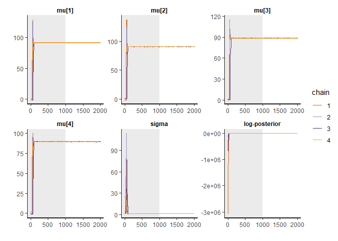<!-- -->

### 3.2.5 Summary of posterior marginal probability distributions for model parameters

``` r
print(
  x = stanAnovaRegNormFixed,
  pars = c("mu", "sigma", "lp__"),
  probs = c(0.015, 0.25, 0.50, 0.75, 0.985)
)
```

    ## Inference for Stan model: anon_model.
    ## 4 chains, each with iter=2000; warmup=1000; thin=1; 
    ## post-warmup draws per chain=1000, total post-warmup draws=4000.
    ## 
    ##          mean se_mean   sd    1.5%     25%     50%     75%   98.5% n_eff Rhat
    ## mu[1]   91.51    0.00 0.14   91.21   91.42   91.51   91.61   91.81  3322    1
    ## mu[2]   90.91    0.00 0.14   90.62   90.83   90.92   91.00   91.20  4167    1
    ## mu[3]   88.71    0.00 0.13   88.43   88.62   88.71   88.80   88.98  4304    1
    ## mu[4]   89.44    0.00 0.14   89.14   89.35   89.44   89.54   89.73  4584    1
    ## sigma    1.08    0.00 0.05    0.98    1.05    1.08    1.11    1.19  3524    1
    ## lp__  -401.61    0.04 1.55 -406.09 -402.39 -401.30 -400.47 -399.44  1930    1
    ## 
    ## Samples were drawn using NUTS(diag_e) at Mon Aug 29 23:45:01 2022.
    ## For each parameter, n_eff is a crude measure of effective sample size,
    ## and Rhat is the potential scale reduction factor on split chains (at 
    ## convergence, Rhat=1).

``` r
rstan::stan_plot(
  object = stanAnovaRegNormFixed,
  pars = c("mu"),
  ci_level = 0.89,
  outer_level = 0.97
)
```

    ## ci_level: 0.89 (89% intervals)

    ## outer_level: 0.97 (97% intervals)

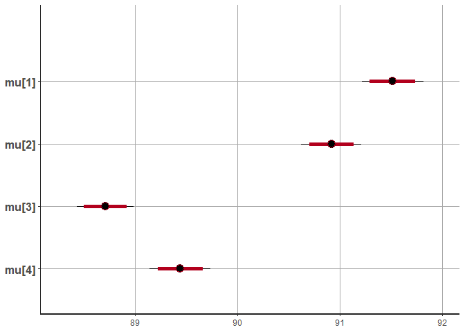<!-- -->

``` r
rstan::stan_plot(
  object = stanAnovaRegNormFixed,
  pars = c("sigma"),
  ci_level = 0.89,
  outer_level = 0.97
)
```

    ## ci_level: 0.89 (89% intervals)
    ## outer_level: 0.97 (97% intervals)

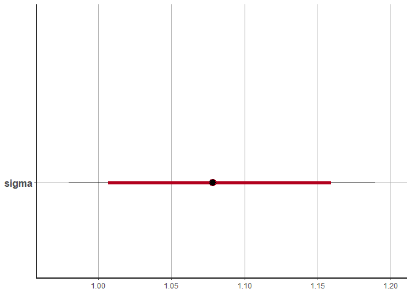<!-- -->

``` r
rstan::stan_dens(object = stanAnovaRegNormFixed,
                 pars = c("mu", "sigma", "lp__"))
```

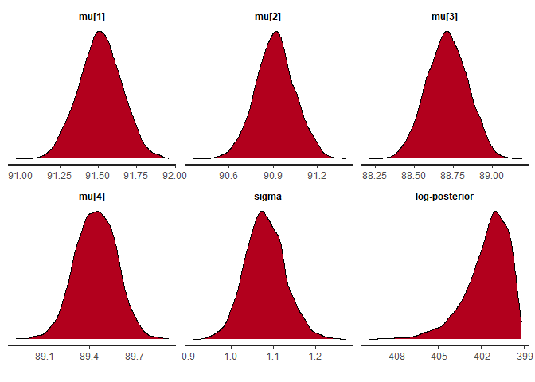<!-- -->

### 3.2.6 Posterior predictive checks

``` r
draws <-
  as.matrix(x = stanAnovaRegNormFixed,
            pars = "yrep")

bayesplot::ppc_dens_overlay(y = dataList$y,
                            yrep = draws[501:600,]) +
  ggplot2::labs(
    title = paste0(
      "Posterior predictive distribution ",
      "(re-using predictor data)"
    ),
    subtitle = "Empirical density overlaid with 100 HMC samples"
  ) +
  ggplot2::xlab(label = "y [kg]") +
  ggplot2::ylab(label = "Density [1/kg]") +
  ggplot2::theme_bw()
```

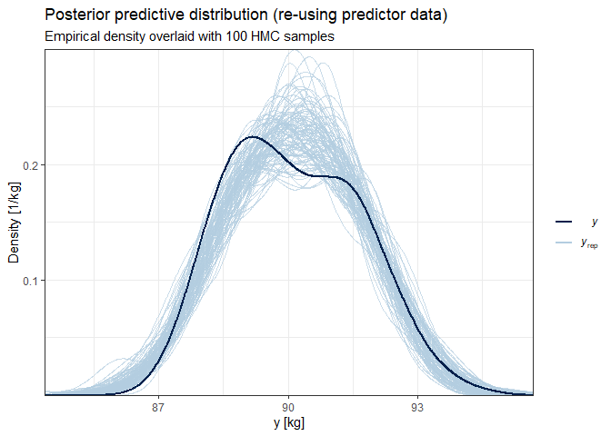<!-- -->

``` r
bayesplot::ppc_intervals_grouped(
  y = dataList$y,
  yrep = draws,
  group = dataList$gp,
  prob = 0.89,
  prob_outer = 0.97,
  size = 1,
  fatten = 3
) +
  ggplot2::labs(
    title = paste0(
      "Posterior predictive compatibility intervals ",
      "(re-using predictor data)"
    ),
    subtitle = "Data points overlaid with interval estimates"
  ) +
  ggplot2::xlab(label = "Sample number") +
  ggplot2::ylab(label = "y [kg]") +
  ggplot2::theme_bw()
```

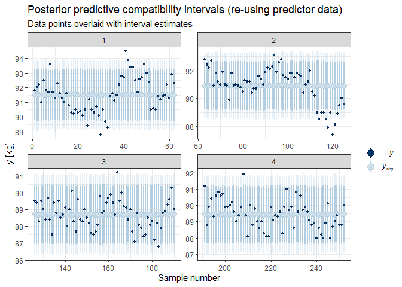<!-- -->

### 3.2.7 Remarks

clear data

``` r
rm(dataList, draws, stanAnovaRegNormFixed)
```

## 3.3 Logistic regression

### 3.3.1 Data and visualisation

**data set** `urine` from R package `boot` by Canty and Ripley (2021);
type `?urine`.

``` r
library(boot)
data("urine")
attach(what = urine)
```

    ## Das folgende Objekt ist maskiert package:boot:
    ## 
    ##     gravity

``` r
any(is.na(x = urine)) # Checking for missing values in the data matrix
```

    ## [1] TRUE

``` r
dat <-
  stats::na.omit(object = urine) %>% # Delete cases with missing values
  tibble::as_tibble(x = .)
rm(urine)
dim(x = dat)
```

    ## [1] 77  7

``` r
head(x = dat)
```

    ## # A tibble: 6 × 7
    ##       r gravity    ph  osmo  cond  urea  calc
    ##   <dbl>   <dbl> <dbl> <dbl> <dbl> <dbl> <dbl>
    ## 1     0    1.02  5.74   577  20     296  4.49
    ## 2     0    1.01  7.2    321  14.9   101  2.36
    ## 3     0    1.01  5.51   408  12.6   224  2.15
    ## 4     0    1.00  6.52   187   7.5    91  1.16
    ## 5     0    1.02  5.27   668  25.3   252  3.34
    ## 6     0    1.01  5.62   461  17.4   195  1.4

**visualisation** (suppressing five independent variables other than
`urea`)

``` r
dat %>%
  ggplot2::ggplot(data = ., mapping = aes(x = urea, y = r)) +
  ggplot2::geom_point() +
  ggplot2::scale_x_continuous(name = paste0("Urea concentration ",
                                            "[millimoles per litre]")) +
  ggplot2::scale_y_continuous(
    name = "Presence of calcium oxalate crystals [1]",
    breaks = seq(from = 0, to = 1, by = 1),
    labels = scales::number_format(
      accuracy = 1,
      big.mark = ".",
      decimal.mark = ","
    )
  ) +
  ggplot2::theme_bw()
```

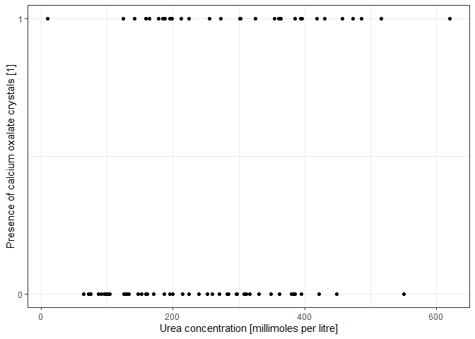<!-- -->

**standardisation** of **variables**

`y`: indicator of the presence of calcium oxalate crystals: {0, 1} (`r`)

`x1`: standardised specific gravity of the urine


(`gravity`)

`x2`: standardised pH reading of the urine


(`ph`)

`x3`: standardised osmolarity of the urine


(`osmo`)

`x4`: standardised conductivity of the urine


(`cond`)

`x5`: standardised urea concentration


(`urea`)

`x6`: standardised calcium concentration


(`calc`)

``` r
Z <-
  scale(x = dat[, 2:7],
        center = TRUE,
        scale = TRUE) %>%
  magrittr::set_colnames(x = .,
                         value = c("x1", "x2", "x3", "x4", "x5", "x6")) %>%
  tibble::as_tibble(x = .)
head(x = Z)
```

    ## # A tibble: 6 × 6
    ##       x1     x2     x3     x4      x5     x6
    ##    <dbl>  <dbl>  <dbl>  <dbl>   <dbl>  <dbl>
    ## 1 -0.140 -0.416 -0.153 -0.113  0.257   0.100
    ## 2 -1.37   1.61  -1.22  -0.750 -1.24   -0.546
    ## 3 -0.961 -0.735 -0.859 -1.04  -0.294  -0.610
    ## 4 -1.78   0.664 -1.78  -1.67  -1.31   -0.910
    ## 5  0.270 -1.07   0.227  0.549 -0.0797 -0.249
    ## 6 -0.824 -0.583 -0.637 -0.438 -0.517  -0.837

**design matrix**

``` r
X <-
  unname(stats::model.matrix(object = dat$r ~ 1 + x1 + x2 + x3 + x4 + x5 + x6,
                             data = Z))
attr(x = X, which = "assign") <- NULL
head(x = X)
```

    ##      [,1]       [,2]       [,3]       [,4]       [,5]        [,6]        [,7]
    ## [1,]    1 -0.1403037 -0.4163725 -0.1528785 -0.1130908  0.25747827  0.09997564
    ## [2,]    1 -1.3710690  1.6055972 -1.2218894 -0.7502609 -1.23693077 -0.54608444
    ## [3,]    1 -0.9608139 -0.7349020 -0.8585927 -1.0376121 -0.29430353 -0.60978050
    ## [4,]    1 -1.7813240  0.6638579 -1.7814497 -1.6747822 -1.31356713 -0.91006194
    ## [5,]    1  0.2699514 -1.0672806  0.2271214  0.5490664 -0.07972172 -0.24883614
    ## [6,]    1 -0.8240622 -0.5825618 -0.6372741 -0.4379226 -0.51654898 -0.83726644

data list for Stan simulation

``` r
dataList <-
  list(
    N = nrow(x = X),
    M = ncol(x = X),
    X = as.matrix(x = X),
    y = as.integer(x = dat$r)
  )
rm(dat, X, Z)
```

### 3.3.2 Statistical model

**model parameters**


")

 :=
`\ln`{=tex}`\left`{=tex}(`\frac{p}{1-p}`{=tex}`\right`{=tex}) =
`\boldsymbol{X}`{=tex}`\boldsymbol{\beta}`{=tex}")

")

### 3.3.3 Fitting a Stan model: Bernoulli likelihood with logit link and regularising fixed priors

``` r
stanLogistRegBernFixed <-
  rstan::stan(
    file = "logistRegBernFixed.stan",
    data = dataList,
    chains = 4,
    iter = 2000,
    warmup = 1000,
    thin = 1,
    init = "random",
    algorithm = "NUTS",
    control = list(adapt_delta = 0.99,
                   max_treedepth = 15),
    cores = 3
  )
```

See also the Stan User’s Guide (Version 2.30), Sec. 1.5, URL (cited on
August 19, 2022):
<https://mc-stan.org/docs/stan-users-guide/logistic-probit-regression.html>.

### 3.3.4 HMC diagnostics

``` r
rstan::check_hmc_diagnostics(object = stanLogistRegBernFixed)
```

    ## 
    ## Divergences:

    ## 0 of 4000 iterations ended with a divergence.

    ## 
    ## Tree depth:

    ## 0 of 4000 iterations saturated the maximum tree depth of 15.

    ## 
    ## Energy:

    ## E-BFMI indicated no pathological behavior.

``` r
rstan::stan_trace(
  object = stanLogistRegBernFixed,
  pars = c("beta", "lp__"),
  inc_warmup = TRUE
)
```

<!-- -->

### 3.3.5 Summary of posterior marginal probability distributions for model parameters

``` r
print(
  x = stanLogistRegBernFixed,
  pars = c("beta", "lp__"),
  probs = c(0.015, 0.25, 0.50, 0.75, 0.985)
)
```

    ## Inference for Stan model: anon_model.
    ## 4 chains, each with iter=2000; warmup=1000; thin=1; 
    ## post-warmup draws per chain=1000, total post-warmup draws=4000.
    ## 
    ##           mean se_mean   sd   1.5%    25%    50%    75%  98.5% n_eff Rhat
    ## beta[1]  -0.18    0.00 0.30  -0.83  -0.38  -0.18   0.02   0.45  4275    1
    ## beta[2]   1.60    0.01 0.59   0.31   1.20   1.59   1.98   2.95  3567    1
    ## beta[3]  -0.18    0.00 0.32  -0.87  -0.39  -0.17   0.03   0.50  4756    1
    ## beta[4]  -0.06    0.02 0.81  -1.86  -0.60  -0.05   0.48   1.68  2616    1
    ## beta[5]  -0.88    0.01 0.50  -1.98  -1.21  -0.88  -0.55   0.21  2613    1
    ## beta[6]  -0.73    0.01 0.57  -1.98  -1.11  -0.73  -0.35   0.49  2468    1
    ## beta[7]   1.60    0.01 0.44   0.68   1.32   1.59   1.88   2.60  4018    1
    ## lp__    -44.68    0.04 1.89 -49.87 -45.72 -44.39 -43.26 -41.80  1812    1
    ## 
    ## Samples were drawn using NUTS(diag_e) at Mon Aug 29 23:51:19 2022.
    ## For each parameter, n_eff is a crude measure of effective sample size,
    ## and Rhat is the potential scale reduction factor on split chains (at 
    ## convergence, Rhat=1).

``` r
rstan::stan_plot(
  object = stanLogistRegBernFixed,
  pars = c("beta"),
  ci_level = 0.89,
  outer_level = 0.97
)
```

    ## ci_level: 0.89 (89% intervals)

    ## outer_level: 0.97 (97% intervals)

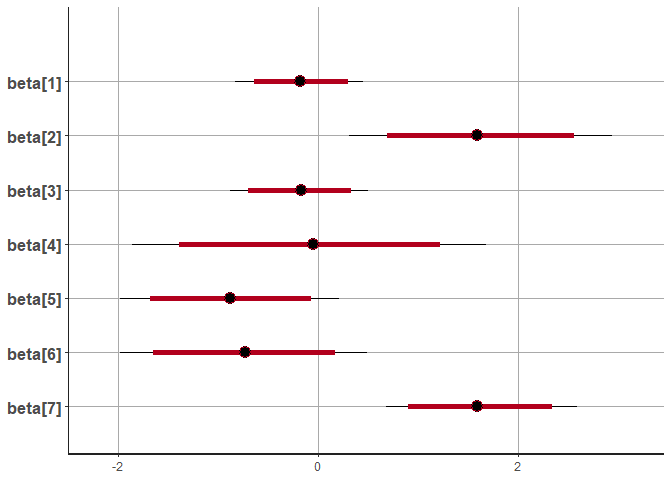<!-- -->

``` r
rstan::stan_dens(object = stanLogistRegBernFixed,
                 pars = c("beta", "lp__"))
```

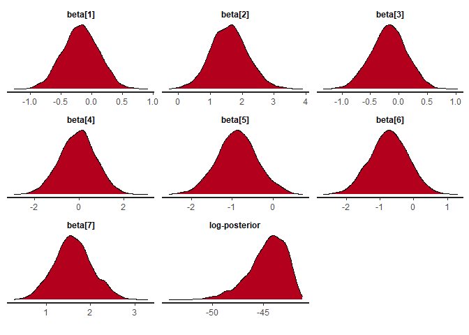<!-- -->

### 3.3.6 Posterior predictive checks

``` r
draws <-
  as.matrix(x = stanLogistRegBernFixed,
            pars = "yrep")

bayesplot::ppc_dens_overlay(y = dataList$y,
                            yrep = draws[501:600,]) +
  ggplot2::labs(
    title = paste0(
      "Posterior predictive distribution ",
      "(re-using predictor data)"
    ),
    subtitle = "Empirical density overlaid with 100 HMC samples"
  ) +
  ggplot2::xlab(label = "y [1]") +
  ggplot2::ylab(label = "Density [1]") +
  ggplot2::theme_bw()
```

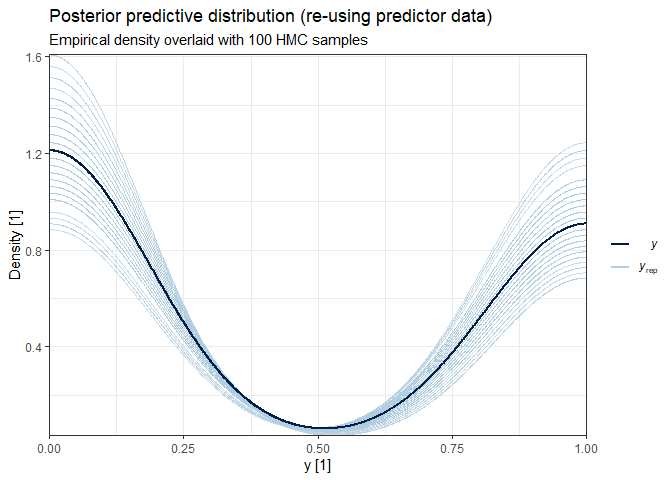<!-- -->

``` r
bayesplot::ppc_intervals(
  y = dataList$y,
  yrep = draws,
  prob = 0.89,
  prob_outer = 0.97,
  size = 1,
  fatten = 3
) +
  ggplot2::labs(
    title = paste0(
      "Posterior predictive compatibility intervals ",
      "(re-using predictor data)"
    ),
    subtitle = "Data points overlaid with interval estimates"
  ) +
  ggplot2::xlab(label = "Sample number") +
  ggplot2::ylab(label = "y [1]") +
  ggplot2::theme_bw()
```

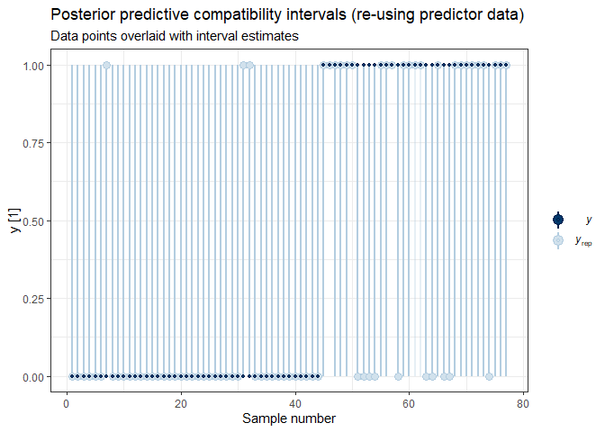<!-- -->

### 3.3.7 Remarks

clear data

``` r
rm(dataList, draws, stanLogistRegBernFixed)
```

## 3.4 Poisson regression

### 3.4.1 Data and visualisation

**data set** `poissonData.RData`

``` r
load("poissonData.RData")
attach(what = poissonData)
any(is.na(x = poissonData)) # Checking for missing values in the data matrix
```

    ## [1] FALSE

``` r
dat <-
  stats::na.omit(object = poissonData) %>% # Delete cases with missing values
  tibble::as_tibble(x = .)
rm(poissonData)
dim(x = dat)
```

    ## [1] 82  5

``` r
head(x = dat)
```

    ## # A tibble: 6 × 5
    ##       y    x1    x2    x3    gp
    ##   <int> <dbl> <int> <int> <int>
    ## 1     2 13.0      1     1     5
    ## 2     1 17.2      1     1     5
    ## 3     0  7.48     1     1     6
    ## 4     2 10.1      1     1     6
    ## 5     1 12.2      1     1     6
    ## 6     2 14.0      1     1     6

**visualisation**

``` r
dat %>%
  ggplot2::ggplot(data = ., mapping = aes(x = y)) +
  ggplot2::geom_bar(mapping = aes(y = ..prop..),
                    stat = "count",
                    width = 0.1) +
  ggplot2::scale_x_continuous(
    name = "Count per 15 min observation interval [1]",
    breaks = seq(from = 0, to = 8, by = 1),
    labels = scales::number_format(
      accuracy = 1,
      big.mark = ".",
      decimal.mark = ","
    )
  ) +
  ggplot2::scale_y_continuous(
    name = "Relative frequency [1]",
    labels = scales::percent) +
  ggplot2::theme_bw()
```

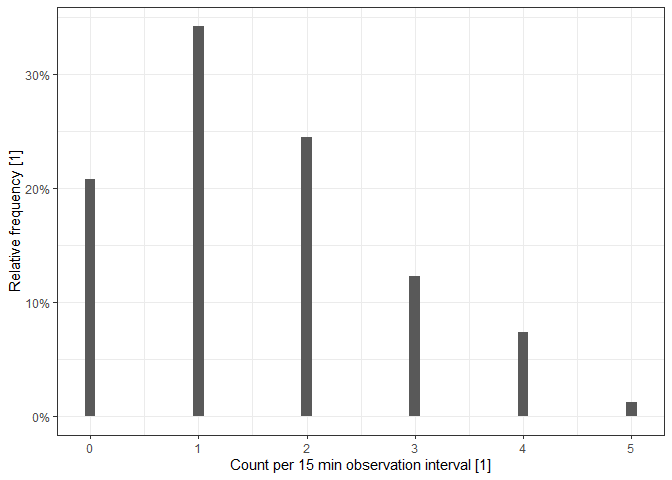<!-- -->

**standardisation** of **variables**

`y`: count of planes touching down inside of a 15 min observation
interval


`x1`: standardised start of 15 min observation interval


`x2`: standardised estimated Beaufort wind force scale number


`x3`: standardised wind direction


`gp`: day-of-week ID: Monday (`1`) to Sunday (`7`)

``` r
Z <-
  scale(x = dat[, 2:4],
        center = TRUE,
        scale = TRUE) %>%
  magrittr::set_colnames(x = ., value = c("x1", "x2", "x3")) %>%
  tibble::as_tibble(x = .)
head(x = Z)
```

    ## # A tibble: 6 × 3
    ##       x1    x2    x3
    ##    <dbl> <dbl> <dbl>
    ## 1 -0.473 -1.48 -1.70
    ## 2  0.448 -1.48 -1.70
    ## 3 -1.69  -1.48 -1.70
    ## 4 -1.12  -1.48 -1.70
    ## 5 -0.656 -1.48 -1.70
    ## 6 -0.276 -1.48 -1.70

**design matrix**

``` r
X <-
  unname(stats::model.matrix(object = dat$y ~ 1 + x1 + x2 + x3,
                             data = Z))
attr(x = X, which = "assign") <- NULL
head(x = X)
```

    ##      [,1]       [,2]      [,3]      [,4]
    ## [1,]    1 -0.4729359 -1.479039 -1.697255
    ## [2,]    1  0.4478921 -1.479039 -1.697255
    ## [3,]    1 -1.6933985 -1.479039 -1.697255
    ## [4,]    1 -1.1197080 -1.479039 -1.697255
    ## [5,]    1 -0.6556399 -1.479039 -1.697255
    ## [6,]    1 -0.2756156 -1.479039 -1.697255

data list for Stan simulation

``` r
dataList <-
  list(
    N = nrow(x = X),
    M = ncol(x = X),
    X = X,
    y = dat$y
  )
rm(dat, X, Z)
```

### 3.4.2 Statistical model

**model parameters**


")

 =
`\boldsymbol{X}`{=tex}`\boldsymbol{\beta}`{=tex}")

")

### 3.4.3 Fitting a Stan model: Poisson likelihood with log link and regularising fixed priors

``` r
stanPoisRegFixed <-
  rstan::stan(
    file = "poisRegFixed.stan",
    data = dataList,
    chains = 4,
    iter = 2000,
    warmup = 1000,
    thin = 1,
    init = "random",
    algorithm = "NUTS",
    control = list(adapt_delta = 0.99,
                   max_treedepth = 15),
    cores = 3
  )
```

### 3.4.4 HMC diagnostics

``` r
rstan::check_hmc_diagnostics(object = stanPoisRegFixed)
```

    ## 
    ## Divergences:

    ## 0 of 4000 iterations ended with a divergence.

    ## 
    ## Tree depth:

    ## 0 of 4000 iterations saturated the maximum tree depth of 15.

    ## 
    ## Energy:

    ## E-BFMI indicated no pathological behavior.

``` r
rstan::stan_trace(
  object = stanPoisRegFixed,
  pars = c("beta", "lp__"),
  inc_warmup = TRUE
)
```

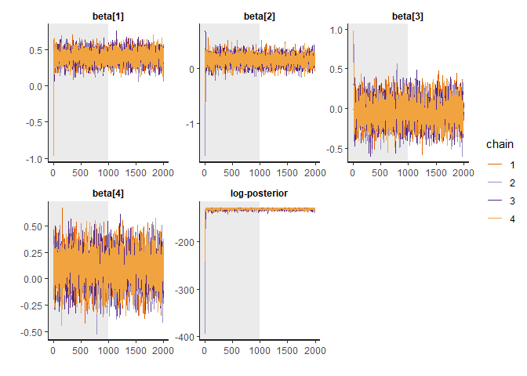<!-- -->

### 3.4.5 Summary of posterior marginal probability distributions for model parameters

``` r
print(
  x = stanPoisRegFixed,
  pars = c("beta", "lp__"),
  probs = c(0.015, 0.25, 0.50, 0.75, 0.985)
)
```

    ## Inference for Stan model: anon_model.
    ## 4 chains, each with iter=2000; warmup=1000; thin=1; 
    ## post-warmup draws per chain=1000, total post-warmup draws=4000.
    ## 
    ##            mean se_mean   sd    1.5%     25%     50%     75%   98.5% n_eff Rhat
    ## beta[1]    0.41    0.00 0.09    0.21    0.35    0.41    0.47    0.60  2378    1
    ## beta[2]    0.16    0.00 0.09   -0.04    0.10    0.16    0.22    0.35  2562    1
    ## beta[3]   -0.03    0.00 0.16   -0.37   -0.14   -0.03    0.07    0.31  1719    1
    ## beta[4]    0.09    0.00 0.16   -0.25   -0.02    0.09    0.20    0.43  1635    1
    ## lp__    -131.19    0.04 1.42 -135.43 -131.91 -130.85 -130.13 -129.39  1507    1
    ## 
    ## Samples were drawn using NUTS(diag_e) at Mon Aug 29 23:55:53 2022.
    ## For each parameter, n_eff is a crude measure of effective sample size,
    ## and Rhat is the potential scale reduction factor on split chains (at 
    ## convergence, Rhat=1).

``` r
rstan::stan_plot(
  object = stanPoisRegFixed,
  pars = c("beta"),
  ci_level = 0.89,
  outer_level = 0.97
)
```

    ## ci_level: 0.89 (89% intervals)

    ## outer_level: 0.97 (97% intervals)

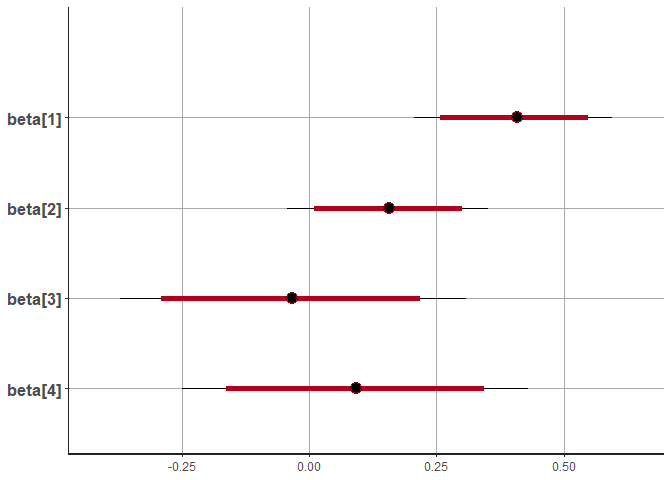<!-- -->

``` r
rstan::stan_dens(object = stanPoisRegFixed,
                 pars = c("beta", "lp__"))
```

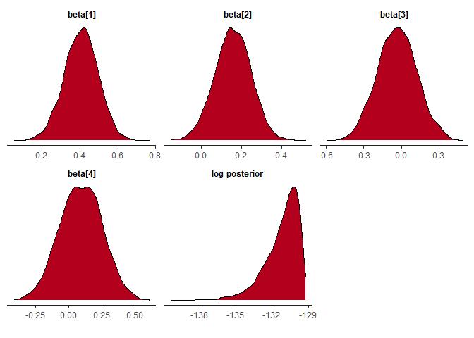<!-- -->

### 3.4.6 Posterior predictive checks

``` r
draws <-
  as.matrix(x = stanPoisRegFixed,
            pars = "yrep")

bayesplot::ppc_dens_overlay(y = dataList$y,
                            yrep = draws[501:600,]) +
  ggplot2::labs(
    title = paste0(
      "Posterior predictive distribution ",
      "(re-using predictor data)"
    ),
    subtitle = "Empirical density overlaid with 100 HMC samples"
  ) +
  ggplot2::ylab(label = "Density [1]") +
  ggplot2::scale_x_continuous(
    name = "y [1]",
    breaks = seq(from = 0, to = 8, by = 1),
    labels = scales::number_format(
      accuracy = 1,
      big.mark = ".",
      decimal.mark = ","
    )
  ) +
  ggplot2::theme_bw()
```

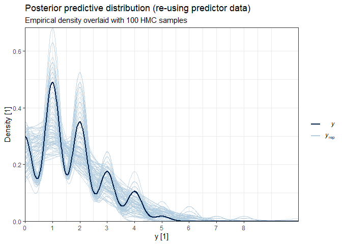<!-- -->

``` r
bayesplot::ppc_intervals(
  y = dataList$y,
  yrep = draws,
  prob = 0.89,
  prob_outer = 0.97,
  size = 1,
  fatten = 3
) +
  ggplot2::labs(
    title = paste0(
      "Posterior predictive compatibility intervals ",
      "(re-using predictor data)"
    ),
    subtitle = "Data points overlaid with interval estimates"
  ) +
  ggplot2::xlab(label = "Sample number") +
  ggplot2::ylab(label = "y [1]") +
  ggplot2::theme_bw()
```

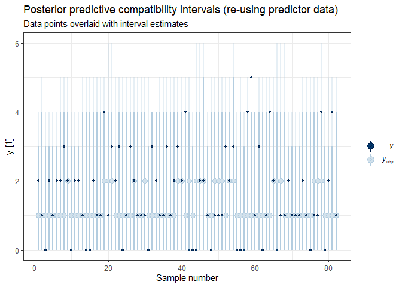<!-- -->

``` r
bayesplot::ppc_rootogram(
  y = dataList$y,
  yrep = draws,
  style = "standing",
  prob = 0.89,
  size = 1
) +
  ggplot2::labs(title = "Rootogram") +
  ggplot2::theme_bw()
```

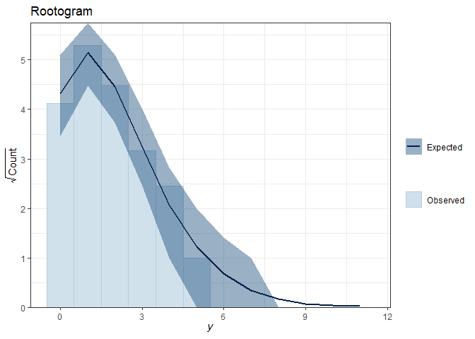<!-- -->

### 3.4.7 Remarks

clear data

``` r
rm(dataList, draws, stanPoisRegFixed)
```

## 3.5 Exponential regression

### 3.5.1 Data and visualisation

**data set** `tramWait.RData`

``` r
load("tramWait.RData")
attach(what = tramWait)
any(is.na(x = tramWait)) # Checking for missing values in the data matrix
```

    ## [1] FALSE

``` r
dat <-
  stats::na.omit(object = tramWait) %>%  # Delete cases with missing values
  tibble::as_tibble(x = .)
rm(tramWait)
dim(x = dat)
```

    ## [1] 100   4

``` r
head(x = dat)
```

    ## # A tibble: 6 × 4
    ##    tram conductors passChanged  wait
    ##   <int>      <int>       <int> <dbl>
    ## 1     1          5         217  8.24
    ## 2     1          5         216  8.00
    ## 3     1          5         190  5.36
    ## 4     1          8         187  2.24
    ## 5     1          7         166  9.13
    ## 6     1          7         170  4.52

**standardisation** of **variables**

`y`: waiting time for tram to arrive at stop


(`wait`)

`x1`: standardised number of tram conductors available on tram line on
day of observation


(`conductors`)

`x2`: standardised number of passengers having left or entered tram at
previous stops


(`passChanged`)

`gp`: tram line number (`1` to `10`) (`tram`)

``` r
Z <-
  scale(x = dat[, 2:3],
        center = TRUE,
        scale = TRUE) %>%
  magrittr::set_colnames(x = ., value = c("x1", "x2")) %>%
  tibble::as_tibble(x = .)
head(x = Z)
```

    ## # A tibble: 6 × 2
    ##       x1     x2
    ##    <dbl>  <dbl>
    ## 1 0.0896  0.475
    ## 2 0.0896  0.434
    ## 3 0.0896 -0.623
    ## 4 1.77   -0.745
    ## 5 1.21   -1.60 
    ## 6 1.21   -1.44

**design matrix**

``` r
X <-
  unname(stats::model.matrix(object = dat$wait ~ 1 + x1 + x2,
                             data = Z))
attr(x = X, which = "assign") <- NULL
head(x = X)
```

    ##      [,1]       [,2]       [,3]
    ## [1,]    1 0.08963533  0.4748407
    ## [2,]    1 0.08963533  0.4341865
    ## [3,]    1 0.08963533 -0.6228218
    ## [4,]    1 1.77029767 -0.7447843
    ## [5,]    1 1.21007689 -1.5985218
    ## [6,]    1 1.21007689 -1.4359051

data list for Stan simulation

``` r
dataList <-
  list(
    N = nrow(x = X),
    M = ncol(x = X),
    X = X,
    y = dat$wait
  )
rm(dat, X, Z)
```

### 3.5.2 Statistical model

**model parameters**


")


= `\boldsymbol{X}`{=tex}`\boldsymbol{\beta}`{=tex}")

")

### 3.5.3 Fitting a Stan model: Exponential likelihood with log link and regularising fixed priors

``` r
stanExpRegFixed <-
  rstan::stan(
    file = "expRegFixed.stan",
    data = dataList,
    chains = 4,
    iter = 2000,
    warmup = 1000,
    thin = 1,
    init = "random",
    algorithm = "NUTS",
    control = list(adapt_delta = 0.99,
                   max_treedepth = 15),
    cores = 3
  )
```

### 3.5.4 HMC diagnostics

``` r
rstan::check_hmc_diagnostics(object = stanExpRegFixed)
```

    ## 
    ## Divergences:

    ## 0 of 4000 iterations ended with a divergence.

    ## 
    ## Tree depth:

    ## 0 of 4000 iterations saturated the maximum tree depth of 15.

    ## 
    ## Energy:

    ## E-BFMI indicated no pathological behavior.

``` r
rstan::stan_trace(
  object = stanExpRegFixed,
  pars = c("beta", "lp__"),
  inc_warmup = TRUE
)
```

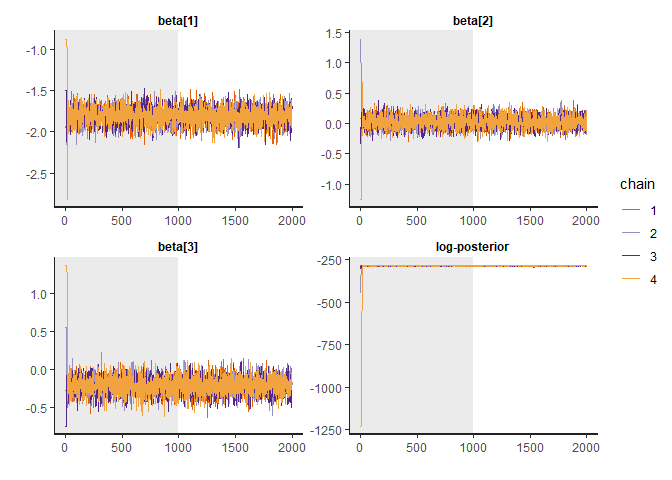<!-- -->

### 3.5.5 Summary of posterior marginal probability distributions for model parameters

``` r
print(
  x = stanExpRegFixed,
  pars = c("beta", "lp__"),
  probs = c(0.015, 0.25, 0.50, 0.75, 0.985)
)
```

    ## Inference for Stan model: anon_model.
    ## 4 chains, each with iter=2000; warmup=1000; thin=1; 
    ## post-warmup draws per chain=1000, total post-warmup draws=4000.
    ## 
    ##            mean se_mean   sd    1.5%     25%     50%     75%   98.5% n_eff Rhat
    ## beta[1]   -1.81    0.00 0.10   -2.03   -1.87   -1.81   -1.74   -1.59  2755    1
    ## beta[2]    0.03    0.00 0.10   -0.18   -0.04    0.03    0.09    0.24  2721    1
    ## beta[3]   -0.21    0.00 0.11   -0.45   -0.28   -0.21   -0.14    0.04  2685    1
    ## lp__    -287.03    0.03 1.24 -290.95 -287.55 -286.72 -286.14 -285.60  1695    1
    ## 
    ## Samples were drawn using NUTS(diag_e) at Tue Aug 30 00:00:31 2022.
    ## For each parameter, n_eff is a crude measure of effective sample size,
    ## and Rhat is the potential scale reduction factor on split chains (at 
    ## convergence, Rhat=1).

``` r
rstan::stan_plot(
  object = stanExpRegFixed,
  pars = c("beta"),
  ci_level = 0.89,
  outer_level = 0.97
)
```

    ## ci_level: 0.89 (89% intervals)

    ## outer_level: 0.97 (97% intervals)

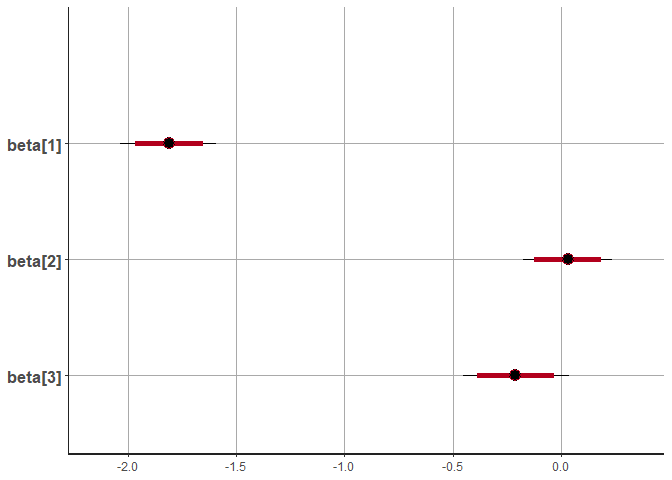<!-- -->

``` r
rstan::stan_dens(object = stanExpRegFixed,
                 pars = c("beta", "lp__"))
```

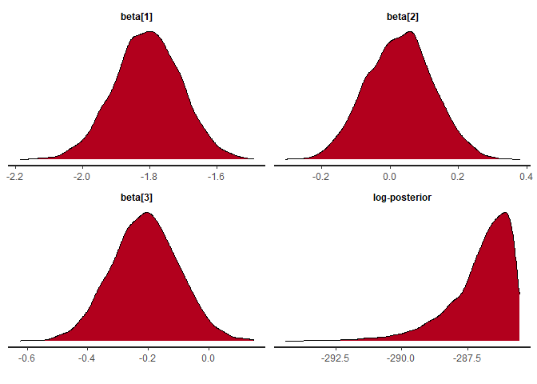<!-- -->

### 3.5.6 Posterior predictive checks

``` r
draws <-
  as.matrix(x = stanExpRegFixed,
            pars = "yrep")

bayesplot::ppc_dens_overlay(y = dataList$y,
                            yrep = draws[501:600,]) +
  ggplot2::labs(
    title = paste0(
      "Posterior predictive distribution ",
      "(re-using predictor data)"
    ),
    subtitle = "Empirical density overlaid with 100 HMC samples"
  ) +
  ggplot2::xlab(label = "y [min]") +
  ggplot2::ylab(label = "Density [1/min]") +
  ggplot2::theme_bw()
```

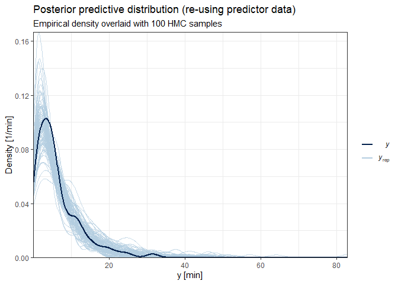<!-- -->

``` r
bayesplot::ppc_intervals(
  y = dataList$y,
  yrep = draws,
  prob = 0.89,
  prob_outer = 0.97,
  size = 1,
  fatten = 3
) +
  ggplot2::labs(
    title = paste0(
      "Posterior predictive compatibility intervals ",
      "(re-using predictor data)"
    ),
    subtitle = "Data points overlaid with interval estimates"
  ) +
  ggplot2::xlab(label = "Sample number") +
  ggplot2::ylab(label = "y [min]") +
  ggplot2::theme_bw()
```

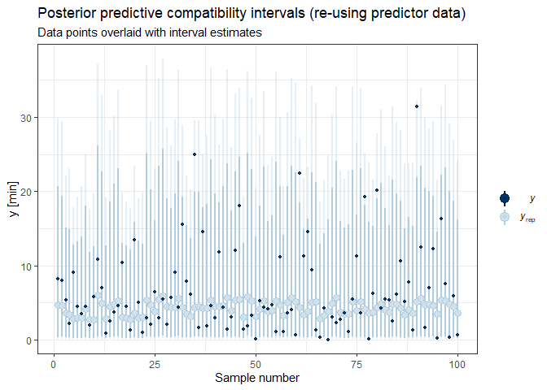<!-- -->

### 3.5.7 Remarks

clear data

``` r
rm(dataList, draws, stanExpRegFixed)
```

# 4 Varying effects generalised linear models

## 4.1 Multi-level linear regression

### 4.1.1 Data and visualisation

**data set** `iris` from R package `datasets` by the R Core Team (2022);
type `?iris`.

``` r
data("iris")
attach(what = iris)
any(is.na(x = iris)) # Checking for missing values in the data matrix
```

    ## [1] FALSE

``` r
dat <-
  stats::na.omit(object = iris) %>% # Delete cases with missing values
  tibble::as_tibble(x = .) %>%
  dplyr::group_by(.data = ., Species) %>%
  dplyr::mutate(.data = ., gp = dplyr::cur_group_id()) %>% # Create group index
  dplyr::ungroup(x = .)
rm(iris)
dim(x = dat)
```

    ## [1] 150   6

``` r
head(x = dat)
```

    ## # A tibble: 6 × 6
    ##   Sepal.Length Sepal.Width Petal.Length Petal.Width Species    gp
    ##          <dbl>       <dbl>        <dbl>       <dbl> <fct>   <int>
    ## 1          5.1         3.5          1.4         0.2 setosa      1
    ## 2          4.9         3            1.4         0.2 setosa      1
    ## 3          4.7         3.2          1.3         0.2 setosa      1
    ## 4          4.6         3.1          1.5         0.2 setosa      1
    ## 5          5           3.6          1.4         0.2 setosa      1
    ## 6          5.4         3.9          1.7         0.4 setosa      1

**visualisation** (variables `Sepal.Width` and `Petal.Length`
suppressed)

``` r
dat %>%
  ggplot2::ggplot(data = ., mapping = aes(x = Sepal.Length, y = Petal.Width)) +
  ggplot2::geom_point() +
  ggplot2::facet_wrap(facets = ~ Species) +
  ggplot2::scale_x_continuous(name = "Sepal length [cm]") +
  ggplot2::scale_y_continuous(name = "Petal width [cm]") +
  ggplot2::theme_bw()
```

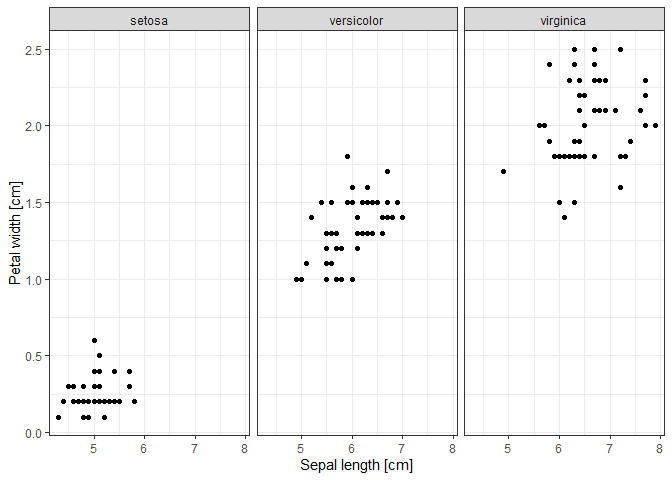<!-- -->

**standardisation** of **variables**

`y`: standardised petal width


(`Petal.Width`)

`x1`: standardised sepal length


(`Sepal.Length`)

`x2`: standardised sepal width


(`Sepal.Width`)

`x3`: standardised petal length


(`Petal.Length`)

`gp`: group index: `1` (`setosa`), `2` (`versicolor`), `3` (`virginica`)

``` r
Z <-
  scale(x = dat[, 1:4],
        center = TRUE,
        scale = TRUE) %>%
  magrittr::set_colnames(x = ., value = c("x1", "x2", "x3", "y")) %>%
  tibble::as_tibble(x = .)
head(x = Z)
```

    ## # A tibble: 6 × 4
    ##       x1      x2    x3     y
    ##    <dbl>   <dbl> <dbl> <dbl>
    ## 1 -0.898  1.02   -1.34 -1.31
    ## 2 -1.14  -0.132  -1.34 -1.31
    ## 3 -1.38   0.327  -1.39 -1.31
    ## 4 -1.50   0.0979 -1.28 -1.31
    ## 5 -1.02   1.25   -1.34 -1.31
    ## 6 -0.535  1.93   -1.17 -1.05

**design matrix**

``` r
X <-
  unname(stats::model.matrix(object = y ~ 1 + x1 + x2 + x3,
                             data = Z))
attr(x = X, which = "assign") <- NULL
head(x = X)
```

    ##      [,1]       [,2]        [,3]      [,4]
    ## [1,]    1 -0.8976739  1.01560199 -1.335752
    ## [2,]    1 -1.1392005 -0.13153881 -1.335752
    ## [3,]    1 -1.3807271  0.32731751 -1.392399
    ## [4,]    1 -1.5014904  0.09788935 -1.279104
    ## [5,]    1 -1.0184372  1.24503015 -1.335752
    ## [6,]    1 -0.5353840  1.93331463 -1.165809

data list for Stan simulation

``` r
dataList <-
  list(
    N = nrow(x = X),
    M = ncol(x = X),
    K = length(x = unique(x = dat$gp)),
    L = 1L,
    u = matrix(
      data = rep(1.0, length(x = unique(x = dat$gp))),
      nrow = length(x = unique(x = dat$gp)),
      ncol = 1L
    ),
    X = X,
    y = as.numeric(x = Z$y),
    gp = dat$gp
  )
rm(dat, X, Z)
```

### 4.1.2 Statistical model

**model parameters**
![\boldsymbol{\gamma}\_{\boldsymbol{\beta}}\[gp\]](https://latex.codecogs.com/png.image?%5Cdpi%7B110%7D&space;%5Cbg_white&space;%5Cboldsymbol%7B%5Cgamma%7D_%7B%5Cboldsymbol%7B%5Cbeta%7D%7D%5Bgp%5D "\boldsymbol{\gamma}_{\boldsymbol{\beta}}[gp]"),
![\boldsymbol{\sigma}\_{\boldsymbol{\beta}}\[gp\]](https://latex.codecogs.com/png.image?%5Cdpi%7B110%7D&space;%5Cbg_white&space;%5Cboldsymbol%7B%5Csigma%7D_%7B%5Cboldsymbol%7B%5Cbeta%7D%7D%5Bgp%5D "\boldsymbol{\sigma}_{\boldsymbol{\beta}}[gp]"),
,
![\boldsymbol{z}\_{\boldsymbol{\beta}}\[gp\]](https://latex.codecogs.com/png.image?%5Cdpi%7B110%7D&space;%5Cbg_white&space;%5Cboldsymbol%7Bz%7D_%7B%5Cboldsymbol%7B%5Cbeta%7D%7D%5Bgp%5D "\boldsymbol{z}_{\boldsymbol{\beta}}[gp]")
and
.


, I (


, ^{2})  , ^{2} := (.\| , ,


, I) = \]


:= (.\| , , ^{2},


, I) =


,


\]


= *{}


 + (*{}


), *{*{}}, *{}


\]


\|^{2}, I (0, 1)  , .*{}


\|^{2}, I (1)  , .*{*{}} \|^{2}, I (2)  , .\*{}


\|^{2}, I (0, 1)  , .\| I (1) \]

### 4.1.3 Fitting a Stan model: Gauß likelihood and adaptive priors (non-centred parametrisation)

``` r
stanLinRegNormVarying <-
  rstan::stan(
    file = "linRegNormVarying.stan",
    data = dataList,
    chains = 4,
    iter = 2000,
    warmup = 1000,
    thin = 1,
    init = "random",
    algorithm = "NUTS",
    control = list(adapt_delta = 0.99,
                   max_treedepth = 15),
    cores = 3
  )
```

See also the Stan User’s Guide (Version 2.30), Sec. 1.13, URL (cited on
August 20, 2022):
<https://mc-stan.org/docs/stan-users-guide/multivariate-hierarchical-priors.html>.

### 4.1.4 HMC diagnostics

``` r
rstan::check_hmc_diagnostics(object = stanLinRegNormVarying)
```

    ## 
    ## Divergences:

    ## 0 of 4000 iterations ended with a divergence.

    ## 
    ## Tree depth:

    ## 0 of 4000 iterations saturated the maximum tree depth of 15.

    ## 
    ## Energy:

    ## E-BFMI indicated no pathological behavior.

``` r
rstan::stan_trace(
  object = stanLinRegNormVarying,
  pars = c("beta", "R_beta", "sigma", "lp__"),
  inc_warmup = TRUE
)
```

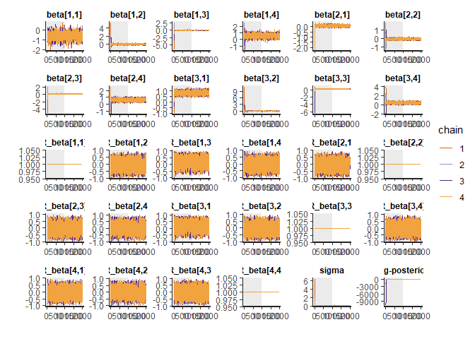<!-- -->

### 4.1.5 Summary of posterior marginal probability distributions for model parameters

**No** densities displayed for reasons of space.

``` r
print(
  x = stanLinRegNormVarying,
  pars = c("beta", "R_beta", "sigma", "lp__"),
  probs = c(0.015, 0.25, 0.50, 0.75, 0.985)
)
```

    ## Inference for Stan model: anon_model.
    ## 4 chains, each with iter=2000; warmup=1000; thin=1; 
    ## post-warmup draws per chain=1000, total post-warmup draws=4000.
    ## 
    ##               mean se_mean   sd   1.5%    25%    50%    75% 98.5% n_eff Rhat
    ## beta[1,1]    -0.56    0.00 0.30  -1.25  -0.75  -0.55  -0.37  0.08  4812    1
    ## beta[1,2]    -0.02    0.00 0.09  -0.18  -0.08  -0.02   0.04  0.21  3374    1
    ## beta[1,3]     0.04    0.00 0.05  -0.07   0.01   0.04   0.07  0.14  3343    1
    ## beta[1,4]     0.57    0.00 0.22   0.05   0.42   0.57   0.71  1.05  5060    1
    ## beta[2,1]     0.08    0.00 0.07  -0.06   0.04   0.08   0.13  0.23  4695    1
    ## beta[2,2]    -0.06    0.00 0.06  -0.20  -0.10  -0.06  -0.02  0.08  4994    1
    ## beta[2,3]     0.14    0.00 0.05   0.03   0.10   0.14   0.17  0.24  4728    1
    ## beta[2,4]     0.63    0.00 0.15   0.30   0.52   0.62   0.73  0.98  4719    1
    ## beta[3,1]     0.79    0.00 0.13   0.51   0.70   0.78   0.87  1.09  3476    1
    ## beta[3,2]    -0.11    0.00 0.07  -0.27  -0.16  -0.11  -0.06  0.03  4032    1
    ## beta[3,3]     0.23    0.00 0.05   0.13   0.20   0.23   0.26  0.33  4059    1
    ## beta[3,4]     0.43    0.00 0.16   0.06   0.32   0.44   0.55  0.78  3637    1
    ## R_beta[1,1]   1.00     NaN 0.00   1.00   1.00   1.00   1.00  1.00   NaN  NaN
    ## R_beta[1,2]  -0.09    0.01 0.38  -0.81  -0.37  -0.11   0.18  0.70  4385    1
    ## R_beta[1,3]   0.18    0.01 0.36  -0.61  -0.07   0.20   0.46  0.85  4023    1
    ## R_beta[1,4]  -0.05    0.01 0.37  -0.78  -0.33  -0.06   0.21  0.71  4647    1
    ## R_beta[2,1]  -0.09    0.01 0.38  -0.81  -0.37  -0.11   0.18  0.70  4385    1
    ## R_beta[2,2]   1.00    0.00 0.00   1.00   1.00   1.00   1.00  1.00  3855    1
    ## R_beta[2,3]  -0.08    0.01 0.39  -0.80  -0.37  -0.10   0.21  0.73  3368    1
    ## R_beta[2,4]   0.01    0.01 0.38  -0.76  -0.27   0.01   0.28  0.77  4027    1
    ## R_beta[3,1]   0.18    0.01 0.36  -0.61  -0.07   0.20   0.46  0.85  4023    1
    ## R_beta[3,2]  -0.08    0.01 0.39  -0.80  -0.37  -0.10   0.21  0.73  3368    1
    ## R_beta[3,3]   1.00    0.00 0.00   1.00   1.00   1.00   1.00  1.00  3838    1
    ## R_beta[3,4]  -0.05    0.01 0.38  -0.78  -0.34  -0.07   0.23  0.73  3871    1
    ## R_beta[4,1]  -0.05    0.01 0.37  -0.78  -0.33  -0.06   0.21  0.71  4647    1
    ## R_beta[4,2]   0.01    0.01 0.38  -0.76  -0.27   0.01   0.28  0.77  4027    1
    ## R_beta[4,3]  -0.05    0.01 0.38  -0.78  -0.34  -0.07   0.23  0.73  3871    1
    ## R_beta[4,4]   1.00    0.00 0.00   1.00   1.00   1.00   1.00  1.00  1682    1
    ## sigma         0.21    0.00 0.01   0.19   0.20   0.21   0.22  0.24  5232    1
    ## lp__        -13.21    0.13 4.27 -23.70 -15.86 -12.90 -10.21 -5.19  1110    1
    ## 
    ## Samples were drawn using NUTS(diag_e) at Tue Aug 30 00:09:48 2022.
    ## For each parameter, n_eff is a crude measure of effective sample size,
    ## and Rhat is the potential scale reduction factor on split chains (at 
    ## convergence, Rhat=1).

``` r
rstan::stan_plot(
  object = stanLinRegNormVarying,
  pars = c("beta", "sigma"),
  ci_level = 0.89,
  outer_level = 0.97
)
```

    ## ci_level: 0.89 (89% intervals)

    ## outer_level: 0.97 (97% intervals)

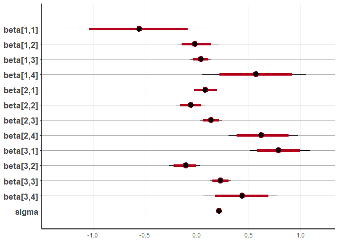<!-- -->

``` r
rstan::stan_plot(
  object = stanLinRegNormVarying,
  pars = c("R_beta"),
  ci_level = 0.89,
  outer_level = 0.97
)
```

    ## ci_level: 0.89 (89% intervals)
    ## outer_level: 0.97 (97% intervals)

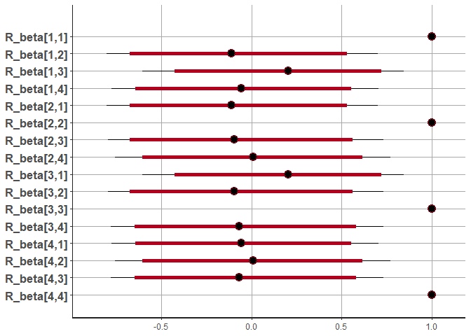<!-- -->

### 4.1.6 Posterior predictive checks

``` r
draws <-
  as.matrix(x = stanLinRegNormVarying,
            pars = "yrep")

bayesplot::ppc_dens_overlay(y = dataList$y,
                            yrep = draws[501:600, ]) +
  ggplot2::labs(
    title = paste0(
      "Posterior predictive distribution ",
      "(re-using predictor data)"
    ),
    subtitle = "Empirical density overlaid with 100 HMC samples"
  ) +
  ggplot2::xlab(label = "Standardised y [1]") +
  ggplot2::ylab(label = "Density [1]") +
  ggplot2::theme_bw()
```

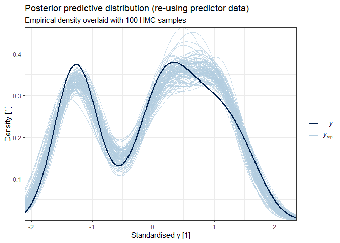<!-- -->

``` r
bayesplot::ppc_intervals_grouped(
  y = dataList$y,
  yrep = draws,
  group = dataList$gp,
  prob = 0.89,
  prob_outer = 0.97,
  size = 1,
  fatten = 3
) +
  ggplot2::labs(
    title = paste0(
      "Posterior predictive compatibility intervals ",
      "(re-using predictor data)"
    ),
    subtitle = "Data points overlaid with interval estimates"
  ) +
  ggplot2::xlab(label = "Sample number") +
  ggplot2::ylab(label = "Standardised y [1]") +
  ggplot2::theme_bw()
```

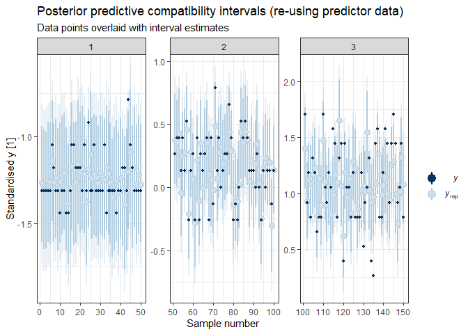<!-- -->

### 4.1.7 Pareto-smoothed importance-sampling leave-one-out cross-validation (PSIS-LOO)

``` r
looLinRegNormVarying <-
  loo::loo(x = stanLinRegNormVarying,
           pars = "log_lik")
```

    ## Warning: Some Pareto k diagnostic values are slightly high. See help('pareto-k-diagnostic') for details.

``` r
print(x = looLinRegNormVarying)
```

    ## 
    ## Computed from 4000 by 150 log-likelihood matrix
    ## 
    ##          Estimate   SE
    ## elpd_loo     13.3 11.1
    ## p_loo        12.5  2.2
    ## looic       -26.6 22.2
    ## ------
    ## Monte Carlo SE of elpd_loo is 0.1.
    ## 
    ## Pareto k diagnostic values:
    ##                          Count Pct.    Min. n_eff
    ## (-Inf, 0.5]   (good)     148   98.7%   797       
    ##  (0.5, 0.7]   (ok)         2    1.3%   505       
    ##    (0.7, 1]   (bad)        0    0.0%   <NA>      
    ##    (1, Inf)   (very bad)   0    0.0%   <NA>      
    ## 
    ## All Pareto k estimates are ok (k < 0.7).
    ## See help('pareto-k-diagnostic') for details.

``` r
plot(x = looLinRegNormVarying,
     label_points = TRUE)
```

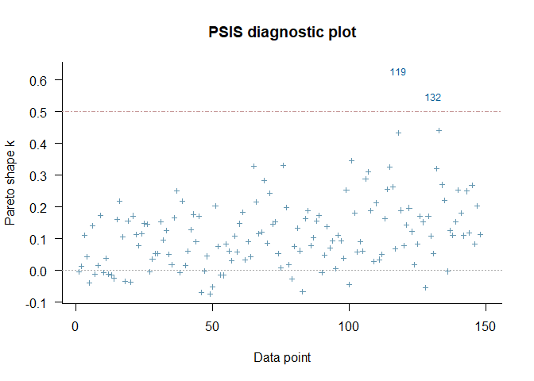<!-- -->

### 4.1.8 Remarks

clear data

``` r
rm(dataList, draws, stanLinRegNormVarying, looLinRegNormVarying)
```

## 4.2 Multi-level ANOVA-like regression

### 4.2.1 Data and visualisation

**data set** `massMonitoring.csv` and **variables**, as in Sec. … above.

``` r
dat <-
  utils::read.csv(file = "massMonitoring.csv") %>%
  tibble::as_tibble(x = .)
any(is.na(x = dat))
```

    ## [1] FALSE

``` r
dim(x = dat)
```

    ## [1] 252   2

``` r
head(x = dat)
```

    ## # A tibble: 6 × 2
    ##      X1    X2
    ##   <dbl> <int>
    ## 1  91.8     1
    ## 2  92       1
    ## 3  92.2     1
    ## 4  91       1
    ## 5  92.5     1
    ## 6  91.8     1

data list for Stan simulation

``` r
dataList <-
  list(
    N = as.integer(x = nrow(x = dat)),
    K = length(x = unique(x = dat$X2)),
    gp = dat$X2,
    y = dat$X1
  )
rm(dat)
```

### 4.2.2 Statistical model

**model parameters**
![\boldsymbol{\mu}\[gp\]](https://latex.codecogs.com/png.image?%5Cdpi%7B110%7D&space;%5Cbg_white&space;%5Cboldsymbol%7B%5Cmu%7D%5Bgp%5D "\boldsymbol{\mu}[gp]")
and
![\boldsymbol{\sigma}\[gp\]](https://latex.codecogs.com/png.image?%5Cdpi%7B110%7D&space;%5Cbg_white&space;%5Cboldsymbol%7B%5Csigma%7D%5Bgp%5D "\boldsymbol{\sigma}[gp]")


, I (


, ^{2}


) \]


(*{}, *{}^{2})  ,


(\*{}) \]

\^{2})  , `\qquad`{=tex}
`\sigma`{=tex}*{`\mu`{=tex}} `\sim `{=tex}`\mathrm{Exp}`{=tex}(1)  ,
`\qquad`{=tex} `\beta`{=tex}*{`\sigma`{=tex}}
`\sim `{=tex}`\mathrm{Exp}`{=tex}(1)")

### 4.2.3 Fitting a Stan model: Gauß likelihood, inhomogeneous variances and adaptive priors

``` r
stanAnovaRegNormVarying <-
  rstan::stan(
    file = "anovaRegNormVarying.stan",
    data = dataList,
    chains = 4,
    iter = 2000,
    warmup = 1000,
    thin = 1,
    init = "random",
    algorithm = "NUTS",
    control = list(adapt_delta = 0.99,
                   max_treedepth = 15),
    cores = 3
  )
```

### 4.2.4 HMC diagnostics

``` r
rstan::check_hmc_diagnostics(object = stanAnovaRegNormVarying)
```

    ## 
    ## Divergences:

    ## 0 of 4000 iterations ended with a divergence.

    ## 
    ## Tree depth:

    ## 0 of 4000 iterations saturated the maximum tree depth of 15.

    ## 
    ## Energy:

    ## E-BFMI indicated no pathological behavior.

``` r
rstan::stan_trace(
  object = stanAnovaRegNormVarying,
  pars = c("mu", "sigma", "lp__"),
  inc_warmup = TRUE
)
```

<!-- -->

### 4.2.5 Summary of posterior marginal probability distributions for model parameters

``` r
print(
  x = stanAnovaRegNormVarying,
  pars = c("mu", "sigma", "lp__"),
  probs = c(0.015, 0.25, 0.50, 0.75, 0.985)
)
```

    ## Inference for Stan model: anon_model.
    ## 4 chains, each with iter=2000; warmup=1000; thin=1; 
    ## post-warmup draws per chain=1000, total post-warmup draws=4000.
    ## 
    ##             mean se_mean   sd    1.5%     25%     50%     75%   98.5% n_eff
    ## mu[1]      91.49    0.00 0.16   91.15   91.39   91.49   91.60   91.84  4490
    ## mu[2]      90.90    0.00 0.16   90.55   90.78   90.90   91.01   91.25  4602
    ## mu[3]      88.72    0.00 0.11   88.49   88.65   88.72   88.80   88.97  5036
    ## mu[4]      89.45    0.00 0.11   89.20   89.37   89.45   89.53   89.69  4626
    ## sigma[1]    1.21    0.00 0.11    0.99    1.13    1.20    1.28    1.47  4120
    ## sigma[2]    1.32    0.00 0.12    1.09    1.24    1.31    1.39    1.61  4851
    ## sigma[3]    0.88    0.00 0.08    0.72    0.82    0.87    0.93    1.07  4377
    ## sigma[4]    0.90    0.00 0.08    0.74    0.84    0.89    0.95    1.10  4014
    ## lp__     -385.74    0.06 2.40 -392.04 -387.07 -385.43 -384.02 -381.79  1716
    ##          Rhat
    ## mu[1]       1
    ## mu[2]       1
    ## mu[3]       1
    ## mu[4]       1
    ## sigma[1]    1
    ## sigma[2]    1
    ## sigma[3]    1
    ## sigma[4]    1
    ## lp__        1
    ## 
    ## Samples were drawn using NUTS(diag_e) at Tue Aug 30 00:17:34 2022.
    ## For each parameter, n_eff is a crude measure of effective sample size,
    ## and Rhat is the potential scale reduction factor on split chains (at 
    ## convergence, Rhat=1).

``` r
rstan::stan_plot(
  object = stanAnovaRegNormVarying,
  pars = c("mu"),
  ci_level = 0.89,
  outer_level = 0.97
)
```

    ## ci_level: 0.89 (89% intervals)

    ## outer_level: 0.97 (97% intervals)

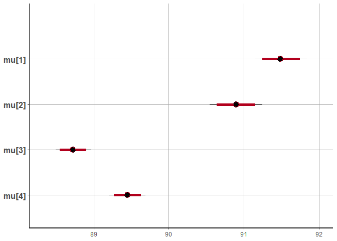<!-- -->

``` r
rstan::stan_plot(
  object = stanAnovaRegNormVarying,
  pars = c("sigma"),
  ci_level = 0.89,
  outer_level = 0.97
)
```

    ## ci_level: 0.89 (89% intervals)
    ## outer_level: 0.97 (97% intervals)

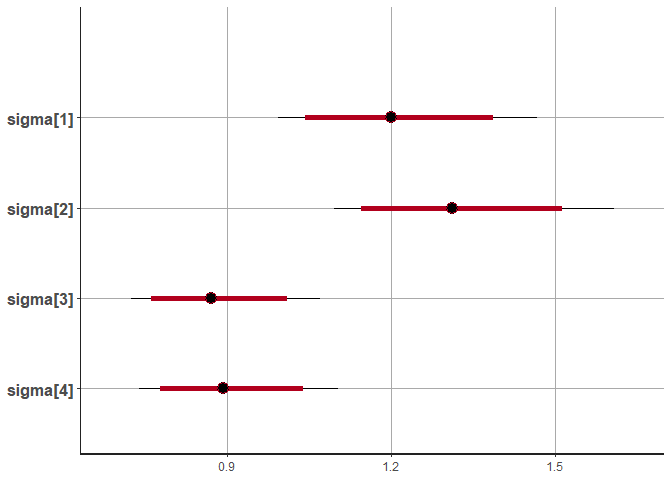<!-- -->

``` r
rstan::stan_dens(object = stanAnovaRegNormVarying,
                 pars = c("mu", "sigma", "lp__"))
```

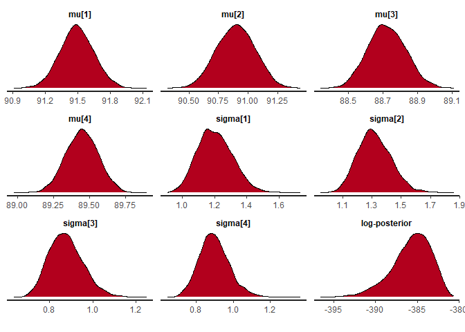<!-- -->

### 4.2.6 Posterior predictive checks

``` r
draws <-
  as.matrix(x = stanAnovaRegNormVarying,
            pars = "yrep")

bayesplot::ppc_dens_overlay(y = dataList$y,
                            yrep = draws[501:600,]) +
  ggplot2::labs(
    title = paste0(
      "Posterior predictive distribution ",
      "(re-using predictor data)"
    ),
    subtitle = "Empirical density overlaid with 100 HMC samples"
  ) +
  ggplot2::xlab(label = "y [kg]") +
  ggplot2::ylab(label = "Density [1/kg]") +
  ggplot2::theme_bw()
```

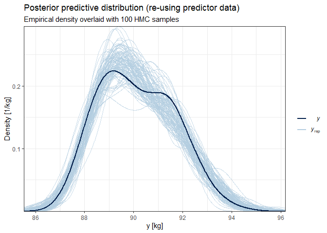<!-- -->

``` r
bayesplot::ppc_intervals_grouped(
  y = dataList$y,
  yrep = draws,
  group = dataList$gp,
  prob = 0.89,
  prob_outer = 0.97,
  size = 1,
  fatten = 3
) +
  ggplot2::labs(
    title = paste0(
      "Posterior predictive compatibility intervals ",
      "(re-using predictor data)"
    ),
    subtitle = "Data points overlaid with interval estimates"
  ) +
  ggplot2::xlab(label = "Sample number") +
  ggplot2::ylab(label = "y [kg]") +
  ggplot2::theme_bw()
```

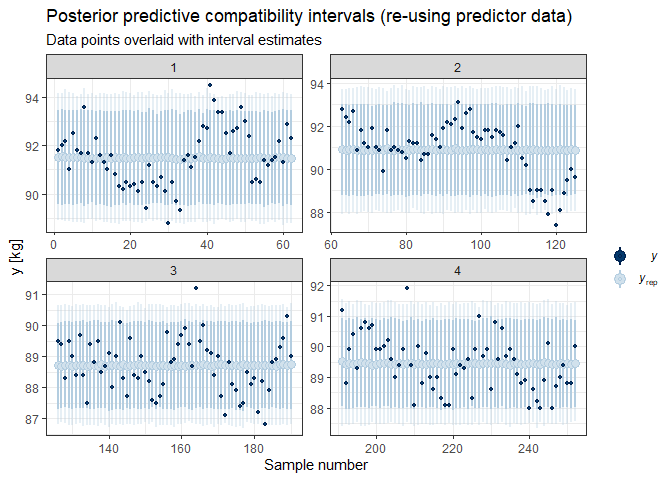<!-- -->

### 4.2.7 Pareto-smoothed importance-sampling leave-one-out cross-validation (PSIS-LOO)

``` r
looAnovaRegNormVarying <-
  loo::loo(x = stanAnovaRegNormVarying,
           pars = "log_lik")
print(x = looAnovaRegNormVarying)
```

    ## 
    ## Computed from 4000 by 252 log-likelihood matrix
    ## 
    ##          Estimate   SE
    ## elpd_loo   -374.4 11.5
    ## p_loo         7.7  1.0
    ## looic       748.7 22.9
    ## ------
    ## Monte Carlo SE of elpd_loo is 0.0.
    ## 
    ## All Pareto k estimates are good (k < 0.5).
    ## See help('pareto-k-diagnostic') for details.

``` r
plot(x = looAnovaRegNormVarying,
     label_points = TRUE)
```

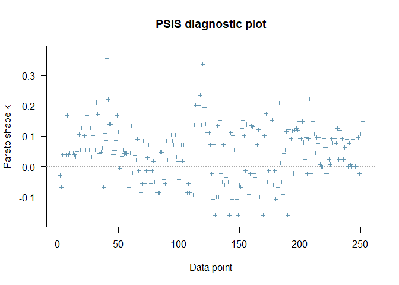<!-- -->

### 4.2.8 Remarks

clear data

``` r
rm(dataList, draws, stanAnovaRegNormVarying, looLinRegNormVarying)
```

    ## Warning in rm(dataList, draws, stanAnovaRegNormVarying, looLinRegNormVarying):
    ## Objekt 'looLinRegNormVarying' nicht gefunden

## 4.3 Multi-level logistic regression

### 4.3.1 Data and visualisation

**data set** `bankloan.RData` (IBM SPSS tutorial binary logistic
regression), URL (cited on August 21, 2022):
<https://www.ibm.com/support/knowledgecenter/en/SSLVMB_sub/statistics_casestudies_project_ddita/spss/tutorials/log_bankloan_intro.html>.

``` r
load("bankloan.RData")
attach(what = bankloan)
any(is.na(x = bankloan)) # Checking for missing values in the data matrix
```

    ## [1] TRUE

``` r
dat <-
  stats::na.omit(object = bankloan) %>% # Delete cases with missing values
  tibble::as_tibble(x = .)
rm(bankloan)
dim(x = dat)
```

    ## [1] 700  10

``` r
head(x = dat)
```

    ## # A tibble: 6 × 10
    ##     age         ed employ address income debtinc credd…¹ othdebt default train…²
    ##   <dbl>  <dbl+lbl>  <dbl>   <dbl>  <dbl>   <dbl>   <dbl>   <dbl> <dbl+l>   <dbl>
    ## 1    41 3 [Some c…     17      12    176     9.3  11.4     5.01  1 [Yes]       0
    ## 2    27 1 [Did no…     10       6     31    17.3   1.36    4.00  0 [No]        1
    ## 3    40 1 [Did no…     15      14     55     5.5   0.856   2.17  0 [No]        0
    ## 4    41 1 [Did no…     15      14    120     2.9   2.66    0.821 0 [No]        1
    ## 5    24 2 [High s…      2       0     28    17.3   1.79    3.06  1 [Yes]       1
    ## 6    41 2 [High s…      5       5     25    10.2   0.393   2.16  0 [No]        1
    ## # … with abbreviated variable names ¹​creddebt, ²​trainingSet

**standardisation** of **variables**

`y`: indicator of previous defaults: {0, 1} (`default`)

`x1`: standardised age


(`age`)

`x2`: standardised years with current employer


(`employ`)

`x3`: standardised years at current address


(`address`)

`x4`: standardised household income


(`income`)

`x5`: standardised debt to income ratio


(`debtinc`)

`x6`: standardised credit card debt


(`creddebt`)

`x7`: standardised other debt


(`othdebt`)

`gp`: level of education: “did not complete high school” (`1`), “high
school degree” (`2`), “some college” (`3`), “college degree” (`4`),
“doctorate” (`5`) (`ed`)

``` r
Z <-
  scale(x = dat[, c(1, 3:8)],
        center = TRUE,
        scale = TRUE) %>%
  magrittr::set_colnames(x = .,
                         value = c("x1", "x2", "x3", "x4", "x5",
                                   "x6", "x7")) %>%
  tibble::as_tibble(x = .)
head(x = Z)
```

    ## # A tibble: 6 × 7
    ##       x1     x2     x3     x4       x5      x6        x7
    ##    <dbl>  <dbl>  <dbl>  <dbl>    <dbl>   <dbl>     <dbl>
    ## 1  0.768  1.29   0.545  3.54  -0.141    4.63    0.593   
    ## 2 -0.983  0.242 -0.334 -0.397  1.03    -0.0904  0.287   
    ## 3  0.643  0.993  0.838  0.255 -0.697   -0.329  -0.271   
    ## 4  0.768  0.993  0.838  2.02  -1.08     0.522  -0.680   
    ## 5 -1.36  -0.960 -1.21  -0.478  1.03     0.110  -0.000500
    ## 6  0.768 -0.509 -0.480 -0.560 -0.00887 -0.548  -0.274

**design matrix**

``` r
X <-
  unname(stats::model.matrix(
    object = dat$default ~ 1 + x1 + x2 + x3 + x4 + x5 + x6 + x7,
    data = Z
  ))
attr(x = X, which = "assign") <- NULL
head(x = X)
```

    ##      [,1]       [,2]       [,3]       [,4]       [,5]         [,6]        [,7]
    ## [1,]    1  0.7677551  1.2933881  0.5452741  3.5420701 -0.140697021  4.63151952
    ## [2,]    1 -0.9828265  0.2420275 -0.3338627 -0.3966246  1.031080669 -0.09037932
    ## [3,]    1  0.6427135  0.9929994  0.8383197  0.2552973 -0.697291424 -0.32943454
    ## [4,]    1  0.7677551  0.9929994  0.8383197  2.0209190 -1.078119173  0.52199544
    ## [5,]    1 -1.3579511 -0.9595275 -1.2129994 -0.4781149  1.031080669  0.11046831
    ## [6,]    1  0.7677551 -0.5089444 -0.4803855 -0.5596051 -0.008872031 -0.54829703
    ##               [,8]
    ## [1,]  0.5932675400
    ## [2,]  0.2867144499
    ## [3,] -0.2705000338
    ## [4,] -0.6804232724
    ## [5,] -0.0005002537
    ## [6,] -0.2740360968

data list for Stan simulation

``` r
dataList <-
  list(
    N = nrow(x = X),
    M = ncol(x = X),
    K = length(x = unique(x = dat$ed)),
    L = 1L,
    u = matrix(
      data = rep(1.0, length(x = unique(x = dat$ed))),
      nrow = length(x = unique(x = dat$ed)),
      ncol = 1L
    ),
    X = X,
    y = as.integer(x = dat$default),
    gp = as.integer(x = dat$ed)
  )
rm(dat, X, Z)
```

### 4.3.2 Statistical model

**model parameters**
![\boldsymbol{\gamma}\_{\boldsymbol{\beta}}\[gp\]](https://latex.codecogs.com/png.image?%5Cdpi%7B110%7D&space;%5Cbg_white&space;%5Cboldsymbol%7B%5Cgamma%7D_%7B%5Cboldsymbol%7B%5Cbeta%7D%7D%5Bgp%5D "\boldsymbol{\gamma}_{\boldsymbol{\beta}}[gp]"),
![\boldsymbol{\sigma}\_{\boldsymbol{\beta}}\[gp\]](https://latex.codecogs.com/png.image?%5Cdpi%7B110%7D&space;%5Cbg_white&space;%5Cboldsymbol%7B%5Csigma%7D_%7B%5Cboldsymbol%7B%5Cbeta%7D%7D%5Bgp%5D "\boldsymbol{\sigma}_{\boldsymbol{\beta}}[gp]"),

and
![\boldsymbol{z}\_{\boldsymbol{\beta}}\[gp\]](https://latex.codecogs.com/png.image?%5Cdpi%7B110%7D&space;%5Cbg_white&space;%5Cboldsymbol%7Bz%7D_%7B%5Cboldsymbol%7B%5Cbeta%7D%7D%5Bgp%5D "\boldsymbol{z}_{\boldsymbol{\beta}}[gp]").


, I (p


) \]

\[gp")

:= ()


=


,


\]


= *{}


 + (*{}


), *{*{}}, *{}


\]


\| I (0, 1)  , .*{}


\| I (1)  , .*{*{}}\| I (2)  , .\*{}


\| I (0, 1) \]

### 4.3.3 Fitting a Stan model: Bernoulli likelihood with logit link and adaptive priors (non-centred parametrisation)

``` r
stanLogistRegBernVarying <-
  rstan::stan(
    file = "logistRegBernVarying.stan",
    data = dataList,
    chains = 4,
    iter = 2000,
    warmup = 1000,
    thin = 1,
    init = "random",
    algorithm = "NUTS",
    control = list(adapt_delta = 0.99,
                   max_treedepth = 15),
    cores = 3
  )
```

See also the Stan User’s Guide (Version 2.30), Secs. 1.9 and 1.13, URLs
(cited on August 21, 2022):
<https://mc-stan.org/docs/stan-users-guide/hierarchical-logistic-regression.html>,
<https://mc-stan.org/docs/stan-users-guide/multivariate-hierarchical-priors.html>.

### 4.3.4 HMC diagnostics

``` r
rstan::check_hmc_diagnostics(object = stanLogistRegBernVarying)
```

    ## 
    ## Divergences:

    ## 0 of 4000 iterations ended with a divergence.

    ## 
    ## Tree depth:

    ## 0 of 4000 iterations saturated the maximum tree depth of 15.

    ## 
    ## Energy:

    ## E-BFMI indicated no pathological behavior.

``` r
rstan::stan_trace(
  object = stanLogistRegBernVarying,
  pars = c("beta", "lp__"),
  inc_warmup = TRUE
)
```

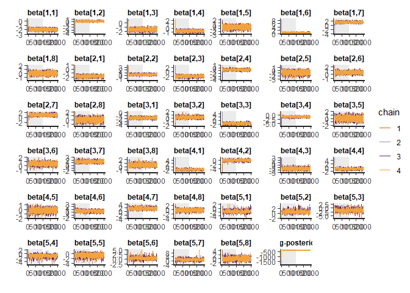<!-- -->

### 4.3.5 Summary of posterior marginal probability distributions for model parameters

**No** densities displayed for reasons of space.

``` r
print(
  x = stanLogistRegBernVarying,
  pars = c("beta", "lp__"),
  probs = c(0.015, 0.25, 0.50, 0.75, 0.985)
)
```

    ## Inference for Stan model: anon_model.
    ## 4 chains, each with iter=2000; warmup=1000; thin=1; 
    ## post-warmup draws per chain=1000, total post-warmup draws=4000.
    ## 
    ##              mean se_mean   sd    1.5%     25%     50%     75%   98.5% n_eff
    ## beta[1,1]   -1.86    0.00 0.19   -2.33   -1.98   -1.85   -1.73   -1.48  4065
    ## beta[1,2]    0.21    0.00 0.16   -0.16    0.10    0.22    0.33    0.56  5072
    ## beta[1,3]   -1.60    0.00 0.25   -2.15   -1.77   -1.60   -1.43   -1.04  4808
    ## beta[1,4]   -0.66    0.00 0.19   -1.06   -0.78   -0.66   -0.54   -0.25  4781
    ## beta[1,5]   -0.38    0.01 0.44   -1.45   -0.66   -0.37   -0.08    0.54  3083
    ## beta[1,6]    0.52    0.00 0.22    0.03    0.37    0.52    0.66    1.01  3835
    ## beta[1,7]    1.46    0.00 0.30    0.86    1.25    1.45    1.65    2.16  3662
    ## beta[1,8]    0.06    0.01 0.34   -0.70   -0.16    0.06    0.28    0.77  3301
    ## beta[2,1]   -1.76    0.00 0.21   -2.24   -1.90   -1.76   -1.63   -1.32  4055
    ## beta[2,2]    0.33    0.00 0.21   -0.10    0.18    0.32    0.46    0.84  4437
    ## beta[2,3]   -1.82    0.01 0.33   -2.64   -2.02   -1.79   -1.59   -1.20  3773
    ## beta[2,4]   -0.65    0.00 0.23   -1.14   -0.80   -0.66   -0.51   -0.12  4989
    ## beta[2,5]   -0.67    0.01 0.55   -2.07   -1.00   -0.61   -0.28    0.32  2525
    ## beta[2,6]    0.49    0.00 0.26   -0.08    0.32    0.50    0.66    1.07  3734
    ## beta[2,7]    1.12    0.01 0.35    0.31    0.90    1.14    1.36    1.82  3163
    ## beta[2,8]    0.10    0.01 0.38   -0.79   -0.14    0.10    0.35    0.93  2980
    ## beta[3,1]   -1.73    0.00 0.24   -2.24   -1.89   -1.74   -1.58   -1.16  3856
    ## beta[3,2]    0.30    0.00 0.24   -0.24    0.15    0.29    0.44    0.90  4892
    ## beta[3,3]   -1.62    0.00 0.33   -2.37   -1.83   -1.63   -1.42   -0.85  4515
    ## beta[3,4]   -0.89    0.01 0.31   -1.72   -1.06   -0.84   -0.67   -0.35  3836
    ## beta[3,5]   -0.05    0.01 0.48   -1.00   -0.37   -0.08    0.25    1.10  3828
    ## beta[3,6]    0.47    0.00 0.31   -0.25    0.28    0.48    0.66    1.14  3896
    ## beta[3,7]    1.38    0.01 0.32    0.71    1.17    1.37    1.59    2.14  4140
    ## beta[3,8]    0.43    0.01 0.36   -0.27    0.19    0.40    0.65    1.30  3668
    ## beta[4,1]   -1.79    0.00 0.29   -2.48   -1.95   -1.79   -1.62   -1.09  4336
    ## beta[4,2]    0.16    0.00 0.30   -0.66    0.02    0.19    0.35    0.74  3920
    ## beta[4,3]   -1.52    0.01 0.37   -2.26   -1.76   -1.55   -1.32   -0.54  3889
    ## beta[4,4]   -0.76    0.00 0.31   -1.58   -0.92   -0.73   -0.57   -0.06  4282
    ## beta[4,5]   -0.26    0.01 0.37   -1.05   -0.49   -0.26   -0.02    0.55  3835
    ## beta[4,6]    0.43    0.01 0.31   -0.33    0.24    0.43    0.62    1.06  3284
    ## beta[4,7]    1.50    0.01 0.46    0.66    1.21    1.45    1.74    2.80  3446
    ## beta[4,8]    0.06    0.01 0.43   -1.07   -0.17    0.10    0.34    0.91  3843
    ## beta[5,1]   -1.71    0.01 0.42   -2.56   -1.92   -1.75   -1.56   -0.52  3143
    ## beta[5,2]    0.38    0.01 0.39   -0.31    0.15    0.32    0.53    1.52  4027
    ## beta[5,3]   -1.55    0.01 0.59   -2.80   -1.85   -1.60   -1.33    0.16  2674
    ## beta[5,4]   -0.88    0.01 0.48   -2.33   -1.05   -0.79   -0.60   -0.07  3105
    ## beta[5,5]   -0.43    0.01 0.57   -1.96   -0.72   -0.36   -0.06    0.60  3609
    ## beta[5,6]    0.49    0.01 0.43   -0.56    0.28    0.49    0.70    1.55  3157
    ## beta[5,7]    1.28    0.01 0.65   -0.41    1.02    1.30    1.59    2.74  3110
    ## beta[5,8]    0.19    0.01 0.54   -1.17   -0.11    0.19    0.48    1.46  3548
    ## lp__      -370.54    0.21 7.39 -387.87 -375.20 -370.33 -365.48 -355.49  1266
    ##           Rhat
    ## beta[1,1]    1
    ## beta[1,2]    1
    ## beta[1,3]    1
    ## beta[1,4]    1
    ## beta[1,5]    1
    ## beta[1,6]    1
    ## beta[1,7]    1
    ## beta[1,8]    1
    ## beta[2,1]    1
    ## beta[2,2]    1
    ## beta[2,3]    1
    ## beta[2,4]    1
    ## beta[2,5]    1
    ## beta[2,6]    1
    ## beta[2,7]    1
    ## beta[2,8]    1
    ## beta[3,1]    1
    ## beta[3,2]    1
    ## beta[3,3]    1
    ## beta[3,4]    1
    ## beta[3,5]    1
    ## beta[3,6]    1
    ## beta[3,7]    1
    ## beta[3,8]    1
    ## beta[4,1]    1
    ## beta[4,2]    1
    ## beta[4,3]    1
    ## beta[4,4]    1
    ## beta[4,5]    1
    ## beta[4,6]    1
    ## beta[4,7]    1
    ## beta[4,8]    1
    ## beta[5,1]    1
    ## beta[5,2]    1
    ## beta[5,3]    1
    ## beta[5,4]    1
    ## beta[5,5]    1
    ## beta[5,6]    1
    ## beta[5,7]    1
    ## beta[5,8]    1
    ## lp__         1
    ## 
    ## Samples were drawn using NUTS(diag_e) at Tue Aug 30 00:36:41 2022.
    ## For each parameter, n_eff is a crude measure of effective sample size,
    ## and Rhat is the potential scale reduction factor on split chains (at 
    ## convergence, Rhat=1).

``` r
rstan::stan_plot(
  object = stanLogistRegBernVarying,
  pars = c("beta"),
  ci_level = 0.89,
  outer_level = 0.97
)
```

    ## ci_level: 0.89 (89% intervals)

    ## outer_level: 0.97 (97% intervals)

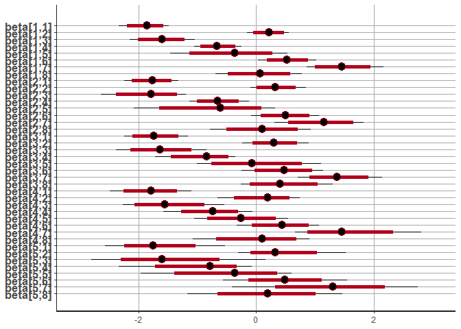<!-- -->

### 4.3.6 Posterior predictive checks

``` r
draws <-
  as.matrix(x = stanLogistRegBernVarying,
            pars = "yrep")

bayesplot::ppc_dens_overlay(y = dataList$y,
                            yrep = draws[501:600,]) +
  ggplot2::labs(
    title = paste0(
      "Posterior predictive distribution ",
      "(re-using predictor data)"
    ),
    subtitle = "Empirical density overlaid with 100 HMC samples"
  ) +
  ggplot2::xlab(label = "y [1]") +
  ggplot2::ylab(label = "Density [1]") +
  ggplot2::theme_bw()
```

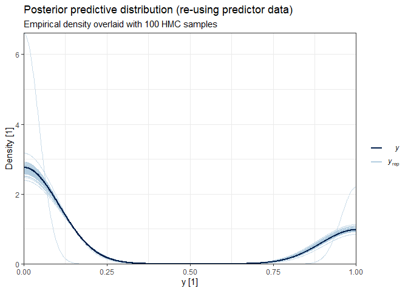<!-- -->

``` r
bayesplot::ppc_intervals_grouped(
  y = dataList$y,
  yrep = draws,
  group = dataList$gp,
  prob = 0.89,
  prob_outer = 0.97,
  size = 1,
  fatten = 3
) +
  ggplot2::labs(
    title = paste0(
      "Posterior predictive compatibility intervals ",
      "(re-using predictor data)"
    ),
    subtitle = "Data points overlaid with interval estimates"
  ) +
  ggplot2::xlab(label = "Sample number") +
  ggplot2::ylab(label = "y [1]") +
  ggplot2::theme_bw()
```

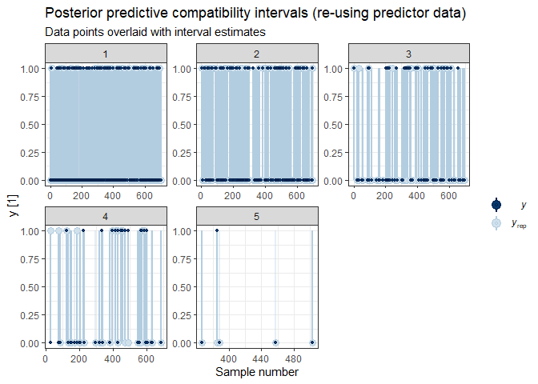<!-- -->

### 4.3.7 Pareto-smoothed importance-sampling leave-one-out cross-validation (PSIS-LOO)

``` r
looLogistRegBernVarying <-
  loo::loo(x = stanLogistRegBernVarying,
           pars = "log_lik")
```

    ## Warning: Some Pareto k diagnostic values are too high. See help('pareto-k-diagnostic') for details.

``` r
print(x = looLogistRegBernVarying)
```

    ## 
    ## Computed from 4000 by 700 log-likelihood matrix
    ## 
    ##          Estimate   SE
    ## elpd_loo   -285.4 14.7
    ## p_loo        16.9  1.4
    ## looic       570.9 29.3
    ## ------
    ## Monte Carlo SE of elpd_loo is NA.
    ## 
    ## Pareto k diagnostic values:
    ##                          Count Pct.    Min. n_eff
    ## (-Inf, 0.5]   (good)     692   98.9%   1306      
    ##  (0.5, 0.7]   (ok)         6    0.9%   2537      
    ##    (0.7, 1]   (bad)        2    0.3%   101       
    ##    (1, Inf)   (very bad)   0    0.0%   <NA>      
    ## See help('pareto-k-diagnostic') for details.

``` r
plot(x = looLogistRegBernVarying,
     label_points = TRUE)
```

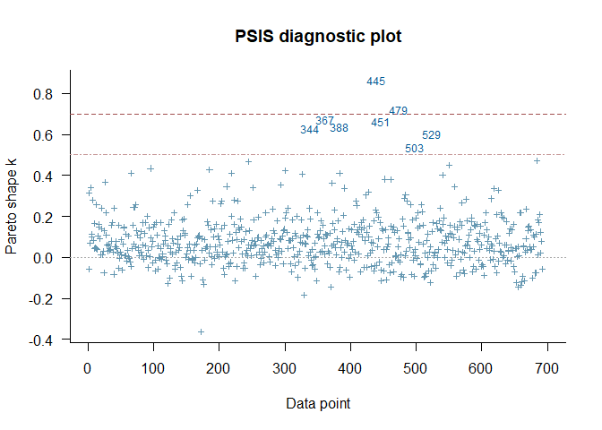<!-- -->

### 4.3.8 Remarks

clear data

``` r
rm(dataList, draws, stanLogistRegBernVarying, looLogistRegBernVarying)
```

## 4.4 Multi-level Poisson regression

### 4.4.1 Data and visualisation

**data set** `poissonData.RData` and **variables**, as in Sec. … above.

``` r
load("poissonData.RData")
attach(what = poissonData)
```

    ## Die folgenden Objekte sind maskiert von poissonData (pos = 6):
    ## 
    ##     gp, x1, x2, x3, y

``` r
any(is.na(x = poissonData)) # Checking for missing values in the data matrix
```

    ## [1] FALSE

``` r
dat <-
  stats::na.omit(object = poissonData) %>% # Delete cases with missing values
  tibble::as_tibble(x = .)
rm(poissonData)
dim(x = dat)
```

    ## [1] 82  5

``` r
head(x = dat)
```

    ## # A tibble: 6 × 5
    ##       y    x1    x2    x3    gp
    ##   <int> <dbl> <int> <int> <int>
    ## 1     2 13.0      1     1     5
    ## 2     1 17.2      1     1     5
    ## 3     0  7.48     1     1     6
    ## 4     2 10.1      1     1     6
    ## 5     1 12.2      1     1     6
    ## 6     2 14.0      1     1     6

**visualisation**

``` r
dat %>%
  ggplot2::ggplot(data = ., mapping = aes(x = y)) +
  ggplot2::geom_bar(mapping = aes(y = ..prop..),
                    stat = "count",
                    width = 0.1) +
  ggplot2::scale_x_continuous(
    name = "Count per 15 min observation interval [1]",
    breaks = seq(from = 0, to = 8, by = 1),
    labels = scales::number_format(
      accuracy = 1,
      big.mark = ".",
      decimal.mark = ","
    )
  ) +
  ggplot2::scale_y_continuous(
    name = "Relative frequency [1]",
    labels = scales::percent) +
  ggplot2::facet_wrap(facets = ~ gp) +
  ggplot2::theme_bw()
```

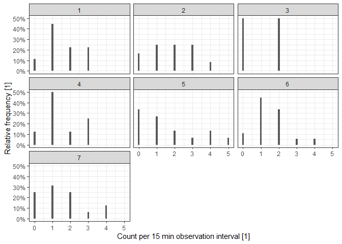<!-- -->

**standardisation**

``` r
Z <-
  scale(x = dat[, 2:4],
        center = TRUE,
        scale = TRUE) %>%
  magrittr::set_colnames(x = ., value = c("x1", "x2", "x3")) %>%
  tibble::as_tibble(x = .)
head(x = Z)
```

    ## # A tibble: 6 × 3
    ##       x1    x2    x3
    ##    <dbl> <dbl> <dbl>
    ## 1 -0.473 -1.48 -1.70
    ## 2  0.448 -1.48 -1.70
    ## 3 -1.69  -1.48 -1.70
    ## 4 -1.12  -1.48 -1.70
    ## 5 -0.656 -1.48 -1.70
    ## 6 -0.276 -1.48 -1.70

**design matrix**

``` r
X <-
  unname(stats::model.matrix(object = dat$y ~ 1 + x1 + x2 + x3,
                             data = Z))
attr(x = X, which = "assign") <- NULL
head(x = X)
```

    ##      [,1]       [,2]      [,3]      [,4]
    ## [1,]    1 -0.4729359 -1.479039 -1.697255
    ## [2,]    1  0.4478921 -1.479039 -1.697255
    ## [3,]    1 -1.6933985 -1.479039 -1.697255
    ## [4,]    1 -1.1197080 -1.479039 -1.697255
    ## [5,]    1 -0.6556399 -1.479039 -1.697255
    ## [6,]    1 -0.2756156 -1.479039 -1.697255

data list for Stan simulation

``` r
dataList <-
  list(
    N = nrow(x = X),
    M = ncol(x = X),
    K = length(x = unique(x = dat$gp)),
    L = 1L,
    u = matrix(
      data = rep(1.0, length(x = unique(x = dat$gp))),
      nrow = length(x = unique(x = dat$gp)),
      ncol = 1L
    ),
    X = X,
    y = as.integer(x = dat$y),
    gp = as.integer(x = dat$gp)
  )
rm(dat, X, Z)
```

### 4.4.2 Statistical model

**model parameters**
![\boldsymbol{\gamma}\_{\boldsymbol{\beta}}\[gp\]](https://latex.codecogs.com/png.image?%5Cdpi%7B110%7D&space;%5Cbg_white&space;%5Cboldsymbol%7B%5Cgamma%7D_%7B%5Cboldsymbol%7B%5Cbeta%7D%7D%5Bgp%5D "\boldsymbol{\gamma}_{\boldsymbol{\beta}}[gp]"),
![\boldsymbol{\sigma}\_{\boldsymbol{\beta}}\[gp\]](https://latex.codecogs.com/png.image?%5Cdpi%7B110%7D&space;%5Cbg_white&space;%5Cboldsymbol%7B%5Csigma%7D_%7B%5Cboldsymbol%7B%5Cbeta%7D%7D%5Bgp%5D "\boldsymbol{\sigma}_{\boldsymbol{\beta}}[gp]"),

and
![\boldsymbol{z}\_{\boldsymbol{\beta}}\[gp\]](https://latex.codecogs.com/png.image?%5Cdpi%7B110%7D&space;%5Cbg_white&space;%5Cboldsymbol%7Bz%7D_%7B%5Cboldsymbol%7B%5Cbeta%7D%7D%5Bgp%5D "\boldsymbol{z}_{\boldsymbol{\beta}}[gp]").


, I () \]

\[gp")

=


,


\]


= *{}


 + (*{}


), *{*{}}, *{}


\]


\| I (0, 1)  , .*{}


\| I (1)  , .*{*{}}\| I (2)  , .\*{}


\| I (0, 1) \]

### 4.4.3 Fitting a Stan model: Poisson likelihood with log link and adaptive priors (non-centred parametrisation)

``` r
stanPoisRegVarying <-
  rstan::stan(
    file = "poisRegVarying.stan",
    data = dataList,
    chains = 4,
    iter = 2000,
    warmup = 1000,
    thin = 1,
    init = "random",
    algorithm = "NUTS",
    control = list(adapt_delta = 0.99,
                   max_treedepth = 15),
    cores = 3
  )
```

### 4.4.4 HMC diagnostics

``` r
rstan::check_hmc_diagnostics(object = stanPoisRegVarying)
```

    ## 
    ## Divergences:

    ## 0 of 4000 iterations ended with a divergence.

    ## 
    ## Tree depth:

    ## 0 of 4000 iterations saturated the maximum tree depth of 15.

    ## 
    ## Energy:

    ## E-BFMI indicated no pathological behavior.

``` r
rstan::stan_trace(
  object = stanPoisRegVarying,
  pars = c("beta", "lp__"),
  inc_warmup = TRUE
)
```

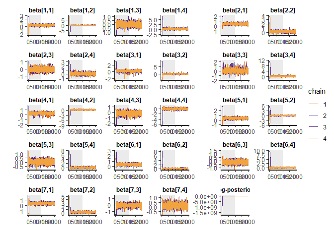<!-- -->

### 4.4.5 Summary of posterior marginal probability distributions for model parameters

**No** densities displayed for reasons of space.

``` r
print(
  x = stanPoisRegVarying,
  pars = c("beta", "lp__"),
  probs = c(0.015, 0.25, 0.50, 0.75, 0.985)
)
```

    ## Inference for Stan model: anon_model.
    ## 4 chains, each with iter=2000; warmup=1000; thin=1; 
    ## post-warmup draws per chain=1000, total post-warmup draws=4000.
    ## 
    ##              mean se_mean   sd    1.5%     25%     50%     75%   98.5% n_eff
    ## beta[1,1]    0.38    0.00 0.16    0.00    0.28    0.38    0.47    0.71  4432
    ## beta[1,2]    0.12    0.00 0.17   -0.33    0.02    0.13    0.22    0.46  4120
    ## beta[1,3]    0.00    0.00 0.22   -0.47   -0.15   -0.01    0.13    0.53  3884
    ## beta[1,4]    0.19    0.00 0.24   -0.29    0.03    0.17    0.34    0.78  3248
    ## beta[2,1]    0.42    0.00 0.14    0.11    0.33    0.41    0.50    0.76  5368
    ## beta[2,2]    0.18    0.00 0.16   -0.18    0.08    0.18    0.27    0.54  4289
    ## beta[2,3]   -0.05    0.00 0.22   -0.52   -0.19   -0.05    0.09    0.46  4272
    ## beta[2,4]    0.13    0.00 0.22   -0.36   -0.01    0.13    0.27    0.63  3549
    ## beta[3,1]    0.32    0.00 0.20   -0.26    0.24    0.35    0.44    0.66  3029
    ## beta[3,2]    0.16    0.00 0.18   -0.27    0.06    0.16    0.26    0.58  4206
    ## beta[3,3]    0.00    0.00 0.28   -0.59   -0.16   -0.01    0.14    0.76  3504
    ## beta[3,4]    0.16    0.00 0.26   -0.37    0.00    0.15    0.31    0.82  3947
    ## beta[4,1]    0.34    0.00 0.17   -0.14    0.25    0.36    0.44    0.64  3300
    ## beta[4,2]    0.17    0.00 0.14   -0.15    0.08    0.17    0.26    0.51  3756
    ## beta[4,3]   -0.14    0.00 0.26   -0.83   -0.29   -0.12    0.03    0.37  3359
    ## beta[4,4]    0.05    0.00 0.24   -0.52   -0.09    0.06    0.20    0.53  3405
    ## beta[5,1]    0.38    0.00 0.13    0.07    0.30    0.39    0.47    0.67  5137
    ## beta[5,2]    0.12    0.00 0.15   -0.25    0.03    0.13    0.22    0.43  4531
    ## beta[5,3]    0.02    0.00 0.20   -0.39   -0.11    0.02    0.15    0.46  3823
    ## beta[5,4]    0.15    0.00 0.22   -0.31    0.00    0.15    0.29    0.67  3776
    ## beta[6,1]    0.38    0.00 0.13    0.08    0.30    0.38    0.47    0.66  6539
    ## beta[6,2]    0.21    0.00 0.14   -0.07    0.12    0.20    0.29    0.53  4898
    ## beta[6,3]   -0.13    0.00 0.20   -0.60   -0.26   -0.12    0.01    0.30  4272
    ## beta[6,4]    0.09    0.00 0.19   -0.35   -0.04    0.09    0.21    0.49  4006
    ## beta[7,1]    0.39    0.00 0.13    0.09    0.31    0.39    0.47    0.67  6048
    ## beta[7,2]    0.19    0.00 0.15   -0.14    0.09    0.18    0.27    0.53  4850
    ## beta[7,3]   -0.06    0.00 0.22   -0.54   -0.19   -0.06    0.08    0.42  4014
    ## beta[7,4]    0.15    0.00 0.22   -0.32    0.01    0.14    0.29    0.66  3964
    ## lp__      -183.41    0.13 5.13 -195.74 -186.62 -183.20 -179.77 -173.35  1450
    ##           Rhat
    ## beta[1,1]    1
    ## beta[1,2]    1
    ## beta[1,3]    1
    ## beta[1,4]    1
    ## beta[2,1]    1
    ## beta[2,2]    1
    ## beta[2,3]    1
    ## beta[2,4]    1
    ## beta[3,1]    1
    ## beta[3,2]    1
    ## beta[3,3]    1
    ## beta[3,4]    1
    ## beta[4,1]    1
    ## beta[4,2]    1
    ## beta[4,3]    1
    ## beta[4,4]    1
    ## beta[5,1]    1
    ## beta[5,2]    1
    ## beta[5,3]    1
    ## beta[5,4]    1
    ## beta[6,1]    1
    ## beta[6,2]    1
    ## beta[6,3]    1
    ## beta[6,4]    1
    ## beta[7,1]    1
    ## beta[7,2]    1
    ## beta[7,3]    1
    ## beta[7,4]    1
    ## lp__         1
    ## 
    ## Samples were drawn using NUTS(diag_e) at Tue Aug 30 00:43:51 2022.
    ## For each parameter, n_eff is a crude measure of effective sample size,
    ## and Rhat is the potential scale reduction factor on split chains (at 
    ## convergence, Rhat=1).

``` r
rstan::stan_plot(
  object = stanPoisRegVarying,
  pars = c("beta"),
  ci_level = 0.89,
  outer_level = 0.97
)
```

    ## ci_level: 0.89 (89% intervals)

    ## outer_level: 0.97 (97% intervals)

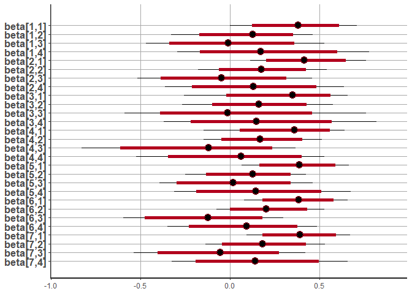<!-- -->

### 4.4.6 Posterior predictive checks

``` r
draws <-
  as.matrix(x = stanPoisRegVarying,
            pars = "yrep")

bayesplot::ppc_dens_overlay(y = dataList$y,
                            yrep = draws[501:600,]) +
  ggplot2::labs(
    title = paste0(
      "Posterior predictive distribution ",
      "(re-using predictor data)"
    ),
    subtitle = "Empirical density overlaid with 100 HMC samples"
  ) +
  ggplot2::ylab(label = "Density [1]") +
  ggplot2::scale_x_continuous(
    name = "y [1]",
    breaks = seq(from = 0, to = 8, by = 1),
    labels = scales::number_format(
      accuracy = 1,
      big.mark = ".",
      decimal.mark = ","
    )
  ) +
  ggplot2::theme_bw()
```

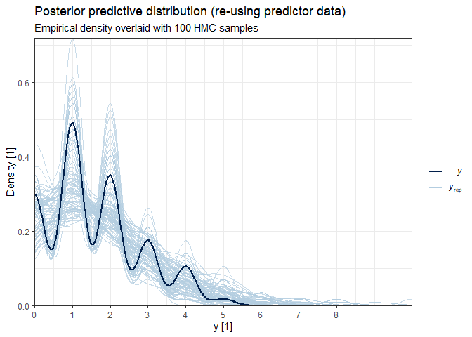<!-- -->

``` r
bayesplot::ppc_intervals_grouped(
  y = dataList$y,
  yrep = draws,
  group = dataList$g ,
  prob = 0.89,
  prob_outer = 0.97,
  size = 1,
  fatten = 3
) +
  ggplot2::labs(
    title = paste0(
      "Posterior predictive compatibility intervals ",
      "(re-using predictor data)"
    ),
    subtitle = "Data points overlaid with interval estimates"
  ) +
  ggplot2::xlab(label = "Sample number") +
  ggplot2::ylab(label = "y [1]") +
  ggplot2::theme_bw()
```

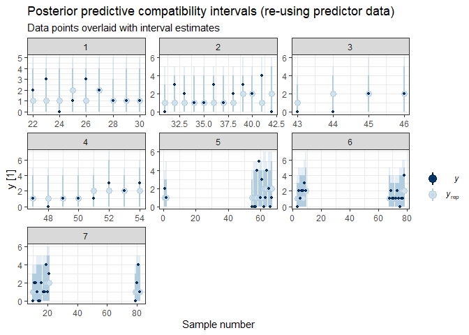<!-- -->

### 4.4.7 Pareto-smoothed importance-sampling leave-one-out cross-validation (PSIS-LOO)

``` r
looPoisRegVarying <-
  loo::loo(x = stanPoisRegVarying,
           pars = "log_lik")
```

    ## Warning: Some Pareto k diagnostic values are slightly high. See help('pareto-k-diagnostic') for details.

``` r
print(x = looPoisRegVarying)
```

    ## 
    ## Computed from 4000 by 82 log-likelihood matrix
    ## 
    ##          Estimate   SE
    ## elpd_loo   -132.5  5.9
    ## p_loo         8.7  1.3
    ## looic       265.0 11.9
    ## ------
    ## Monte Carlo SE of elpd_loo is 0.1.
    ## 
    ## Pareto k diagnostic values:
    ##                          Count Pct.    Min. n_eff
    ## (-Inf, 0.5]   (good)     76    92.7%   1458      
    ##  (0.5, 0.7]   (ok)        6     7.3%   566       
    ##    (0.7, 1]   (bad)       0     0.0%   <NA>      
    ##    (1, Inf)   (very bad)  0     0.0%   <NA>      
    ## 
    ## All Pareto k estimates are ok (k < 0.7).
    ## See help('pareto-k-diagnostic') for details.

``` r
plot(x = looPoisRegVarying,
     label_points = TRUE)
```

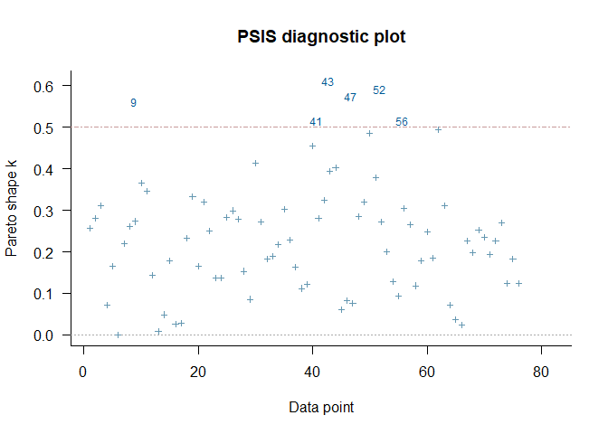<!-- -->

### 4.4.8 Remarks

clear data

``` r
rm(dataList, draws, stanPoisRegVarying, looPoisRegVarying)
```

## 4.5 Multi-level exponential regression

### 4.5.1 Data and visualisation

**data set** `tramWait.RData` and **variables**, as in Sec. … above.

``` r
load("tramWait.RData")
attach(what = tramWait)
```

    ## Die folgenden Objekte sind maskiert von tramWait (pos = 6):
    ## 
    ##     conductors, passChanged, tram, wait

``` r
any(is.na(x = tramWait)) # Checking for missing values in the data matrix
```

    ## [1] FALSE

``` r
dat <-
  stats::na.omit(object = tramWait) %>%  # Delete cases with missing values
  tibble::as_tibble(x = .)
rm(tramWait)
dim(x = dat)
```

    ## [1] 100   4

``` r
head(x = dat)
```

    ## # A tibble: 6 × 4
    ##    tram conductors passChanged  wait
    ##   <int>      <int>       <int> <dbl>
    ## 1     1          5         217  8.24
    ## 2     1          5         216  8.00
    ## 3     1          5         190  5.36
    ## 4     1          8         187  2.24
    ## 5     1          7         166  9.13
    ## 6     1          7         170  4.52

**visualisation** (variable `conductors` suppressed)

``` r
dat %>%
  ggplot2::ggplot(data = ., mapping = aes(x = passChanged, y = wait)) +
  ggplot2::geom_point() +
  ggplot2::facet_wrap(facets = ~ tram) +
  ggplot2::scale_x_continuous(name = "No. of passengers changing [1]") +
  ggplot2::scale_y_continuous(name = "Waiting time [min]") +
  ggplot2::theme_bw()
```

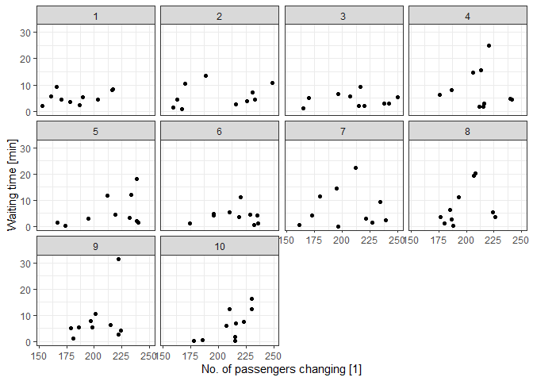<!-- -->

**standardisation** of data

``` r
Z <-
  scale(x = dat[, 2:3],
        center = TRUE,
        scale = TRUE) %>%
  magrittr::set_colnames(x = ., value = c("x1", "x2")) %>%
  tibble::as_tibble(x = .)
head(x = Z)
```

    ## # A tibble: 6 × 2
    ##       x1     x2
    ##    <dbl>  <dbl>
    ## 1 0.0896  0.475
    ## 2 0.0896  0.434
    ## 3 0.0896 -0.623
    ## 4 1.77   -0.745
    ## 5 1.21   -1.60 
    ## 6 1.21   -1.44

**design matrix**

``` r
X <-
  unname(stats::model.matrix(object = dat$wait ~ 1 + x1 + x2,
                             data = Z))
attr(x = X, which = "assign") <- NULL
head(x = X)
```

    ##      [,1]       [,2]       [,3]
    ## [1,]    1 0.08963533  0.4748407
    ## [2,]    1 0.08963533  0.4341865
    ## [3,]    1 0.08963533 -0.6228218
    ## [4,]    1 1.77029767 -0.7447843
    ## [5,]    1 1.21007689 -1.5985218
    ## [6,]    1 1.21007689 -1.4359051

data list for Stan simulation

``` r
dataList <-
  list(
    N = nrow(x = X),
    M = ncol(x = X),
    K = length(x = unique(x = dat$tram)),
    L = 1L,
    u = matrix(
      data = rep(1.0, length(x = unique(x = dat$tram))),
      nrow = length(x = unique(x = dat$tram)),
      ncol = 1L
    ),
    X = X,
    y = dat$wait,
    gp = dat$tram
  )
rm(dat, X, Z)
```

### 4.5.2 Statistical model

**model parameters**
![\boldsymbol{\gamma}\_{\boldsymbol{\beta}}\[gp\]](https://latex.codecogs.com/png.image?%5Cdpi%7B110%7D&space;%5Cbg_white&space;%5Cboldsymbol%7B%5Cgamma%7D_%7B%5Cboldsymbol%7B%5Cbeta%7D%7D%5Bgp%5D "\boldsymbol{\gamma}_{\boldsymbol{\beta}}[gp]"),
![\boldsymbol{\sigma}\_{\boldsymbol{\beta}}\[gp\]](https://latex.codecogs.com/png.image?%5Cdpi%7B110%7D&space;%5Cbg_white&space;%5Cboldsymbol%7B%5Csigma%7D_%7B%5Cboldsymbol%7B%5Cbeta%7D%7D%5Bgp%5D "\boldsymbol{\sigma}_{\boldsymbol{\beta}}[gp]"),

and
![\boldsymbol{z}\_{\boldsymbol{\beta}}\[gp\]](https://latex.codecogs.com/png.image?%5Cdpi%7B110%7D&space;%5Cbg_white&space;%5Cboldsymbol%7Bz%7D_%7B%5Cboldsymbol%7B%5Cbeta%7D%7D%5Bgp%5D "\boldsymbol{z}_{\boldsymbol{\beta}}[gp]").


, I () \]

\[gp")

=


,


\]


= *{}


 + (*{}


), *{*{}}, *{}


\]


\| I (0, 1)  , .*{}


\| I (1)  , .*{*{}}\| I (2)  , .\_{}


\| I (0, 1) \]

### 4.5.3 Fitting a Stan model: Exponential likelihood with log link and adaptive priors (non-centred parametrisation)

``` r
stanExpRegVarying <-
  rstan::stan(
    file = "expRegVarying.stan",
    data = dataList,
    chains = 4,
    iter = 2000,
    warmup = 1000,
    thin = 1,
    init = "random",
    algorithm = "NUTS",
    control = list(adapt_delta = 0.99,
                   max_treedepth = 15),
    cores = 3
  )
```

### 4.5.4 HMC diagnostics

``` r
rstan::check_hmc_diagnostics(object = stanExpRegVarying)
```

    ## 
    ## Divergences:

    ## 0 of 4000 iterations ended with a divergence.

    ## 
    ## Tree depth:

    ## 0 of 4000 iterations saturated the maximum tree depth of 15.

    ## 
    ## Energy:

    ## E-BFMI indicated no pathological behavior.

``` r
rstan::stan_trace(
  object = stanExpRegVarying,
  pars = c("beta", "lp__"),
  inc_warmup = TRUE
)
```

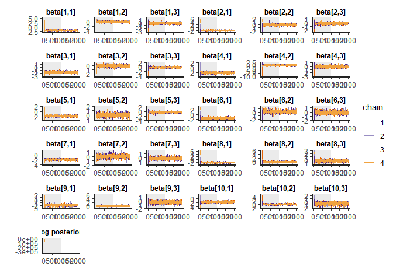<!-- -->

### 4.5.5 Summary of posterior marginal probability distributions for model parameters

**No** densities displayed for reasons of space.

``` r
print(
  x = stanExpRegVarying,
  pars = c("beta", "lp__"),
  probs = c(0.015, 0.25, 0.50, 0.75, 0.985)
)
```

    ## Inference for Stan model: anon_model.
    ## 4 chains, each with iter=2000; warmup=1000; thin=1; 
    ## post-warmup draws per chain=1000, total post-warmup draws=4000.
    ## 
    ##               mean se_mean   sd    1.5%     25%     50%     75%   98.5% n_eff
    ## beta[1,1]    -1.81    0.00 0.19   -2.28   -1.91   -1.80   -1.69   -1.40  5203
    ## beta[1,2]    -0.01    0.00 0.18   -0.46   -0.11    0.00    0.10    0.39  4810
    ## beta[1,3]    -0.21    0.00 0.18   -0.62   -0.33   -0.22   -0.10    0.20  4851
    ## beta[2,1]    -1.81    0.00 0.18   -2.26   -1.91   -1.80   -1.69   -1.41  5113
    ## beta[2,2]     0.01    0.00 0.18   -0.41   -0.10    0.01    0.11    0.42  5141
    ## beta[2,3]    -0.20    0.00 0.16   -0.55   -0.30   -0.21   -0.10    0.17  5106
    ## beta[3,1]    -1.72    0.00 0.20   -2.11   -1.85   -1.74   -1.62   -1.19  4521
    ## beta[3,2]     0.02    0.00 0.17   -0.39   -0.07    0.03    0.13    0.41  5170
    ## beta[3,3]    -0.18    0.00 0.19   -0.57   -0.31   -0.20   -0.07    0.30  4449
    ## beta[4,1]    -1.86    0.00 0.19   -2.35   -1.96   -1.84   -1.73   -1.48  4817
    ## beta[4,2]    -0.06    0.00 0.19   -0.60   -0.16   -0.04    0.07    0.31  3967
    ## beta[4,3]    -0.20    0.00 0.20   -0.63   -0.33   -0.21   -0.09    0.31  4560
    ## beta[5,1]    -1.74    0.00 0.20   -2.13   -1.86   -1.75   -1.63   -1.22  4161
    ## beta[5,2]     0.04    0.00 0.21   -0.44   -0.09    0.03    0.15    0.60  4665
    ## beta[5,3]    -0.29    0.00 0.20   -0.81   -0.40   -0.26   -0.16    0.10  3826
    ## beta[6,1]    -1.70    0.00 0.22   -2.10   -1.84   -1.73   -1.59   -1.11  3904
    ## beta[6,2]     0.05    0.00 0.22   -0.44   -0.08    0.03    0.15    0.63  4734
    ## beta[6,3]    -0.18    0.00 0.22   -0.65   -0.31   -0.20   -0.07    0.45  4141
    ## beta[7,1]    -1.83    0.00 0.18   -2.27   -1.93   -1.82   -1.72   -1.47  5455
    ## beta[7,2]     0.01    0.00 0.22   -0.53   -0.10    0.02    0.13    0.54  4362
    ## beta[7,3]    -0.20    0.00 0.19   -0.61   -0.32   -0.21   -0.09    0.27  5199
    ## beta[8,1]    -1.85    0.00 0.19   -2.34   -1.95   -1.83   -1.73   -1.46  4835
    ## beta[8,2]     0.04    0.00 0.17   -0.34   -0.07    0.03    0.14    0.47  4586
    ## beta[8,3]    -0.27    0.00 0.21   -0.81   -0.38   -0.25   -0.14    0.16  3892
    ## beta[9,1]    -1.83    0.00 0.20   -2.34   -1.94   -1.82   -1.71   -1.39  4363
    ## beta[9,2]     0.09    0.00 0.18   -0.25   -0.03    0.07    0.18    0.57  4020
    ## beta[9,3]    -0.28    0.00 0.21   -0.81   -0.39   -0.26   -0.15    0.16  4718
    ## beta[10,1]   -1.77    0.00 0.21   -2.25   -1.89   -1.78   -1.66   -1.24  4290
    ## beta[10,2]   -0.02    0.00 0.18   -0.43   -0.12   -0.01    0.09    0.39  4866
    ## beta[10,3]   -0.35    0.01 0.27   -1.18   -0.46   -0.30   -0.18    0.07  2842
    ## lp__       -337.67    0.15 5.01 -349.17 -340.94 -337.41 -334.16 -327.58  1098
    ##            Rhat
    ## beta[1,1]     1
    ## beta[1,2]     1
    ## beta[1,3]     1
    ## beta[2,1]     1
    ## beta[2,2]     1
    ## beta[2,3]     1
    ## beta[3,1]     1
    ## beta[3,2]     1
    ## beta[3,3]     1
    ## beta[4,1]     1
    ## beta[4,2]     1
    ## beta[4,3]     1
    ## beta[5,1]     1
    ## beta[5,2]     1
    ## beta[5,3]     1
    ## beta[6,1]     1
    ## beta[6,2]     1
    ## beta[6,3]     1
    ## beta[7,1]     1
    ## beta[7,2]     1
    ## beta[7,3]     1
    ## beta[8,1]     1
    ## beta[8,2]     1
    ## beta[8,3]     1
    ## beta[9,1]     1
    ## beta[9,2]     1
    ## beta[9,3]     1
    ## beta[10,1]    1
    ## beta[10,2]    1
    ## beta[10,3]    1
    ## lp__          1
    ## 
    ## Samples were drawn using NUTS(diag_e) at Tue Aug 30 00:52:24 2022.
    ## For each parameter, n_eff is a crude measure of effective sample size,
    ## and Rhat is the potential scale reduction factor on split chains (at 
    ## convergence, Rhat=1).

``` r
rstan::stan_plot(
  object = stanExpRegVarying,
  pars = c("beta"),
  ci_level = 0.89,
  outer_level = 0.97
)
```

    ## ci_level: 0.89 (89% intervals)

    ## outer_level: 0.97 (97% intervals)

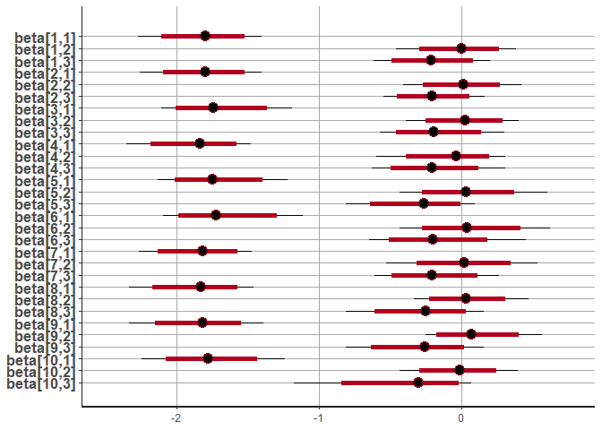<!-- -->

### 4.5.6 Posterior predictive checks

``` r
draws <-
  as.matrix(x = stanExpRegVarying,
            pars = "yrep")

bayesplot::ppc_dens_overlay(y = dataList$y,
                            yrep = draws[501:600,]) +
  ggplot2::labs(
    title = paste0(
      "Posterior predictive distribution ",
      "(re-using predictor data)"
    ),
    subtitle = "Empirical density overlaid with 100 HMC samples"
  ) +
  ggplot2::xlab(label = "y [min]") +
  ggplot2::ylab(label = "Density [1/min]") +
  ggplot2::theme_bw()
```

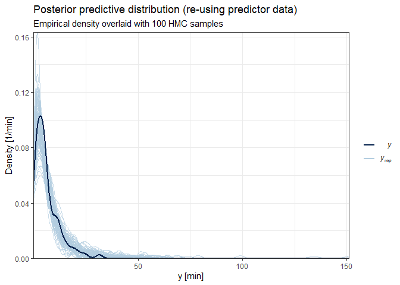<!-- -->

``` r
bayesplot::ppc_intervals_grouped(
  y = dataList$y,
  yrep = draws,
  group = dataList$gp,
  prob = 0.89,
  prob_outer = 0.97,
  size = 1,
  fatten = 3
) +
  ggplot2::labs(
    title = paste0(
      "Posterior predictive compatibility intervals ",
      "(re-using predictor data)"
    ),
    subtitle = "Data points overlaid with interval estimates"
  ) +
  ggplot2::xlab(label = "Sample number") +
  ggplot2::ylab(label = "y [min]") +
  ggplot2::theme_bw()
```

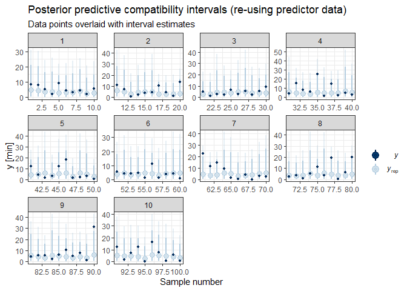<!-- -->

### 4.5.7 Pareto-smoothed importance-sampling leave-one-out cross-validation (PSIS-LOO)

``` r
looExpRegVarying <-
  loo::loo(x = stanExpRegVarying,
           pars = "log_lik")
```

    ## Warning: Some Pareto k diagnostic values are slightly high. See help('pareto-k-diagnostic') for details.

``` r
print(x = looExpRegVarying)
```

    ## 
    ## Computed from 4000 by 100 log-likelihood matrix
    ## 
    ##          Estimate   SE
    ## elpd_loo   -285.8  9.4
    ## p_loo         6.0  1.0
    ## looic       571.6 18.9
    ## ------
    ## Monte Carlo SE of elpd_loo is 0.1.
    ## 
    ## Pareto k diagnostic values:
    ##                          Count Pct.    Min. n_eff
    ## (-Inf, 0.5]   (good)     96    96.0%   2100      
    ##  (0.5, 0.7]   (ok)        4     4.0%   464       
    ##    (0.7, 1]   (bad)       0     0.0%   <NA>      
    ##    (1, Inf)   (very bad)  0     0.0%   <NA>      
    ## 
    ## All Pareto k estimates are ok (k < 0.7).
    ## See help('pareto-k-diagnostic') for details.

``` r
plot(x = looExpRegVarying,
     label_points = TRUE)
```

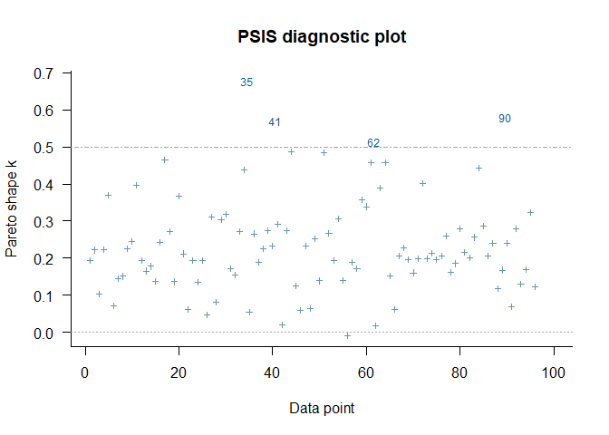<!-- -->

### 4.5.8 Remarks

clear data

``` r
rm(dataList, draws, stanExpRegVarying, looExpRegVarying)
```

# 5 Time series analysis

The **stationarity** property of time series data may be checked with
unit root tests from the R package `urca` by Pfaff (2008). We skip this
issue at this point for reasons of space.

## 5.1 Stationary linear ")-model with Gauß likelihood

blog entry by Daniel Foley, dated Nov 10, 2018, on “A Bayesian approach
to time series forecasting”, URL (cited on August 27, 2022):
<https://towardsdatascience.com/a-bayesian-approach-to-time-series-forecasting-d97dd4168cb7>

### 5.1.1 Data and visualisation

**data set** `USGDPpcData.RData`, US GDP growth data from the period
`1947-04-01` to `2018-10-01`, made available by the Federal Reserve of
St. Louis website at the URL (cited on August 27, 2022):
<https://fred.stlouisfed.org/series/GDPC1#0>.

``` r
load("USGDPpc.RData")
attach(what = USGDPpc)
any(is.na(x = USGDPpc)) # Checking for missing values in the data matrix
```

    ## [1] FALSE

``` r
dat <-
  stats::na.omit(object = USGDPpc) %>% # Delete cases with missing values
  tibble::as_tibble(x = .) %>%
  dplyr::filter(.data = ., date >= lubridate::ymd("1994-01-01"))
dat$date <-
  lubridate::as_datetime(x = dat$date)
rm(USGDPpc)
dim(x = dat)
```

    ## [1] 100   2

``` r
head(x = dat)
```

    ## # A tibble: 6 × 2
    ##   date                percentage_change
    ##   <dttm>                          <dbl>
    ## 1 1994-01-01 00:00:00             0.970
    ## 2 1994-04-01 00:00:00             1.36 
    ## 3 1994-07-01 00:00:00             0.585
    ## 4 1994-10-01 00:00:00             1.15 
    ## 5 1995-01-01 00:00:00             0.355
    ## 6 1995-04-01 00:00:00             0.298

**variables**

`T`: date of observation (`date`)

`y`: quarterly percentage change of US GDP


(`percentage_change`)

Present consideration restricted to the observations from the period
`1994-01-01` to `2018-10-01`.

**visualisation**

``` r
dat %>%
  ggplot2::ggplot(data = ., mapping = aes(x = date, y = percentage_change)) +
  ggplot2::geom_line() +
  ggplot2::scale_x_datetime(name = "Date of observation",
                            date_labels = "%b %Y") +
  ggplot2::scale_y_continuous(name = "Quarterly percentage change [%]") +
  ggplot2::theme_bw()
```

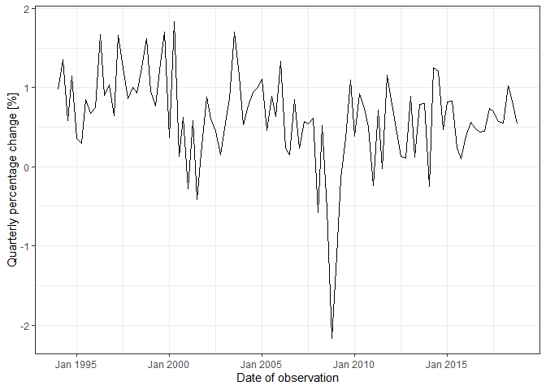<!-- -->

data list for Stan simulation

``` r
dataList <-
  list(T = as.integer(x = nrow(x = dat)),   # no. of time steps
       y = dat$percentage_change,           # times series data
       P = 2L)                              # order p of AR(p) model
rm(dat)
```

### 5.1.2 Statistical model

**model parameters**
,

and
,
with the constraint

imposed in order to ensure a necessary (though not sufficient) condition
for stationarity to hold for the time series model to be constructed.

![\`\text{Likelihood:}\`{=tex}
\`\quad \`{=tex}\`\left\`{=tex}.y\\\_{n}\`\right\`{=tex}\\\|y\\\_{n-i},
\`\alpha\`{=tex}, \`\beta\`{=tex}\*{i}, \`\sigma\`{=tex}\\^{2}, I
\`\stackrel{\mathrm{ind}}{\sim}\`{=tex}
\`\mathrm{N}\`{=tex}\`\left\`{=tex}(\`\mu\`{=tex}\*{n},
\`\sigma\`{=tex}\\^{2}\`\right\`{=tex})  , \`\qquad\`{=tex} \`\sigma\`{=tex}\\^{2}
:=
\`\mathrm{Var}\`{=tex}\`\left\`{=tex}(\`\left\`{=tex}.y\\\_{n}\`\right\`{=tex}\\\|
I\`\right\`{=tex}) = \`\text{constant}\`{=tex}](https://latex.codecogs.com/png.image?%5Cdpi%7B110%7D&space;%5Cbg_white&space;%60%5Ctext%7BLikelihood%3A%7D%60%7B%3Dtex%7D%0A%60%5Cquad%20%60%7B%3Dtex%7D%60%5Cleft%60%7B%3Dtex%7D.y%5C_%7Bn%7D%60%5Cright%60%7B%3Dtex%7D%5C%7Cy%5C_%7Bn-i%7D%2C%0A%60%5Calpha%60%7B%3Dtex%7D%2C%20%60%5Cbeta%60%7B%3Dtex%7D%2A%7Bi%7D%2C%20%60%5Csigma%60%7B%3Dtex%7D%5C%5E%7B2%7D%2C%20I%0A%60%5Cstackrel%7B%5Cmathrm%7Bind%7D%7D%7B%5Csim%7D%60%7B%3Dtex%7D%0A%60%5Cmathrm%7BN%7D%60%7B%3Dtex%7D%60%5Cleft%60%7B%3Dtex%7D%28%60%5Cmu%60%7B%3Dtex%7D%2A%7Bn%7D%2C%0A%60%5Csigma%60%7B%3Dtex%7D%5C%5E%7B2%7D%60%5Cright%60%7B%3Dtex%7D%29%20%C2%A0%2C%20%60%5Cqquad%60%7B%3Dtex%7D%20%60%5Csigma%60%7B%3Dtex%7D%5C%5E%7B2%7D%0A%3A%3D%0A%60%5Cmathrm%7BVar%7D%60%7B%3Dtex%7D%60%5Cleft%60%7B%3Dtex%7D%28%60%5Cleft%60%7B%3Dtex%7D.y%5C_%7Bn%7D%60%5Cright%60%7B%3Dtex%7D%5C%7C%0AI%60%5Cright%60%7B%3Dtex%7D%29%20%3D%20%60%5Ctext%7Bconstant%7D%60%7B%3Dtex%7D "`\text{Likelihood:}`{=tex}
`\quad `{=tex}`\left`{=tex}.y\_{n}`\right`{=tex}\|y\_{n-i},
`\alpha`{=tex}, `\beta`{=tex}*{i}, `\sigma`{=tex}\^{2}, I
`\stackrel{\mathrm{ind}}{\sim}`{=tex}
`\mathrm{N}`{=tex}`\left`{=tex}(`\mu`{=tex}*{n},
`\sigma`{=tex}\^{2}`\right`{=tex})  , `\qquad`{=tex} `\sigma`{=tex}\^{2}
:=
`\mathrm{Var}`{=tex}`\left`{=tex}(`\left`{=tex}.y\_{n}`\right`{=tex}\|
I`\right`{=tex}) = `\text{constant}`{=tex}")


= `\alpha `{=tex}+ `\sum`{=tex}*{i=1}\^{p}`\beta`{=tex}*{i}y*{n-i}")

  , `\qquad`{=tex}
`\sigma `{=tex}`\sim `{=tex}`\mathrm{Exp}`{=tex}(1)")

### 5.1.3 Fitting a Stan model: Gauß likelihood with fixed priors

``` r
stanAR_p_NormFixed <-
  rstan::stan(
    file = "AR_p_NormFixed.stan",
    data = dataList,
    chains = 4,
    iter = 2000,
    warmup = 1000,
    thin = 1,
    init = "random",
    algorithm = "NUTS",
    control = list(adapt_delta = 0.99,
                   max_treedepth = 15),
    cores = 3
  )
```

See also the Stan User’s Guide (Version 2.30), Sec. 2.1, URL (cited on
August 27, 2022):
<https://mc-stan.org/docs/stan-users-guide/autoregressive.html>, and Ali
(2017), URL (cited on August 27, 2022):
<https://imadali.net/projects/bsss/rstan/generated-quantities/>.

### 5.1.4 HMC diagnostics

``` r
rstan::check_hmc_diagnostics(object = stanAR_p_NormFixed)
```

    ## 
    ## Divergences:

    ## 0 of 4000 iterations ended with a divergence.

    ## 
    ## Tree depth:

    ## 0 of 4000 iterations saturated the maximum tree depth of 15.

    ## 
    ## Energy:

    ## E-BFMI indicated no pathological behavior.

``` r
rstan::stan_trace(
  object = stanAR_p_NormFixed,
  pars = c("alpha", "beta", "sigma", "lp__"),
  inc_warmup = TRUE
)
```

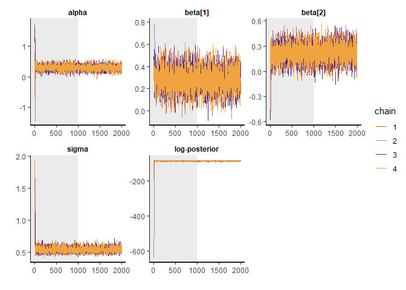<!-- -->

### 5.1.5 Summary of posterior marginal probability distributions for model parameters

``` r
print(
  x = stanAR_p_NormFixed,
  pars = c("alpha", "beta", "sigma", "lp__"),
  probs = c(0.015, 0.25, 0.50, 0.75, 0.985)
)
```

    ## Inference for Stan model: anon_model.
    ## 4 chains, each with iter=2000; warmup=1000; thin=1; 
    ## post-warmup draws per chain=1000, total post-warmup draws=4000.
    ## 
    ##           mean se_mean   sd   1.5%    25%    50%    75%  98.5% n_eff Rhat
    ## alpha     0.29    0.00 0.09   0.11   0.24   0.29   0.35   0.49  2001    1
    ## beta[1]   0.28    0.00 0.10   0.07   0.22   0.29   0.35   0.49  2046    1
    ## beta[2]   0.23    0.00 0.10   0.01   0.16   0.23   0.30   0.45  2089    1
    ## sigma     0.54    0.00 0.04   0.47   0.51   0.54   0.57   0.64  2306    1
    ## lp__    -84.08    0.04 1.46 -88.56 -84.75 -83.73 -83.01 -82.23  1387    1
    ## 
    ## Samples were drawn using NUTS(diag_e) at Tue Aug 30 00:59:21 2022.
    ## For each parameter, n_eff is a crude measure of effective sample size,
    ## and Rhat is the potential scale reduction factor on split chains (at 
    ## convergence, Rhat=1).

``` r
rstan::stan_plot(
  object = stanAR_p_NormFixed,
  pars = c("alpha", "beta", "sigma"),
  ci_level = 0.89,
  outer_level = 0.97
)
```

    ## ci_level: 0.89 (89% intervals)

    ## outer_level: 0.97 (97% intervals)

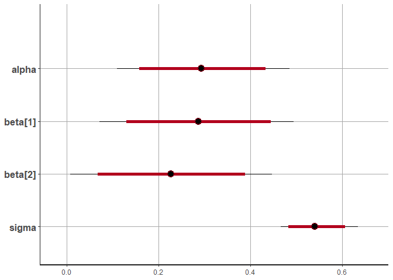<!-- -->

``` r
rstan::stan_dens(object = stanAR_p_NormFixed,
                 pars = c("alpha", "beta", "sigma", "lp__"))
```

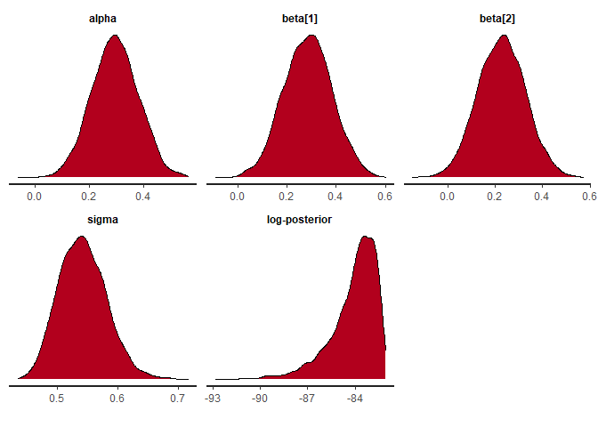<!-- -->

### 5.1.6 Posterior predictive checks

``` r
draws <-
  as.matrix(x = stanAR_p_NormFixed,
            pars = "yrep")

bayesplot::ppc_dens_overlay(y = dataList$y[-c(1:2)],
                            yrep = draws[501:600,]) +
  ggplot2::labs(
    title = paste0(
      "Posterior predictive distribution ",
      "(re-using predictor data)"
    ),
    subtitle = "Empirical density overlaid with 100 HMC samples"
  ) +
  ggplot2::xlab(label = "Quarterly percentage change [%]") +
  ggplot2::ylab(label = "Density [1/%]") +
  ggplot2::theme_bw()
```

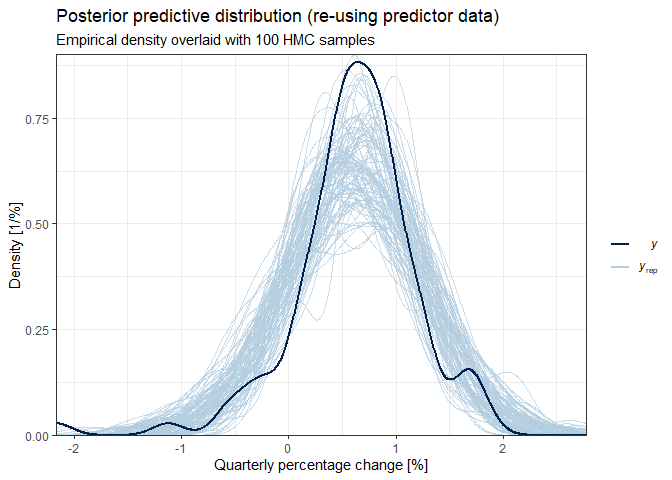<!-- -->

``` r
bayesplot::ppc_intervals(
  y = dataList$y[-c(1:2)],
  yrep = draws,
  prob = 0.89,
  prob_outer = 0.97,
  size = 1,
  fatten = 3
) +
  ggplot2::labs(
    title = paste0(
      "Posterior predictive compatibility intervals ",
      "(re-using predictor data)"
    ),
    subtitle = "Data points overlaid with interval estimates"
  ) +
  ggplot2::xlab(label = "Sample number") +
  ggplot2::ylab(label = "Quarterly percentage change [%]") +
  ggplot2::theme_bw()
```

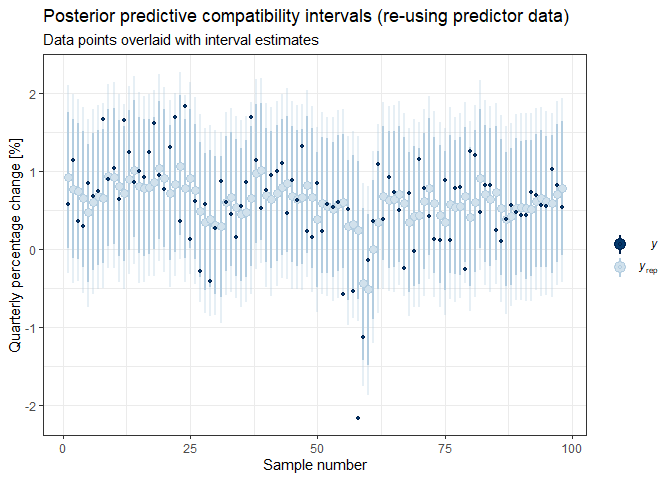<!-- -->

### 5.1.7 Remarks

clear data

``` r
rm(dataList, draws, stanAR_p_NormFixed)
```

## 5.2 Stationary linear ")-model with Gauß likelihood

phases of volatility clustering; Bollerslev (1986), Bürkner *et al*
(2020), approximating exact LFO-CV.

### 5.2.1 Data and visualisation

**data set** `massChangeData.RData`, **variables**

``` r
load("massChangeData.RData")
attach(what = massChangeData)
```

    ## Das folgende Objekt ist maskiert USGDPpc:
    ## 
    ##     date

``` r
any(is.na(x = massChangeData)) # Checking for missing values in the data matrix
```

    ## [1] FALSE

``` r
dat <-
  stats::na.omit(object = massChangeData) %>% # Delete cases with missing 
                                              #   values
  tibble::as_tibble(x = .)
rm(massChangeData)
dim(x = dat)
```

    ## [1] 128   2

``` r
head(x = dat)
```

    ## # A tibble: 6 × 2
    ##   date                massChange
    ##   <dttm>                   <dbl>
    ## 1 2015-01-05 00:00:00      0.5  
    ## 2 2015-01-11 00:00:00     -0.400
    ## 3 2015-01-17 00:00:00     -2.90 
    ## 4 2015-01-18 00:00:00      2.70 
    ## 5 2015-01-30 00:00:00      0.5  
    ## 6 2015-02-08 00:00:00     -1.80

**variables**

`T`: date of observation (`date`)

`y`: mass change


(`massChange`)

observations from the period `2015-01-01` to `2016-12-31`.

**visualisation**

``` r
dat %>%
  ggplot2::ggplot(data = ., mapping = aes(x = date, y = massChange)) +
  ggplot2::geom_line() +
  ggplot2::scale_x_datetime(name = "Date of observation",
                            date_labels = "%b %Y") +
  ggplot2::scale_y_continuous(name = "Mass change [kg]") +
  ggplot2::theme_bw()
```

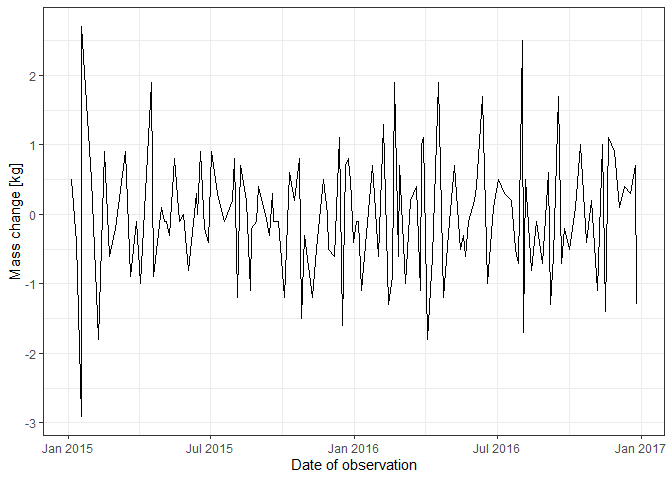<!-- -->

data list for Stan simulation

``` r
dataList <-
  list(T = as.integer(x = nrow(x = dat)),   # no. of time steps
       y = dat$massChange,                  # times series data
       sigma1 = 2.0)                        # initial sd
rm(dat)
```

### 5.2.2 Statistical model

**model parameters**
,

and
,
with the constraint

imposed in order to ensure stationarity.

![\`\text{Likelihood:}\`{=tex}
\`\quad \`{=tex}\`\left\`{=tex}.y\\\_{n}\`\right\`{=tex}\\\|y\\\_{n-1}, \`\mu\`{=tex},
\`\alpha\`{=tex}\*{0}, \`\alpha\`{=tex}\*{1}, \`\beta\`{=tex}\*{1},
\`\sigma\`{=tex}\*{n-1}\\^{2}, I \`\stackrel{\mathrm{ind}}{\sim}\`{=tex}
\`\mathrm{N}\`{=tex}\`\left\`{=tex}(\`\mu\`{=tex},
\`\sigma\`{=tex}\*{n}\\^{2}\`\right\`{=tex})  , \`\qquad\`{=tex} \`\mu \`{=tex}:=
\`\mathrm{E}\`{=tex}\`\left\`{=tex}(\`\left\`{=tex}.y\*{n}\`\right\`{=tex}\\\|I\`\right\`{=tex})
= \`\text{constant}\`{=tex}](https://latex.codecogs.com/png.image?%5Cdpi%7B110%7D&space;%5Cbg_white&space;%60%5Ctext%7BLikelihood%3A%7D%60%7B%3Dtex%7D%0A%60%5Cquad%20%60%7B%3Dtex%7D%60%5Cleft%60%7B%3Dtex%7D.y%5C_%7Bn%7D%60%5Cright%60%7B%3Dtex%7D%5C%7Cy%5C_%7Bn-1%7D%2C%20%60%5Cmu%60%7B%3Dtex%7D%2C%0A%60%5Calpha%60%7B%3Dtex%7D%2A%7B0%7D%2C%20%60%5Calpha%60%7B%3Dtex%7D%2A%7B1%7D%2C%20%60%5Cbeta%60%7B%3Dtex%7D%2A%7B1%7D%2C%0A%60%5Csigma%60%7B%3Dtex%7D%2A%7Bn-1%7D%5C%5E%7B2%7D%2C%20I%20%60%5Cstackrel%7B%5Cmathrm%7Bind%7D%7D%7B%5Csim%7D%60%7B%3Dtex%7D%0A%60%5Cmathrm%7BN%7D%60%7B%3Dtex%7D%60%5Cleft%60%7B%3Dtex%7D%28%60%5Cmu%60%7B%3Dtex%7D%2C%0A%60%5Csigma%60%7B%3Dtex%7D%2A%7Bn%7D%5C%5E%7B2%7D%60%5Cright%60%7B%3Dtex%7D%29%20%C2%A0%2C%20%60%5Cqquad%60%7B%3Dtex%7D%20%60%5Cmu%20%60%7B%3Dtex%7D%3A%3D%0A%60%5Cmathrm%7BE%7D%60%7B%3Dtex%7D%60%5Cleft%60%7B%3Dtex%7D%28%60%5Cleft%60%7B%3Dtex%7D.y%2A%7Bn%7D%60%5Cright%60%7B%3Dtex%7D%5C%7CI%60%5Cright%60%7B%3Dtex%7D%29%0A%3D%20%60%5Ctext%7Bconstant%7D%60%7B%3Dtex%7D "`\text{Likelihood:}`{=tex}
`\quad `{=tex}`\left`{=tex}.y\_{n}`\right`{=tex}\|y\_{n-1}, `\mu`{=tex},
`\alpha`{=tex}*{0}, `\alpha`{=tex}*{1}, `\beta`{=tex}*{1},
`\sigma`{=tex}*{n-1}\^{2}, I `\stackrel{\mathrm{ind}}{\sim}`{=tex}
`\mathrm{N}`{=tex}`\left`{=tex}(`\mu`{=tex},
`\sigma`{=tex}*{n}\^{2}`\right`{=tex})  , `\qquad`{=tex} `\mu `{=tex}:=
`\mathrm{E}`{=tex}`\left`{=tex}(`\left`{=tex}.y*{n}`\right`{=tex}\|I`\right`{=tex})
= `\text{constant}`{=tex}")

![\`\text{Linear model:}\`{=tex}
\`\quad \`{=tex}\`\sigma\`{=tex}\*{n}\\^{2} :=
\`\mathrm{Var}\`{=tex}\`\left\`{=tex}(\`\left\`{=tex}.y\*{n}\`\right\`{=tex}\\\|y\\\_{n-1},
\`\mu\`{=tex}, \`\alpha\`{=tex}\*{0}, \`\alpha\`{=tex}\*{1}, \`\beta\`{=tex}\*{1},
\`\sigma\`{=tex}\*{n-1}\\^{2}, I\`\right\`{=tex}) = \`\alpha\`{=tex}\*{0} +
\`\alpha\`{=tex}\*{1}\`\left\`{=tex}(y\\\_{n-1}-\`\mu\`{=tex}\`\right\`{=tex})\\^{2} +
\`\beta\`{=tex}\*{1}\`\sigma\`{=tex}\*{n-1}\\^{2}](https://latex.codecogs.com/png.image?%5Cdpi%7B110%7D&space;%5Cbg_white&space;%60%5Ctext%7BLinear%20model%3A%7D%60%7B%3Dtex%7D%0A%60%5Cquad%20%60%7B%3Dtex%7D%60%5Csigma%60%7B%3Dtex%7D%2A%7Bn%7D%5C%5E%7B2%7D%20%3A%3D%0A%60%5Cmathrm%7BVar%7D%60%7B%3Dtex%7D%60%5Cleft%60%7B%3Dtex%7D%28%60%5Cleft%60%7B%3Dtex%7D.y%2A%7Bn%7D%60%5Cright%60%7B%3Dtex%7D%5C%7Cy%5C_%7Bn-1%7D%2C%0A%60%5Cmu%60%7B%3Dtex%7D%2C%20%60%5Calpha%60%7B%3Dtex%7D%2A%7B0%7D%2C%20%60%5Calpha%60%7B%3Dtex%7D%2A%7B1%7D%2C%20%60%5Cbeta%60%7B%3Dtex%7D%2A%7B1%7D%2C%0A%60%5Csigma%60%7B%3Dtex%7D%2A%7Bn-1%7D%5C%5E%7B2%7D%2C%20I%60%5Cright%60%7B%3Dtex%7D%29%20%3D%20%60%5Calpha%60%7B%3Dtex%7D%2A%7B0%7D%20%2B%0A%60%5Calpha%60%7B%3Dtex%7D%2A%7B1%7D%60%5Cleft%60%7B%3Dtex%7D%28y%5C_%7Bn-1%7D-%60%5Cmu%60%7B%3Dtex%7D%60%5Cright%60%7B%3Dtex%7D%29%5C%5E%7B2%7D%20%2B%0A%60%5Cbeta%60%7B%3Dtex%7D%2A%7B1%7D%60%5Csigma%60%7B%3Dtex%7D%2A%7Bn-1%7D%5C%5E%7B2%7D "`\text{Linear model:}`{=tex}
`\quad `{=tex}`\sigma`{=tex}*{n}\^{2} :=
`\mathrm{Var}`{=tex}`\left`{=tex}(`\left`{=tex}.y*{n}`\right`{=tex}\|y\_{n-1},
`\mu`{=tex}, `\alpha`{=tex}*{0}, `\alpha`{=tex}*{1}, `\beta`{=tex}*{1},
`\sigma`{=tex}*{n-1}\^{2}, I`\right`{=tex}) = `\alpha`{=tex}*{0} +
`\alpha`{=tex}*{1}`\left`{=tex}(y\_{n-1}-`\mu`{=tex}`\right`{=tex})\^{2} +
`\beta`{=tex}*{1}`\sigma`{=tex}*{n-1}\^{2}")

\^{2}`\right`{=tex})  , `\qquad`{=tex}
`\alpha`{=tex}*{0}
`\sim `{=tex}`\mathrm{Exp}`{=tex}(1/(1\~`\mathrm{kg}`{=tex})\^{2})  ,
`\qquad`{=tex} `\alpha`{=tex}*{1}, `\beta`{=tex}\_{1}
`\sim `{=tex}`\mathrm{Be}`{=tex}(1,1)")

### 5.2.3 Fitting a Stan model: Gauß likelihood with fixed priors

``` r
stanGARCH_1_1_NormFixed <-
  rstan::stan(
    file = "GARCH_1_1_NormFixed.stan",
    data = dataList,
    chains = 4,
    iter = 2000,
    warmup = 1000,
    thin = 1,
    init = "random",
    algorithm = "NUTS",
    control = list(adapt_delta = 0.99,
                   max_treedepth = 15),
    cores = 3
  )
```

See also the Stan User’s Guide (Version 2.30), Sec. 2.2, URL (cited on
August 22, 2022):
<https://mc-stan.org/docs/stan-users-guide/modeling-temporal-heteroscedasticity.html>.

### 5.2.4 HMC diagnostics

``` r
rstan::check_hmc_diagnostics(object = stanGARCH_1_1_NormFixed)
```

    ## 
    ## Divergences:

    ## 0 of 4000 iterations ended with a divergence.

    ## 
    ## Tree depth:

    ## 0 of 4000 iterations saturated the maximum tree depth of 15.

    ## 
    ## Energy:

    ## E-BFMI indicated no pathological behavior.

``` r
rstan::stan_trace(
  object = stanGARCH_1_1_NormFixed,
  pars = c("mu", "alpha0", "alpha1", "beta1", "lp__"),
  inc_warmup = TRUE
)
```

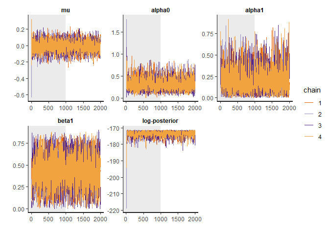<!-- -->

### 5.2.5 Summary of posterior marginal probability distributions for model parameters

``` r
print(
  x = stanGARCH_1_1_NormFixed,
  pars = c("mu", "alpha0", "alpha1", "beta1", "lp__"),
  probs = c(0.015, 0.25, 0.50, 0.75, 0.985)
)
```

    ## Inference for Stan model: anon_model.
    ## 4 chains, each with iter=2000; warmup=1000; thin=1; 
    ## post-warmup draws per chain=1000, total post-warmup draws=4000.
    ## 
    ##           mean se_mean   sd    1.5%     25%     50%     75%   98.5% n_eff Rhat
    ## mu       -0.01    0.00 0.07   -0.16   -0.05   -0.01    0.04    0.14  1999 1.00
    ## alpha0    0.31    0.00 0.14    0.09    0.21    0.29    0.39    0.67  1476 1.00
    ## alpha1    0.20    0.00 0.14    0.01    0.09    0.18    0.27    0.61  1527 1.00
    ## beta1     0.43    0.01 0.19    0.03    0.30    0.43    0.58    0.80  1264 1.00
    ## lp__   -173.59    0.05 1.62 -178.53 -174.40 -173.25 -172.40 -171.46  1026 1.01
    ## 
    ## Samples were drawn using NUTS(diag_e) at Tue Aug 30 01:07:43 2022.
    ## For each parameter, n_eff is a crude measure of effective sample size,
    ## and Rhat is the potential scale reduction factor on split chains (at 
    ## convergence, Rhat=1).

``` r
rstan::stan_plot(
  object = stanGARCH_1_1_NormFixed,
  pars = c("mu", "alpha0", "alpha1", "beta1"),
  ci_level = 0.89,
  outer_level = 0.97
)
```

    ## ci_level: 0.89 (89% intervals)

    ## outer_level: 0.97 (97% intervals)

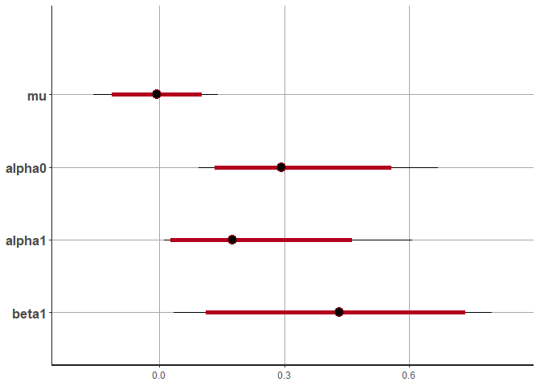<!-- -->

``` r
rstan::stan_dens(object = stanGARCH_1_1_NormFixed,
                 pars = c("mu", "alpha0", "alpha1", "beta1", "lp__"))
```

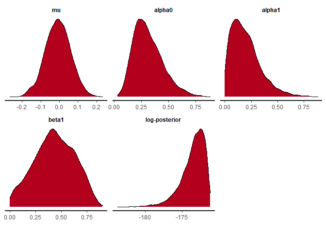<!-- -->

### 5.2.6 Posterior predictive checks

``` r
draws <-
  as.matrix(x = stanGARCH_1_1_NormFixed,
            pars = "yrep")

bayesplot::ppc_dens_overlay(y = dataList$y,
                            yrep = draws[501:600,]) +
  ggplot2::labs(
    title = paste0(
      "Posterior predictive distribution ",
      "(re-using predictor data)"
    ),
    subtitle = "Empirical density overlaid with 100 HMC samples"
  ) +
  ggplot2::xlab(label = "Mass change [kg]") +
  ggplot2::ylab(label = "Density [1/kg]") +
  ggplot2::theme_bw()
```

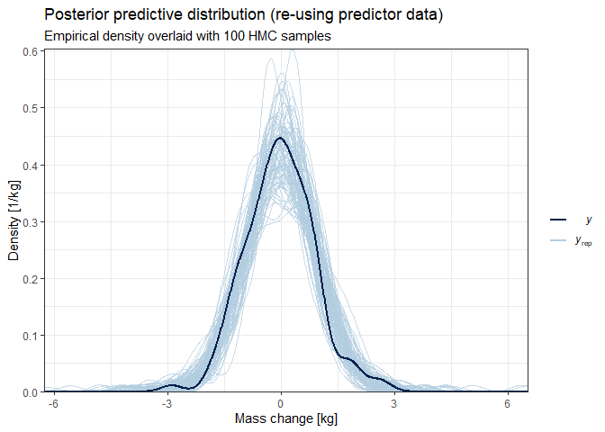<!-- -->

``` r
bayesplot::ppc_intervals(
  y = dataList$y,
  yrep = draws,
  prob = 0.89,
  prob_outer = 0.97,
  size = 1,
  fatten = 3
) +
  ggplot2::labs(
    title = paste0(
      "Posterior predictive compatibility intervals ",
      "(re-using predictor data)"
    ),
    subtitle = "Data points overlaid with interval estimates"
  ) +
  ggplot2::xlab(label = "Sample number") +
  ggplot2::ylab(label = "Mass change [kg]") +
  ggplot2::theme_bw()
```

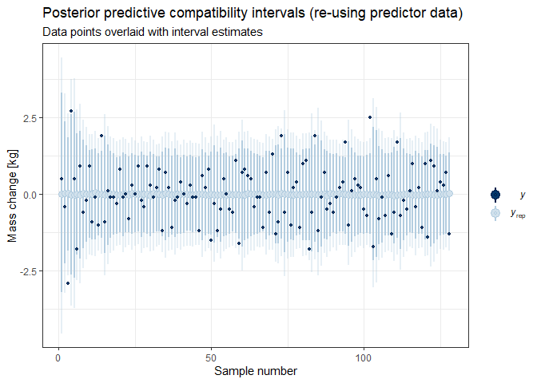<!-- -->

### 5.2.7 Remarks

clear data

``` r
rm(dataList, draws, stanGARCH_1_1_NormFixed)
```

# 6 References

1.  S Bache and H Wickham (2022) magrittr: A forward-pipe operator for R
    (R package version 2.0.3) URL (cited on August 18, 2022):
    <https://CRAN.R-project.org/package=magrittr>

2.  T Bollerslev (1986) Generalized autoregressive conditional
    heteroskedasticity *Journal of Econometrics* **31** 307-327 DOI:
    <https://doi.org/10.1016/0304-4076(86)90063-1>

3.  P-C Bürkner, J Gabry and A Vehtari (2020) Approximate
    leave-future-out cross-validation for Bayesian time series models
    *Journal of Statistical Computation and Simulation* **90** 2499–2523
    DOI: <https://doi.org/10.1080/00949655.2020.1783262>

4.  A Canty and B Ripley (2021) boot: Bootstrap R (S-Plus) functions (R
    package version 1.3-28) URL (cited on August 18, 2022):
    <https://CRAN.R-project.org/package=boot>

5.  B Carpenter, A Gelman, M D Hoffman, D Lee, B Goodrich, M Betancourt,
    M Brubaker, J Guo, P Li and A Riddell (2017) Stan: A probabilistic
    programming language *Journal of Statistical Software* **76** 1–32
    DOI: <https://doi.org/10.18637/jss.v076.i01>

6.  H van Elst (2022) An introduction to inductive statistical
    inference: from parameter estimation to decision-making *eprint*
    arXiv:1808.10173v3

    

    URL: <https://arxiv.org/abs/1808.10173>

    

7.  J Gabry, Daniel Simpson, A Vehtari, M Betancourt and A Gelman (2019)
    Visualization in Bayesian workflow *Journal of the Royal Statistical
    Society: Series A (Statistics in Society)* **182** 389-402 DOI:
    <https://doi.org/10.1111/rssa.12378>

    

8.  J Gabry and T Mahr (2022) bayesplot: Plotting for Bayesian models (R
    package version 1.9.0) URL (cited on August 18, 2022):
    <https://CRAN.R-project.org/package=bayesplot>

9.  A Gelman, J B Carlin, H S Stern, D B Dunson, A Vehtari and D B
    Rubin (2014) *Bayesian Data Analysis* 3rd Edition (Boca Raton, FL:
    Chapman & Hall) ISBN–13: 9781439840955

10. G Grolemund and Hadley Wickham (2011) Dates and times made easy with
    lubridate *Journal of Statistical Software* **40**(3) 1-25 URL:
    <https://www.jstatsoft.org/v40/i03/>

11. D Kahneman (2011) Thinking, Fast and Slow (London: Penguin) ISBN–13:
    9780141033570

12. R McElreath (2020) *Statistical Rethinking — A Bayesian Course with
    Examples in R and Stan* 2nd Edition (Boca Raton, FL: Chapman & Hall)
    ISBN–13: 9780367139919

13. B Pfaff (2008) *Analysis of Integrated and Cointegrated Time Series
    with R* 2nd Edition (New York: Springer) ISBN-10: 0387279601 URL
    (cited on August 28, 2022): <http://www.pfaffikus.de>

14. R Core Team (2022) R: A language and environment for statistical
    computing (Wien: R Foundation for Statistical Computing) URL (cited
    on August 18, 2022): <https://www.R-project.org>

15. B Schloerke, D Cook, J Larmarange, F Briatte, M Marbach, E Thoen, A
    Elberg and J Crowley (2021) GGally: Extension to ‘ggplot2’ (R
    package version 2.1.2) URL (cited on August 21, 2022):
    <https://CRAN.R-project.org/package=GGally>

16. Stan Development Team (2022a) *Stan* URL (cited on August 18, 2022):
    <https://mc-stan.org>

17. Stan Development Team (2022b) rstan: R interface to Stan (R package
    version 2.21.5) URL (cited on August 17, 2022):
    <https://CRAN.R-project.org/package=rstan>

18. A Vehtari, J Gabry, M Magnusson, Y Yao, P Bürkner, T Paananen and A
    Gelman (2022) loo: Efficient leave-one-out cross-validation and WAIC
    for Bayesian models (R package version 2.5.1) URL (cited on August
    20, 2022): <https://mc-stan.org/loo/>

19. H Wickham, M Averick, J Bryan, W Chang, L D McGowan, R François, G
    Grolemund, A Hayes, L Henry, J Hester, M Kuhn, T L Pedersen, E
    Miller, S M Bache, K Müller, J Ooms, D Robinson, D P Seidel, V
    Spinu, K Takahashi, D Vaughan, C Wilke, K Woo and H Yutani (2019)
    Welcome to the tidyverse *Journal of Open Source Software*
    **4** (43) 1686 DOI: <https://doi.org/10.21105/joss.01686>

20. H Wickham H and D Seidel (2022) scales: Scale functions for
    visualization (R package version 1.2.0) URL (cited on August 27,
    2022): <https://CRAN.R-project.org/package=scales>

# 7 Information on current R session

    ## R version 4.2.1 (2022-06-23 ucrt)
    ## Platform: x86_64-w64-mingw32/x64 (64-bit)
    ## Running under: Windows 10 x64 (build 19043)
    ## 
    ## Matrix products: default
    ## 
    ## locale:
    ## [1] LC_COLLATE=German_Germany.utf8  LC_CTYPE=German_Germany.utf8   
    ## [3] LC_MONETARY=German_Germany.utf8 LC_NUMERIC=C                   
    ## [5] LC_TIME=German_Germany.utf8    
    ## 
    ## attached base packages:
    ## [1] stats     graphics  grDevices utils     datasets  methods   base     
    ## 
    ## other attached packages:
    ##  [1] boot_1.3-28         forcats_0.5.1       stringr_1.4.0      
    ##  [4] dplyr_1.0.9         purrr_0.3.4         readr_2.1.2        
    ##  [7] tidyr_1.2.0         tibble_3.1.8        tidyverse_1.3.2    
    ## [10] scales_1.2.0        rstan_2.26.13       StanHeaders_2.26.13
    ## [13] magrittr_2.0.3      lubridate_1.8.0     loo_2.5.1          
    ## [16] GGally_2.1.2        ggplot2_3.3.6       bayesplot_1.9.0    
    ## 
    ## loaded via a namespace (and not attached):
    ##  [1] httr_1.4.3          jsonlite_1.8.0      modelr_0.1.8       
    ##  [4] RcppParallel_5.1.5  assertthat_0.2.1    highr_0.9          
    ##  [7] stats4_4.2.1        googlesheets4_1.0.0 cellranger_1.1.0   
    ## [10] yaml_2.3.5          pillar_1.8.0        backports_1.4.1    
    ## [13] glue_1.6.2          digest_0.6.29       RColorBrewer_1.1-3 
    ## [16] checkmate_2.1.0     rvest_1.0.2         colorspace_2.0-3   
    ## [19] htmltools_0.5.3     plyr_1.8.7          pkgconfig_2.0.3    
    ## [22] broom_1.0.0         haven_2.5.0         processx_3.7.0     
    ## [25] tzdb_0.3.0          googledrive_2.0.0   farver_2.1.1       
    ## [28] generics_0.1.3      ellipsis_0.3.2      withr_2.5.0        
    ## [31] cli_3.3.0           readxl_1.4.0        crayon_1.5.1       
    ## [34] evaluate_0.15       ps_1.7.1            fs_1.5.2           
    ## [37] fansi_1.0.3         xml2_1.3.3          pkgbuild_1.3.1     
    ## [40] tools_4.2.1         prettyunits_1.1.1   hms_1.1.1          
    ## [43] gargle_1.2.0        lifecycle_1.0.1     matrixStats_0.62.0 
    ## [46] V8_4.2.0            reprex_2.0.1        munsell_0.5.0      
    ## [49] callr_3.7.1         compiler_4.2.1      rlang_1.0.4        
    ## [52] grid_4.2.1          ggridges_0.5.3      rstudioapi_0.13    
    ## [55] labeling_0.4.2      rmarkdown_2.14      gtable_0.3.0       
    ## [58] codetools_0.2-18    inline_0.3.19       DBI_1.1.3          
    ## [61] reshape_0.8.9       curl_4.3.2          reshape2_1.4.4     
    ## [64] R6_2.5.1            gridExtra_2.3       knitr_1.39         
    ## [67] fastmap_1.1.0       utf8_1.2.2          stringi_1.7.8      
    ## [70] parallel_4.2.1      Rcpp_1.0.9          vctrs_0.4.1        
    ## [73] dbplyr_2.2.1        tidyselect_1.1.2    xfun_0.31
